# RAG Platform

A production-grade Retrieval-Augmented Generation platform built with Clean Architecture and Domain-Driven Design. Runs fully self-hosted on Apple Silicon (M-series) by default; API-based embedding providers (OpenAI, Voyage AI, Cohere, Gemini) can be enabled with a single config change.

> **Multi-faceted retrieval filtering (T-134):** `POST /chat` and `POST /chat/full` accept optional `document_ids`, `metadata_filters`, and `min_score` to constrain retrieval at query time. Filters propagate through every hybrid leg — dense (Qdrant), BM25, graph, HyPE, HyDE, and hierarchical — before RRF fusion. `min_score` applies only to cosine-similarity sources (dense and Qdrant-backed retrievers), not BM25 or graph ranks. See [Multi-Faceted Retrieval Filtering (T-134)](#multi-faceted-retrieval-filtering-t-134).

> **Diversity retrieval (T-135):** Optional MMR re-ranking after the cross-encoder reduces near-duplicate chunks in the final context by balancing relevance and pairwise passage similarity. Configure via `retrieval.diversity` in `configs/retrieval.yaml` (`enabled: false` by default). See [Diversity Retrieval — MMR (T-135)](#diversity-retrieval--mmr-t-135).

> **Reliable RAG relevancy grading (T-140):** Optional LLM quality gate after RSE and parent-context expansion grades each passage against the query (using the same `chunk_context_text` sent to compression/generation) and drops chunks below `quality.reliable_rag.min_score`. When all passages fail, generation returns *"I don't have information about this."* Configure via `quality.reliable_rag` in `configs/retrieval.yaml` (`enabled: false` by default). See [Reliable RAG — Document Relevancy Grading (T-140)](#reliable-rag--document-relevancy-grading-t-140).

> **Self-RAG decision loop (T-141):** Optional agent-side quality gates on `/chat/agent` and `/chat/agent/full` — decide whether to retrieve, check draft-answer support against context, and score utility before accepting, re-retrieving, or refusing. Replaces the standard agent decision loop when `quality.self_rag.enabled=true` (`false` by default). Pairs well with Reliable RAG (T-140) inside the retrieval path. See [Self-RAG Decision Loop (T-141)](#self-rag-decision-loop-t-141).

> **Corrective RAG web fallback (T-142):** Optional post-retrieval quality gate on `/chat` and `/chat/full` — scores aggregate retrieval quality from Reliable RAG `relevance_score` metadata, then uses retrieved context as-is, combines retrieval with web search and LLM refinement, or discards retrieval for web-only correction. Configure via `quality.crag` in `configs/retrieval.yaml` and `web_search` in `configs/web_search.yaml` (both off/`provider: none` by default). Requires Reliable RAG (T-140) for graded scores. See [Corrective RAG — Web Search Fallback (T-142)](#corrective-rag--web-search-fallback-t-142).

> **Explainable retrieval (T-143):** Optional per-source explanations on `POST /chat/full?explain=true` — after generation, an LLM explains why each cited chunk was retrieved and how it relates to the question (using the same `chunk_context_text` the generator saw). When highlighting is also requested, a combined LLM call runs first with fallback to the dedicated explain path. Default `explain=false` adds no extra LLM calls. Omitted when CRAG refines context to a web-only passage, or when explanation generation fails. See [Explainable Retrieval (T-143)](#explainable-retrieval-t-143).

> **Source highlighting (T-144):** Optional per-source supporting spans on `POST /chat/full?highlights=true` (or globally via `quality.source_highlighting.enabled` in `configs/retrieval.yaml`). Spans are verbatim substrings of `chunk_context_text` — the LLM-facing passage text, not always `Chunk.text` when parent context or contextual headers apply. When both explain and highlights are requested, the pipeline tries one combined LLM call first, then falls back to dedicated paths for any missing side. Default off; omitted on failure. See [Source Highlighting (T-144)](#source-highlighting-t-144).

> **Retrieval feedback loop (T-145):** Optional user relevance feedback via `POST /feedback` — clients vote on retrieved chunks (`relevant: true/false`); scores accumulate in chunk metadata and additively boost future hybrid retrieval after RRF fusion and again after cross-encoder reranking. Configure via `quality.feedback_loop` in `configs/retrieval.yaml` (`enabled: false` by default). Default backend is Qdrant compare-and-set accumulation; no BM25 disk writes on the feedback path. See [Retrieval Feedback Loop (T-145)](#retrieval-feedback-loop-t-145).

> **Feedback production hardening (T-146):** Multi-replica deployments can select `quality.feedback_loop.backend: qdrant | redis | postgres` for atomic score increments, skip unchanged BM25 saves on shutdown, and follow the ops guide in [docs/operations/feedback-multi-replica.md](docs/operations/feedback-multi-replica.md). Concurrency regression coverage lives in `tests/benchmarks/test_feedback_concurrency.py`. See [Multi-Replica Feedback (T-146)](#multi-replica-feedback-t-146).

> **API rate limiting (T-160):** Optional sliding-window middleware protects `/ingest`, `/chat`, `/chat/agent`, `/evals/run`, and `/feedback` — Redis-backed when available, in-memory fallback otherwise. Disabled by default (`api.rate_limit.enabled: false`). Returns `429` with `Retry-After` when exceeded. See [API Rate Limiting (T-160)](#api-rate-limiting-t-160).

> **Technique benchmark (T-150):** Compare optional RAG techniques side-by-side on the golden QA dataset — baseline, multi-query expansion, HyDE, contextual compression, Reliable RAG, Self-RAG (agent path), and feedback-loop boost A/B — without code changes between runs. Each technique toggles via isolated env overrides; results export to `data/exports/technique_benchmark_{timestamp}.json`. See [Compare RAG Techniques (T-150)](#compare-rag-techniques-t-150).

> **Chunk size sweep (T-151):** Automate chunk-size tuning by benchmarking multiple `chunk_size` values on the golden QA dataset — each size gets an isolated Qdrant collection (`rag_documents_cs{size}`), optional on-disk chunk/BM25 caches, and a weighted recommendation across Recall@5, Faithfulness, Relevance, and latency. Results export to `data/exports/chunk_size_sweep_{timestamp}.json`. See [Chunk Size Optimization Sweep (T-151)](#chunk-size-optimization-sweep-t-151).

> **Infra performance baseline (T-172):** Capture p50/p95 latency for streaming chat, concurrent chats, 100K-chunk disk BM25 search, and Neo4j graph retrieval. Results export to `data/exports/infra_benchmark_{timestamp}.json`; committed comparison baseline in `data/exports/infra_baseline.json`. `--compare` warns on >10% p95 regression or increased failure counts (exit 2). Scenario 5 (concurrent feedback) lives in `tests/benchmarks/test_feedback_concurrency.py`. See [Infrastructure Performance Baseline (T-172)](#infrastructure-performance-baseline-t-172).

> **Golden dataset & CI eval gates (T-152):** Populate and validate `datasets/goldens/qa_dataset.json` and `retrieval_dataset.json` via `make evals` (requires `make ingest` first; filters placeholders, expands chunks until ≥ 20 evaluable QA pairs). Sync retrieval goldens without LLM regeneration via `make sync-retrieval-goldens`. CI runs `scripts/check_regression_gate.py` when real data is committed — enforces QA/retrieval sync, minimum sample counts, and per-row oracle Recall@5 floors from `retrieval_baseline.json`. Extend evals with human-in-the-loop feedback via [Retrieval Feedback Loop (T-145)](#retrieval-feedback-loop-t-145) and [docs/operations/feedback-multi-replica.md](docs/operations/feedback-multi-replica.md). See [Golden Dataset & Eval Regression Gates (T-152)](#golden-dataset--eval-regression-gates-t-152).

> **Automated dependency scanning (T-161):** CI runs `pip-audit` on every PR via the **Quality** job — blocks high/critical CVEs (CVSS ≥ 7.0) in direct and transitive dependencies. Known unfixable risks are allowlisted in `configs/cve-allowlist.yaml` with review dates. Run locally with `make audit-deps`. See [Automated Dependency Scanning (T-161)](#automated-dependency-scanning-t-161).

> **diskcache CVE mitigation (T-162):** Compensating controls for CVE-2025-69872 (`diskcache` transitive via `llama-cpp-python`): `diskcache-weave` fork override, RAM-only prompt cache by default, emergency kill switch (`LLM__DISABLE_DISK_CACHE=true`), upstream PyPI monitor (`./scripts/check_diskcache_cve.sh`), and weekly Dependabot PRs for `llama-cpp-python`. Formal risk acceptance in [docs/security-advisories.md](docs/security-advisories.md). See [diskcache CVE Mitigation (T-162)](#diskcache-cve-mitigation-t-162).

> **Neo4j async driver (T-164):** Graph RAG uses Neo4j's `AsyncGraphDatabase` so entity lookup does not block the FastAPI event loop. `HybridRetriever` awaits the graph leg in the same `asyncio.gather` as dense + BM25; sync callers (CLI ingestion, shutdown) use `upsert_sync` / `close_sync` via `src/core/async_bridge.py`. Pool size is `neo4j.max_connection_pool_size` (default 100). See [Knowledge Graph (Graph RAG)](#knowledge-graph-graph-rag).

> **Disk-backed BM25 (T-165):** Lexical search stays `memory` by default (in-RAM `rank-bm25`). For corpora approaching 100K–1M+ chunks, set `retrieval.bm25.backend: disk` to use a segmented/mmap index under `retrieval.bm25.disk_path` so search RAM stays bounded. Ingestion wraps each document in `deferred_rebuild()` so re-ingest purges superseded chunk IDs from Qdrant and BM25 atomically; eval/rebuild scripts stream chunks via `iter_chunks()` without loading the full corpus into RAM. See [Disk-Backed BM25 (T-165)](#disk-backed-bm25-t-165).

> **Mypy CI gate hardening (T-171):** CI, `make lint`, and the pre-commit mypy hook run identical static analysis — `ruff check` → `ruff format --check` → `mypy src` → `basedpyright --level error src` — with no CLI `--ignore-missing-imports` bypass. `scripts/check_lint_gate.py` validates config drift across CI, Makefile, and pre-commit, then re-runs mypy. Typed smoke modules under `src/type_regression/` exercise compression and contextual-header APIs so mypy catches return-type regressions at lint time. Builds on the T-170 type-ignore audit ([docs/type-safety.md](docs/type-safety.md)). See [Lint workflow for contributors](#lint-workflow-for-contributors).

> **Multimodal parsing contracts (T-190):** Domain-layer ABCs for layout-aware parsing and OCR — `LayoutParserRepository`, `OcrRepository`, and `ParsedDocument` — plus feature-flagged `ParsingSettings` in `configs/parsing.yaml`. Multimodal chunk types (`table`, `caption`, `figure`, `page`) and metadata keys (`table_id`, `figure_id`, `bbox`, `page`, `section`) are defined in `src/core/constants.py` for Phases 20–28. See [Multimodal Parsing Contracts (T-190)](#multimodal-parsing-contracts-t-190).

> **Layout-aware parsing (T-200):** Optional Docling-backed layout parser for PDF/DOCX — `DoclingLayoutParser` implements `LayoutParserRepository` and routes through `load_document()` when `parsing.layout_parser.enabled=true` (off by default). Exports markdown plus layout metadata (sections, tables, figures with `table_id`/`figure_id`/`bbox`/`page`); `chunk_metadata()` filters document-level structures from per-chunk payloads and promotes `CHUNK_SECTION_KEY` for contextual headers. Install Docling separately: `uv pip install docling`. See [Layout-Aware Parsing (T-200)](#layout-aware-parsing-t-200).

> **Structured table chunks (T-202):** Optional `type=table` index points at ingest — `TableChunker` reads layout `tables[]` metadata (with markdown fallback) and indexes embedded table chunks in Qdrant and BM25 when `parsing.table_chunks.enabled=true` (off by default). Stable UUIDv5 IDs (`source:table_id`) enable skip-path backfill and stale purge on unchanged re-ingests; failed embeds retain prior table points. Requires T-200 layout metadata for best results. See [Structured Table Chunks at Ingest (T-202)](#structured-table-chunks-at-ingest-t-202).

> **Multimodal domain model (T-210):** First-class modality fields on `Chunk` (`modality`, `image_embedding`, `asset_path`), structured `SourceReference` citations, and `Answer.source_references` — all with backward-compatible defaults (`modality=text`, empty references). Legacy `metadata.type` table/figure chunks still resolve via `resolve_modality` / `SourceReference.from_chunk`. Domain-only; API wiring is T-272. See [Multimodal Domain Model (T-210)](#multimodal-domain-model-t-210).

> **Scanned-PDF OCR fallback (T-223):** When `parsing.ocr.enabled=true`, low-text / empty PDF loads run through `get_ocr_provider()` after `load_document` and replace document content before chunking. Dual-hash dedup (`content_hash` or PDF `source_file_hash`) preserves OCR-derived chunks when toggling OCR flags; failed OCR stores a pending hash for retry. Off by default. Providers: self-hosted (T-221) or Azure DI (T-222). See [Scanned-PDF OCR Fallback (T-223)](#scanned-pdf-ocr-fallback-t-223) and [docs/ocr-providers.md](docs/ocr-providers.md).

> **Azure Document Intelligence OCR (T-222):** Optional cloud OCR via `parsing.ocr.provider=azure_di` — REST `prebuilt-read`, credentials under `parsing.ocr.azure_di` / `PARSING__OCR__AZURE_DI__*`. Factory caches by Azure DI identity and disposes the previous `httpx` client on credential/config rotation. See [docs/ocr-providers.md](docs/ocr-providers.md).

> **Figure asset extraction (T-230):** When `parsing.figure_assets.enabled=true`, ingest persists figure bytes from layout `figures[]` (Docling PDF/DOCX) or PPTX picture shapes under `store_dir` (default `data/assets`), sets `figures[].asset_path`, and exposes `build_figure_chunks()` with `Chunk.asset_path` / `figure_id`. Off by default; soft-fails per figure. See [Figure Asset Extraction & Storage (T-230)](#figure-asset-extraction--storage-t-230).

> **VLM captioning at ingest (T-231):** When `parsing.figure_captions.enabled=true` (requires T-230 assets), OpenAI or Gemini writes `figures[].caption` and hash-bound `{stem}.caption.txt` sidecars for skip-path reuse. Off by default; soft-fails per figure. See [VLM Captioning at Ingest (T-231)](#vlm-captioning-at-ingest-t-231).

> **Image caption chunks (T-232):** When `parsing.caption_chunks.enabled=true`, ingest indexes `type=caption` chunks from `figures[].caption` (stable UUIDv5 IDs, skip-path backfill like T-202 tables). Off by default. See [Image Caption Chunks (T-232)](#image-caption-chunks-t-232).

---

## Table of Contents

- [Architecture Overview](#architecture-overview)
- [Tech Stack](#tech-stack)
- [Prerequisites](#prerequisites)
- [Installation](#installation)
- [Model Setup](#model-setup)
- [Configuration](#configuration)
- [Usage](#usage)
  - [Ingest Documents](#ingest-documents)
    - [Optional Chunk Enrichment](#optional-chunk-enrichment)
    - [Multimodal Parsing Contracts (T-190)](#multimodal-parsing-contracts-t-190)
    - [Layout-Aware Parsing (T-200)](#layout-aware-parsing-t-200)
    - [Scanned-PDF OCR Fallback (T-223)](#scanned-pdf-ocr-fallback-t-223)
    - [Figure Asset Extraction & Storage (T-230)](#figure-asset-extraction--storage-t-230)
    - [VLM Captioning at Ingest (T-231)](#vlm-captioning-at-ingest-t-231)
    - [Image Caption Chunks (T-232)](#image-caption-chunks-t-232)
    - [Structured Table Chunks at Ingest (T-202)](#structured-table-chunks-at-ingest-t-202)
    - [Multimodal Domain Model (T-210)](#multimodal-domain-model-t-210)
  - [Start the API Server](#start-the-api-server)
  - [Chat](#chat)
    - [Scoped retrieval filters (T-134)](#scoped-retrieval-filters-t-134)
    - [Corrective RAG in standard chat (T-142)](#corrective-rag-in-standard-chat-t-142)
    - [Explainable retrieval in standard chat (T-143)](#explainable-retrieval-in-standard-chat-t-143)
    - [Source highlighting in standard chat (T-144)](#source-highlighting-in-standard-chat-t-144)
    - [Retrieval feedback (T-145)](#retrieval-feedback-t-145)
  - [Run Evaluations](#run-evaluations)
  - [Benchmark](#benchmark)
  - [Compare RAG Techniques (T-150)](#compare-rag-techniques-t-150)
  - [Chunk Size Optimization Sweep (T-151)](#chunk-size-optimization-sweep-t-151)
  - [Infrastructure Performance Baseline (T-172)](#infrastructure-performance-baseline-t-172)
  - [Golden Dataset & Eval Regression Gates (T-152)](#golden-dataset--eval-regression-gates-t-152)
  - [Compare Embedding Providers](#compare-embedding-providers)
- [Docker Compose](#docker-compose)
  - [Full Stack](#full-stack)
  - [Development Hot-Reload](#development-hot-reload)
  - [Ingestion via Docker](#ingestion-via-docker)
- [Kubernetes & Production](#kubernetes--production)
  - [Helm Chart](#helm-chart)
  - [Multi-Replica Feedback (T-146)](#multi-replica-feedback-t-146)
  - [API Rate Limiting (T-160)](#api-rate-limiting-t-160)
  - [Automated Dependency Scanning (T-161)](#automated-dependency-scanning-t-161)
  - [diskcache CVE Mitigation (T-162)](#diskcache-cve-mitigation-t-162)
  - [Disk-Backed BM25 (T-165)](#disk-backed-bm25-t-165)
  - [EKS Setup](#eks-setup)
- [Knowledge Graph (Graph RAG)](#knowledge-graph-graph-rag)
  - [Async Neo4j driver (T-164)](#async-neo4j-driver-t-164)
- [Agentic RAG](#agentic-rag)
  - [Self-RAG decision loop (T-141)](#self-rag-decision-loop-t-141)
- [Embedding Providers](#embedding-providers)
- [API Reference](#api-reference)
- [Project Structure](#project-structure)
- [Development](#development)
  - [Lint workflow for contributors (T-171)](#lint-workflow-for-contributors)
- [Testing](#testing)
- [Evaluation Framework](#evaluation-framework)
- [Observability](#observability)
- [CI/CD](#cicd)

---

## Architecture Overview

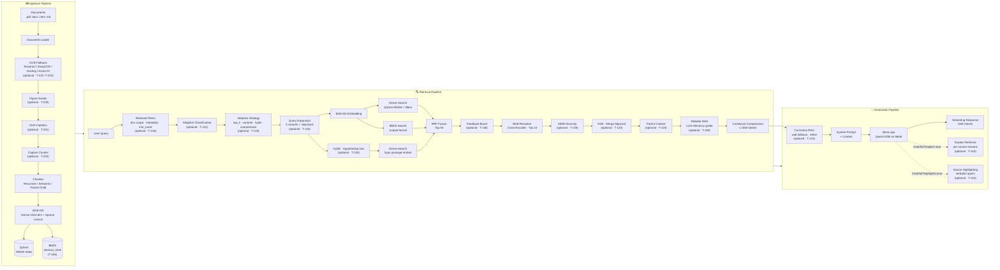

### Layer Separation (Clean Architecture)

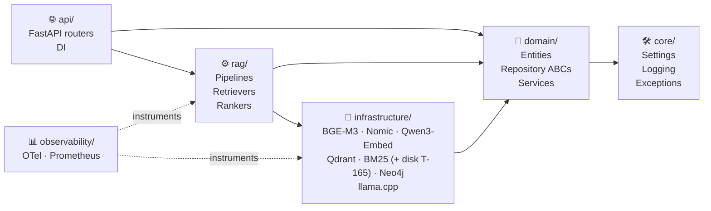

> **Rule:** arrows point inward — `domain/` never imports from `infrastructure/` or `rag/`.

---

## Tech Stack

| Component | Technology |
|---|---|
| LLM (inference) | [llama.cpp](https://github.com/ggerganov/llama.cpp) via `llama-cpp-python` |
| Default model | Qwen3-30B (GGUF) |
| Embeddings (self-hosted) | [BGE-M3](https://huggingface.co/BAAI/bge-m3) · [Nomic-Embed-Text v1.5](https://huggingface.co/nomic-ai/nomic-embed-text-v1.5) · [Qwen3-Embedding](https://huggingface.co/Qwen/Qwen3-Embedding-0.6B) |
| Embeddings (API, optional) | OpenAI · Voyage AI · Cohere · Gemini (`uv sync --extra api-embeddings`) |
| Embedding cache | Redis (transparent decorator, configurable TTL) |
| Reranker | [BGE-Reranker-v2-M3](https://huggingface.co/BAAI/bge-reranker-v2-m3) |
| Vector DB | [Qdrant](https://qdrant.tech) (self-hosted, with embedding model versioning) |
| Sparse search | BM25 via `rank-bm25` (`memory` default; optional `disk` backend — T-165) |
| Knowledge graph | [Neo4j](https://neo4j.com) (optional, `uv sync --extra graph`) |
| Layout parser (optional) | [Docling](https://github.com/docling-project/docling) — PDF/DOCX layout-aware parsing (T-200; `uv pip install docling`) |
| OCR (optional) | Docling-backed Tesseract / EasyOCR / Docling engines via `get_ocr_provider()` (T-221); Azure Document Intelligence REST (`azure_di`, T-222); scanned-PDF ingest fallback (T-223) |
| API framework | [FastAPI](https://fastapi.tiangolo.com) |
| Package manager | [uv](https://docs.astral.sh/uv/) |
| Linting | [Ruff](https://docs.astral.sh/ruff/) + [mypy](https://mypy-lang.org/) + [basedpyright](https://docs.basedpyright.com/) |
| Tracing | [OpenTelemetry](https://opentelemetry.io/) |
| Metrics | [Prometheus](https://prometheus.io/) |
| Evaluation | [Ragas](https://docs.ragas.io/) + [DeepEval](https://docs.confident-ai.com/) |

---

## Prerequisites

- **macOS** with Apple Silicon (M1/M2/M3/M4) — MPS acceleration
- **Python 3.12+** (managed by uv)
- **[uv](https://docs.astral.sh/uv/)** — `brew install uv`
- **[Docker Desktop](https://www.docker.com/)** — for Qdrant (native) or the full stack (Compose)
- **~64 GB RAM** recommended for Qwen3-30B; smaller models work on less

---

## Installation

### Option A — Native (recommended for active development on Apple Silicon)

```bash
# 1. Clone the repository
git clone <repo-url>
cd rag_implementation

# 2. Install all dependencies (including dev tools)
make install

# 3. Copy and edit the environment file
cp .env.example .env

# 4. Start Qdrant only
make qdrant-up

# 5. Start the API server (Metal/MPS acceleration)
make serve
```

### Option B — Docker Compose (full stack, no local Python setup required)

```bash
cp .env.example .env   # adjust LLM__MODEL_PATH etc.
make docker-up         # starts api, qdrant, ollama, redis, prometheus, otel-collector
```

See [Docker Compose](#docker-compose) for details.

---

## Model Setup

Download models into the `models/` directory:

```bash
# BGE-M3 embeddings (~570 MB)
huggingface-cli download BAAI/bge-m3 --local-dir models/embeddings/bge-m3

# BGE-Reranker-v2-M3 (~570 MB)
huggingface-cli download BAAI/bge-reranker-v2-m3 --local-dir models/rerankers/bge-reranker-v2-m3

# Qwen3-30B-Instruct GGUF (~16 GB at Q4_K_M)
# Download from Hugging Face and place in models/llm/
# e.g. qwen3-30b-instruct-q4_k_m.gguf
```

Update `configs/llm.yaml` with your model filename:
```yaml
llm:
  model_path: models/llm/qwen3-30b-instruct-q4_k_m.gguf
```

---

## Configuration

All configuration lives in `configs/*.yaml` with environment variable overrides. Copy `.env.example` to `.env` and adjust:

```bash
# Key settings (use __ as nested delimiter)
LLM__MODEL_PATH=models/llm/your-model.gguf
LLM__N_GPU_LAYERS=-1                       # -1 = all layers on Metal
LLM__DISABLE_DISK_CACHE=false              # true disables llama.cpp prompt cache (T-162)
EMBEDDINGS__PROVIDER=bge_m3                # bge_m3 | nomic | qwen_embedding | openai | voyage | cohere | gemini
EMBEDDINGS__DEVICE=mps                     # mps | cuda | cpu
QDRANT__URL=http://localhost:6333
QDRANT__COLLECTION=rag_documents

# API embedding providers (only required when EMBEDDINGS__PROVIDER matches)
EMBEDDINGS__OPENAI__API_KEY=
EMBEDDINGS__VOYAGE__API_KEY=
EMBEDDINGS__COHERE__API_KEY=
EMBEDDINGS__GEMINI__API_KEY=

# Embedding cache (disabled by default — set true to enable Redis caching)
EMBEDDINGS__CACHE__ENABLED=false
REDIS__URL=redis://localhost:6379

# Retrieval fusion (multi-query variants fused via RRF by default)
RETRIEVAL__TOP_K_FINAL=5
RETRIEVAL__HYBRID_FUSION=rrf              # rrf | weighted_linear
RETRIEVAL__HYBRID_ALPHA=0.7               # weighted_linear only
RETRIEVAL__BM25__BACKEND=memory           # memory (default) | disk (T-165 scale)
# RETRIEVAL__BM25__DISK_PATH=data/processed/bm25_disk
# RETRIEVAL__BM25__SEGMENT_SIZE=10000
RETRIEVAL__HYPE__ENABLED=false            # HyPE question-question matching (T-122)
RETRIEVAL__HYPE__N_QUESTIONS=3
RETRIEVAL__HYDE__ENABLED=false            # HyDE hypothetical document embedding (T-130)
RETRIEVAL__ADAPTIVE__ENABLED=false        # LLM query classification + per-category strategies (T-131/T-132)
# Per-category strategy overrides (when adaptive enabled), e.g.:
# RETRIEVAL__ADAPTIVE__STRATEGIES__ANALYTICAL__TOP_K=50
# RETRIEVAL__ADAPTIVE__STRATEGIES__ANALYTICAL__HYDE=true
RETRIEVAL__RSE__ENABLED=false             # merge adjacent retrieved chunks (T-123)
RETRIEVAL__RSE__MAX_SEGMENT_TOKENS=1500
RETRIEVAL__PARENT_CONTEXT__ENABLED=false  # expand child chunks to parent text (T-124; requires parent_child)
RETRIEVAL__DIVERSITY__ENABLED=false        # MMR diversity re-ranking after cross-encoder (T-135)
RETRIEVAL__DIVERSITY__LAMBDA=0.7           # 1.0 = pure relevance, 0.0 = max diversity
QUALITY__RELIABLE_RAG__ENABLED=false       # LLM relevancy grading after enrichment (T-140)
QUALITY__RELIABLE_RAG__MIN_SCORE=0.5       # chunks below this score excluded from context
QUALITY__SELF_RAG__ENABLED=false           # Self-RAG gates on agent endpoints (T-141)
QUALITY__CRAG__ENABLED=false               # Corrective RAG web fallback on /chat* (T-142)
QUALITY__CRAG__LOWER_THRESHOLD=0.3         # below → web-only correction
QUALITY__CRAG__UPPER_THRESHOLD=0.7         # above → use retrieval as-is
QUALITY__FEEDBACK_LOOP__ENABLED=false      # user relevance feedback + retrieval boost (T-145)
QUALITY__FEEDBACK_LOOP__BOOST_MULTIPLIER=0.05  # additive boost per unit of positive feedback_score
QUALITY__FEEDBACK_LOOP__BACKEND=qdrant     # qdrant | redis | postgres — atomic backend (T-146)
QUALITY__FEEDBACK_LOOP__POSTGRES_URL=      # SQLite file path or DSN when backend=postgres
WEB_SEARCH__PROVIDER=none                  # none | duckduckgo | tavily (T-142)
WEB_SEARCH__MAX_RESULTS=5
WEB_SEARCH__TAVILY__API_KEY=               # required when provider=tavily
QUERY_EXPANSION__STEP_BACK__ENABLED=false # broader background query for multi-query RRF fusion (T-133)

# Chunk enrichment (disabled by default — see Optional Chunk Enrichment)
CHUNKING__STRATEGY=recursive              # recursive | semantic | parent_child | proposition | section (T-240)
CHUNKING__PROPOSITION__QUALITY_THRESHOLD=7  # min score 1-10 per category when strategy=proposition (T-126)
CHUNKING__CONTEXTUAL_HEADERS__ENABLED=false
CHUNKING__CONTEXTUAL_HEADERS__EXCLUDE_FROM_LLM_CONTEXT=true
CHUNKING__AUGMENTATION__ENABLED=false
CHUNKING__AUGMENTATION__N_QUESTIONS=3
CHUNKING__HIERARCHICAL__ENABLED=false      # document summary + detail two-tier index (T-125)
CHUNKING__HIERARCHICAL__SUMMARY_TOP_K=3

# Neo4j Graph RAG (disabled by default; async driver — T-164)
NEO4J__ENABLED=false
NEO4J__URI=bolt://localhost:7687
NEO4J__USER=neo4j
NEO4J__PASSWORD=
NEO4J__MAX_CONNECTION_POOL_SIZE=100      # AsyncGraphDatabase pool (T-164)
NEO4J__EXTRACT_ENTITIES_ON_INGEST=true

# SQLite metadata store (ingestion history + content-hash dedup)
METADATA__ENABLED=true
METADATA__DB_PATH=data/processed/metadata.db

# Multimodal parsing (layout parser off by default; OCR T-220–T-223; figure assets T-230; VLM captions T-231; caption chunks T-232)
PARSING__LAYOUT_PARSER__ENABLED=false   # Docling layout parser for .pdf/.docx (T-200)
PARSING__LAYOUT_PARSER__PROVIDER=docling
PARSING__TABLE_CHUNKS__ENABLED=false    # structured type=table chunks at ingest (T-202)
PARSING__CAPTION_CHUNKS__ENABLED=false  # structured type=caption chunks at ingest (T-232)
PARSING__FIGURE_ASSETS__ENABLED=false   # persist figure bytes + asset_path (T-230)
PARSING__FIGURE_ASSETS__STORE_DIR=data/assets
PARSING__FIGURE_CAPTIONS__ENABLED=false # VLM captions for stored figures (T-231)
PARSING__FIGURE_CAPTIONS__PROVIDER=openai  # openai | gemini
# PARSING__FIGURE_CAPTIONS__OPENAI__API_KEY=
# PARSING__FIGURE_CAPTIONS__GEMINI__API_KEY=
PARSING__OCR__ENABLED=false             # OCR factory + scanned-PDF fallback (T-220/T-223)
PARSING__OCR__PROVIDER=tesseract        # tesseract | easyocr | docling | azure_di
PARSING__OCR__MIN_CHARS=50              # OCR when extractable text is below this many non-whitespace chars
# PARSING__OCR__AZURE_DI__ENDPOINT=https://<resource>.cognitiveservices.azure.com
# PARSING__OCR__AZURE_DI__API_KEY=      # required when provider=azure_di (T-222)

# API security (optional — local dev leaves API key empty)
API__API_KEY=                          # when set, require X-API-Key on /ingest, /chat, /feedback, /evals
API__MAX_UPLOAD_BYTES=10485760           # POST /ingest/upload size cap (10 MiB)
API__CORS_ORIGINS='["*"]'              # JSON list of allowed browser origins
API__RATE_LIMIT__ENABLED=false         # sliding-window limit on sensitive routes (T-160)
API__RATE_LIMIT__REQUESTS_PER_MINUTE=60
API__RATE_LIMIT__BURST=10
# API__INGEST_ALLOWED_ROOTS='["data/raw"]'  # JSON list; /ingest/path restricted to these dirs
```

| File | Purpose |
|---|---|
| `configs/app.yaml` | API host/port, CORS origins, API key, upload limits, rate limiting (T-160) |
| `configs/llm/qwen3-30b.yaml` | Default LLM profile (llama.cpp + Qwen3-30B) |
| `configs/llm/qwen3-14b.yaml` | Lighter LLM profile (llama.cpp + Qwen3-14B) |
| `configs/llm/ollama-*.yaml` | Ollama-backed profiles (GLM-5.2, Gemma3-27B, Llama3.3-70B) |
| `configs/embeddings.yaml` | Embedding provider, dimensions, API credentials, cache TTL |
| `configs/retrieval.yaml` | Chunking (incl. proposition), contextual headers, synthetic-question augmentation, hierarchical summaries, HyPE, HyDE, adaptive classification & strategies, step-back query transformation, RSE, parent context, MMR diversity, BM25 backend (`memory`/`disk` — T-165), Reliable RAG relevancy grading, Corrective RAG thresholds, source highlighting (T-144), retrieval feedback loop + backend (T-145/T-146), hybrid fusion, reranker; explainable retrieval (T-143) is API-only via `/chat/full?explain=true` |
| `configs/parsing.yaml` | Layout parser (T-200 Docling), structured table chunks (T-202), caption chunks (T-232), figure assets (T-230), VLM figure captions (T-231), OCR factory + scanned-PDF fallback + Azure DI (T-220–T-223), and T-210 domain-model notes — feature flags disabled by default |
| `configs/web_search.yaml` | Web search provider for Corrective RAG (T-142): `none`, `duckduckgo`, or `tavily` |
| `configs/neo4j.yaml` | Neo4j connection, graph enable flag, async driver pool size (T-164), entity extraction on ingest |
| `configs/evals.yaml` | Evaluation thresholds, dataset paths, regression config (T-152), technique benchmark matrix (T-150), chunk size sweep sizes/weights (T-151), infra benchmark thresholds (T-172) |
| `configs/logging.yaml` | Log level, format (json/text), OTel endpoint |
| `configs/cve-allowlist.yaml` | Accepted CVE allowlist with review dates for `make audit-deps` (T-161/T-162) |

---

## Usage

### Ingest Documents

```bash
# Ingest a single file
make ingest SOURCE=data/raw/manual.pdf

# Ingest a directory
make ingest SOURCE=data/raw/

# List ingested documents (SQLite metadata store)
uv run python scripts/ingest.py --list

# Supported formats: .pdf, .docx, .html, .htm, .md, .markdown
```

Re-ingesting the same file is **idempotent**: unchanged content is skipped (`IngestionResult.skipped=True`); modified content removes superseded chunk IDs from Qdrant and BM25, then upserts the new set inside a single `deferred_rebuild()` scope (one lexical rebuild per document). Deduplication uses a hash stored in the SQLite metadata store (`data/processed/metadata.db` by default) — normally a text `content_hash`, or for PDFs that went through OCR a `source_file_hash` of the file bytes (T-223 dual-hash contract). Hierarchical summaries (T-125) and HyPE questions (T-122) are indexed in the same scope when enabled. When `parsing.table_chunks.enabled=true` and/or `parsing.caption_chunks.enabled=true` and no LLM enrichers force a full reindex, unchanged documents still sync structured chunks on the skip path — backfilling missing/updated tables (T-202) and captions (T-232) and purging stale ones, including when OCR is skipped or fails but layout metadata still carries table/caption text.

With `chunking.strategy: parent_child`, both parent and child chunks are indexed in Qdrant and BM25. At query time, retrieval matches on child embeddings; enable `retrieval.parent_context` to substitute parent text into the LLM context (see [Parent Context on Retrieve (T-124)](#parent-context-on-retrieve-t-124)).

**Security notes:**
- `POST /ingest/path` only reads files under `api.ingest_allowed_roots` (default: `data/raw`). It cannot ingest arbitrary server paths such as `/etc/passwd`.
- `POST /ingest/upload` reads uploads in bounded chunks (`api.max_upload_bytes`, default 10 MiB) and accepts only supported extensions.
- Set `API__API_KEY` to require an `X-API-Key` header on `/ingest`, `/chat`, `/feedback`, and `/evals/run`. `/health` and `/metrics` stay public.
- Enable `API__RATE_LIMIT__ENABLED=true` for public or multi-replica deployments — limits apply per `X-API-Key` when set, otherwise per client IP (`X-Forwarded-For` or direct connection). `/health` and `/metrics` are exempt.

#### Ingestion Flow

```mermaid
flowchart LR
    SRC["📄 Source File<br/>.pdf/.docx/.html/.md"] --> LP{"Layout parser?<br/>(optional · T-200)"}
    LP -->|disabled / default| LD["Plain Loader<br/>pypdf · python-docx · …"]
    LP -->|parsing.layout_parser.enabled| PARSE["DoclingLayoutParser<br/>→ ParsedDocument<br/>→ Document"]
    PARSE --> DEDUP{"Unchanged?<br/>content_hash or<br/>source_file_hash"}
    LD --> DEDUP
    DEDUP -->|skip · preserve index| SKIP["Skip path<br/>table backfill · T-202<br/>figure assets · T-230<br/>VLM captions · T-231<br/>caption chunks · T-232"]
    DEDUP -->|new / changed| OCR{"OCR fallback?<br/>(optional · T-223)"}
    OCR -->|low-text PDF + enabled| OCRSEL{"get_ocr_provider()<br/>tesseract · easyocr · docling · azure_di"}
    OCRSEL --> OCRRUN["ocr(path) → replace content<br/>ocr_applied=true"]
    OCR -->|born-digital / disabled / fail| FIG{"Figure assets?<br/>(optional · T-230)"}
    OCRRUN --> FIG
    FIG -->|enabled| FAS["apply_figure_assets()<br/>LocalAssetStore"]
    FIG -->|disabled| CAP{"VLM captions?<br/>(optional · T-231)"}
    FAS --> CAP
    CAP -->|enabled| VLMC["apply_figure_captions()<br/>OpenAI / Gemini"]
    CAP -->|disabled| CL["Text Cleaning"]
    VLMC --> CL
    CL --> CM["chunk_metadata()<br/>filter doc-level keys<br/>promote section"]
    CM --> CH{"Chunking<br/>Strategy"}
    CH -->|recursive| RC["Recursive<br/>Splitter"]
    CH -->|semantic| SC["Semantic<br/>Splitter"]
    CH -->|parent_child| PC["Parent-Child<br/>Splitter<br/>(child embed · parent stored)"]
    CH -->|proposition| PR["Proposition<br/>Splitter<br/>(segment · LLM extract · grade)"]
    CH -->|section| SEC["Section<br/>Splitter<br/>(heading boundaries · T-240)"]
    RC & SC & PC & PR & SEC --> CCH{"Contextual<br/>Headers?<br/>(optional)"}
    CCH -->|enabled| HDR["Prepend doc/section/page<br/>to embedded text"]
    CCH -->|disabled| EM["Embed Both<br/>dense + sparse"]
    HDR --> EM
    EM --> AUG{"Synthetic<br/>Questions?<br/>(T-121)"}
    EM --> HYPE{"HyPE<br/>Questions?<br/>(T-122)"}
    EM --> HIER{"Hierarchical<br/>Summaries?<br/>(T-125)"}
    EM --> TBL{"Table chunks?<br/>(T-202)"}
    EM --> CAPC{"Caption chunks?<br/>(T-232)"}
    AUG -->|enabled| SQ["LLM → N questions/chunk<br/>embed · Qdrant + BM25"]
    HYPE -->|enabled| HY["LLM → N questions/chunk<br/>embed · Qdrant only"]
    HIER -->|enabled| HS["LLM → doc summary<br/>tag details · Qdrant only"]
    TBL -->|enabled| TC["TableChunker<br/>layout tables → type=table<br/>stable UUIDv5 IDs"]
    CAPC -->|enabled| CAPIDX["CaptionChunker<br/>figures[].caption → type=caption<br/>stable UUIDv5 IDs"]
    AUG -->|disabled| IDX
    EM --> IDX
    SQ --> IDX
    HY --> IDX
    HS --> IDX
    TC --> IDX
    CAPIDX --> IDX
    SKIP --> META
    IDX["Upsert indexes"] --> QD[("Qdrant<br/>HNSW + Sparse")]
    IDX --> BM[("BM25<br/>memory | disk<br/>excludes HyPE + summaries<br/>includes table + caption chunks")]
    IDX --> META[("SQLite<br/>metadata.db")]
    EM -->|neo4j.enabled| GR["Entity Extractor<br/>→ Neo4j"]
    QD & BM & META --> DONE["✅ Indexed"]
```

#### Optional Chunk Enrichment

Chunking **strategy** is selected via `chunking.strategy` (`recursive`, `semantic`, `parent_child`, `proposition`, or `section` — see [Proposition Chunking (T-126)](#proposition-chunking-t-126) and [Section-Boundary Chunking (T-240)](#section-boundary-chunking-t-240)). The optional enrichments below stack on top of whichever strategy is active.

Several optional index-time techniques are configured in `configs/retrieval.yaml`. All are **off by default** — enabling any flag leaves behavior unchanged when it stays `false`.

Query-time retrieval techniques (**multi-faceted filtering** · T-134, **adaptive classification & strategies** · T-131/T-132, **HyDE** · T-130, **step-back** · T-133, **MMR diversity** · T-135, **RSE** · T-123, **parent context** · T-124, **Reliable RAG relevancy grading** · T-140, **retrieval feedback loop** · T-145) are configured under `retrieval.*`, `quality.*`, or `query_expansion.*` (or per-request on `/chat`) and documented in [Retrieval Pipeline Details](#retrieval-pipeline-details). **Corrective RAG** (T-142) runs in the chat pipeline after retrieval returns and is documented in [Corrective RAG — Web Search Fallback (T-142)](#corrective-rag--web-search-fallback-t-142). **Explainable retrieval** (T-143) is opt-in via `?explain=true` on `/chat/full`; **source highlighting** (T-144) via `?highlights=true` or `quality.source_highlighting.enabled` — both documented in [Explainable Retrieval (T-143)](#explainable-retrieval-t-143) and [Source Highlighting (T-144)](#source-highlighting-t-144). **Retrieval feedback** (T-145) is a separate `POST /feedback` API documented in [Retrieval Feedback Loop (T-145)](#retrieval-feedback-loop-t-145).

| Technique | Config path | Indexed in | Retrieved via |
|---|---|---|---|
| Contextual headers (T-120) | `chunking.contextual_headers` | Same chunk text (header prepended before embed) | Standard dense/BM25 |
| Document augmentation (T-121) | `chunking.augmentation` | Qdrant + BM25 (`type=synthetic_question`) | Standard dense/BM25 → resolve to source |
| HyPE (T-122) | `retrieval.hype` | Qdrant only (`type=hype_question`) | Dedicated question→question dense search → RRF source |
| Hierarchical summaries (T-125) | `chunking.hierarchical` | Qdrant only (`type=summary` + `type=detail`) | Two-stage summary→detail dense search → RRF source |
| Structured table chunks (T-202) | `parsing.table_chunks` | Qdrant + BM25 (`type=table`) | Standard dense/BM25 (same as passage chunks) |
| Image caption chunks (T-232) | `parsing.caption_chunks` | Qdrant + BM25 (`type=caption`) | Standard dense/BM25 (linked via `figure_id`) |
| Scanned-PDF OCR fallback (T-223) | `parsing.ocr` | Replaces document text before chunk/embed | Standard dense/BM25 (OCR text becomes passage chunks) |
| Figure assets (T-230) | `parsing.figure_assets` | Local files under `store_dir` + `figures[].asset_path` | Assets on disk; use T-232 caption chunks for retrieval |
| VLM figure captions (T-231) | `parsing.figure_captions` | Writes `figures[].caption` + hash-bound sidecars | Feeds T-232 `type=caption` indexing when enabled |

##### Contextual Chunk Headers (T-120)

Prepends document title, section, and page metadata to each chunk **before embedding**, improving recall without changing the text shown to the generator (by default).

```yaml
# configs/retrieval.yaml
chunking:
  contextual_headers:
    enabled: false                    # set true to prepend headers at ingest
    exclude_from_llm_context: true      # true → generation uses raw chunk body
```

Example embedded text:

```
[Document: Annual Report 2023 | Section: Revenue | Page: 42]
Revenue grew 12% year over year.
```

Headers are derived from loader metadata (`filename`, `section`, `page`). The original body is preserved in `Chunk.metadata["raw_text"]` for retrieval context and compression.

##### Document Augmentation — Synthetic Questions (T-121)

At ingest time, the LLM generates up to **N questions per chunk**. Each question is embedded and indexed in Qdrant + BM25 as a separate point (`metadata.type = synthetic_question`, `metadata.source_chunk_id` links back to the source chunk). At retrieval, question hits are resolved to their source chunks before RRF fusion.

```yaml
# configs/retrieval.yaml
chunking:
  augmentation:
    enabled: false       # set true to generate questions during ingest
    n_questions: 3
```

**Trade-offs:** augmentation adds one LLM call per chunk at ingest (failures on individual chunks are logged and skipped). Re-ingest after toggling these flags — existing indexes are not updated retroactively.

##### Proposition Chunking (T-126)

Indexes **atomic factual propositions** instead of arbitrary text windows. At ingest, the document is split into non-overlapping processing segments (recursive chunker with `overlap: 0` — these segments are not indexed), then an LLM extracts standalone factual statements from each segment and grades each proposition on accuracy, clarity, completeness, and conciseness. Propositions below `chunking.proposition.quality_threshold` (default 7/10 per category) are discarded. Duplicate propositions extracted from multiple segments are deduplicated before indexing.

```yaml
# configs/retrieval.yaml
chunking:
  strategy: proposition          # recursive | semantic | parent_child | proposition | section
  proposition:
    quality_threshold: 7
```

**When to use:** dense factual corpora (policies, contracts, compliance docs) where precise fact retrieval matters more than narrative context.

**Trade-offs:** significantly slower ingestion than `recursive` or `semantic` — expect roughly two LLM calls per extracted proposition (extract + grade) plus one per processing segment. A 10-page policy may take minutes instead of seconds. Failures on individual segments or propositions are logged and skipped. Re-ingest after changing strategy — existing indexes are not updated retroactively.

##### Section-Boundary Chunking (T-240)

Splits on document structure, so each chunk carries the correct `metadata.section` (used by contextual headers and filters). Boundaries, in priority order:

1. PptxLoader `slides[]` records — authoritative per-slide `{title, text}` (handles untitled slides, agenda title lists, intra-slide `---`, and body lines that look like ATX headings such as `# Key Points`)
2. Markdown ATX headings (`#` … `######`) outside fenced code blocks — Markdown loaders and Docling markdown export
3. PPTX `---` slide separators — string fallback only when `metadata.loader == "pptx"` (first-line title match; not used for DOCX/Markdown horizontal rules)
4. Outline titles as whole lines — plain DOCX `sections[]`
5. No boundaries — falls back to a single recursive split (same as `recursive`)

Oversized sections are further split with `RecursiveChunker` (`chunk_size` / `overlap`). Preamble text before the first heading omits `section` so contextual headers show `—`.

```yaml
# configs/retrieval.yaml
chunking:
  strategy: section              # recursive | semantic | parent_child | proposition | section
  chunk_size: 500
  overlap: 50
```

**When to use:** long structured docs (manuals, reports, slide decks) where section-aware retrieval or headers matter. Prefer Markdown or Docling layout output for heading markup; DOCX/PPTX use outline / slide fallbacks.

**Trade-offs:** no LLM cost; heading quality depends on source structure. Re-ingest after switching strategy — existing indexes are not updated retroactively. Page-aware chunking is T-241.

##### HyPE — Hypothetical Prompt Embeddings (T-122)

HyPE precomputes hypothetical questions per chunk at **ingest** time and embeds them as separate Qdrant points (`metadata.type = hype_question`). At **query** time, the user question is embedded and matched against those HyPE vectors (question→question similarity), then hits are resolved to source chunks and fused as a **fourth RRF source** alongside dense, BM25, and graph retrieval.

HyPE vectors are stored in Qdrant only — they are excluded from BM25 and from the standard dense search path (so they do not compete with passage embeddings).

```yaml
# configs/retrieval.yaml
retrieval:
  hype:
    enabled: false       # set true to index + retrieve via HyPE
    n_questions: 3
```

**When to use:** FAQ-style corpora and question-like queries where matching the user's phrasing to pre-generated questions improves recall. Can be combined with document augmentation (T-121), but both add LLM calls per chunk at ingest — enable deliberately.

**Trade-offs:** one LLM call per chunk at ingest (same generator as T-121; failures are logged and skipped). Re-ingest after enabling — existing indexes are not updated retroactively. `rebuild_embeddings.py` re-embeds passage chunks from BM25; re-run ingestion to rebuild HyPE question vectors. For query-time hypothetical passage retrieval without ingest overhead, see [HyDE (T-130)](#hyde--hypothetical-document-embedding-t-130).

```bash
# HyPE only
RETRIEVAL__HYPE__ENABLED=true
RETRIEVAL__HYPE__N_QUESTIONS=3

# Or combine with other enrichment flags
CHUNKING__CONTEXTUAL_HEADERS__ENABLED=true
CHUNKING__AUGMENTATION__ENABLED=true
CHUNKING__AUGMENTATION__N_QUESTIONS=3
RETRIEVAL__HYPE__ENABLED=true
```

##### Hierarchical Index Summaries (T-125)

Hierarchical indexing builds a **two-tier index** at ingest time: one document-level summary vector plus detail chunk vectors tagged by document. At query time, the retriever first matches summaries to select the most relevant documents, then searches detail chunks scoped to those documents. Only **detail** chunks reach the LLM — summary text is used for routing, not generation.

At ingest, detail chunks receive `metadata.type = detail`. The LLM generates a concise document summary from the full source text; that summary is embedded and stored as `metadata.type = summary` with the same `document_id`. Summary vectors are stored in Qdrant only (excluded from BM25 and standard dense search, like HyPE).

At retrieval, `HierarchicalRetriever` runs a two-stage dense search: top `summary_top_k` documents from summary vectors, then detail search filtered to those document IDs. Results are fused into RRF alongside dense, BM25, HyPE, and graph retrieval.

```yaml
# configs/retrieval.yaml
chunking:
  hierarchical:
    enabled: false       # set true to index document summaries + detail tags
    summary_top_k: 3     # documents selected in stage 1 before detail search
```

**When to use:** large multi-document corpora where coarse document-level matching improves recall before drilling into passages — especially when individual chunks lack enough context to rank well on their own.

**Trade-offs:** one LLM call per document at ingest (failures are logged; detail chunks are still tagged and indexed). Re-ingest after enabling — existing indexes are not updated retroactively. `rebuild_embeddings.py` re-embeds passage chunks from BM25; re-run ingestion to rebuild summary vectors and detail type tags.

```bash
CHUNKING__HIERARCHICAL__ENABLED=true
CHUNKING__HIERARCHICAL__SUMMARY_TOP_K=3
```

#### Multimodal Parsing Contracts (T-190)

Phase 19 defines **domain contracts** for multimodal ingestion (Phases 20–28 in [specs/TODO.md](specs/TODO.md)). Layout parsing (T-200), PPTX loading (T-201), structured table chunks (T-202), and the multimodal domain model (T-210) are implemented. The OCR factory (`get_ocr_provider()`, T-220) returns Docling-backed self-hosted providers when enabled (T-221) or Azure Document Intelligence (`azure_di`, T-222); scanned-PDF ingest fallback is T-223. Figure asset extraction (T-230) persists layout/PPTX figure bytes locally; VLM captioning (T-231) enriches `figures[].caption` when enabled; caption chunk indexing (T-232) emits `type=caption` points when `parsing.caption_chunks` is enabled. See [docs/ocr-providers.md](docs/ocr-providers.md).

```mermaid
flowchart TB
    subgraph DOMAIN["domain/ — contracts (T-190)"]
        LPR["LayoutParserRepository<br/>parse(path) → ParsedDocument"]
        OCR["OcrRepository<br/>ocr(path) → str"]
        PD["ParsedDocument<br/>source · content · metadata"]
        CONST["constants.py<br/>table · caption · figure · page<br/>table_id · figure_id · bbox · asset_path"]
    end

    subgraph CONFIG["configs/parsing.yaml"]
        LPSET["layout_parser.enabled=false<br/>provider=docling"]
        TCSET["table_chunks.enabled=false"]
        CCSET["caption_chunks.enabled=false"]
        FASET["figure_assets.enabled=false<br/>store_dir=data/assets"]
        FCSET["figure_captions.enabled=false<br/>provider=openai|gemini"]
        OCRSET["ocr.enabled=false<br/>provider=tesseract|easyocr|docling|azure_di<br/>min_chars=50 · azure_di.*"]
    end

    subgraph IMPL["Implementations"]
        T200["T-200 DoclingLayoutParser ✅"]
        T201["T-201 PPTX loader ✅"]
        T202["T-202 table chunks at ingest ✅"]
        T210["T-210 multimodal domain model ✅"]
        T220["T-220 OCR provider factory ✅"]
        T221["T-221 Self-hosted OCR ✅"]
        T222["T-222 Azure DI OCR ✅"]
        T223["T-223 Scanned-PDF OCR fallback ✅"]
        T230["T-230 Figure assets ✅"]
        T231["T-231 VLM captions ✅"]
        T232["T-232 Caption chunks ✅"]
    end

    LPR --> PD
    CONFIG -.->|gates| T200
    CONFIG -.->|gates| T202
    CONFIG -.->|gates| T220
    CONFIG -.->|gates| T223
    CONFIG -.->|gates| T230
    CONFIG -.->|gates| T231
    CONFIG -.->|gates| T232
    T200 -.->|implements| LPR
    T220 -.->|implements| OCR
    T221 -.->|implements| OCR
    T222 -.->|implements| OCR
    T223 -.->|uses| OCR
    T200 --> T201
    T200 --> T202
    T202 --> T210
    T221 --> T223
    T222 --> T223
    T210 -.->|asset_path / figure_id| T230
    T230 -.->|asset_path| T231
    T231 -.->|figures[].caption| T232
    CONST -.->|metadata keys for| T202
    CONST -.->|modality labels for| T210
```

| Artifact | Location | Role |
|---|---|---|
| `LayoutParserRepository` | `src/domain/repositories/layout_parser_repository.py` | ABC for layout-aware PDF/DOCX/PPTX parsing |
| `OcrRepository` | `src/domain/repositories/ocr_repository.py` | ABC for scanned-page / image OCR |
| `ParsedDocument` | `src/domain/entities/parsed_document.py` | Immutable parse result before chunking (`source`, `content`, optional `metadata`) |
| `SourceReference` | `src/domain/entities/source_reference.py` | Structured multimodal citation (T-210) |
| `ParsingSettings` | `src/core/settings.py` + `configs/parsing.yaml` | Feature flags and provider selection |
| Multimodal chunk constants | `src/core/constants.py` | `CHUNK_TYPE_TABLE`, `CHUNK_TYPE_CAPTION`, `CHUNK_TYPE_FIGURE`, `CHUNK_TYPE_PAGE`, `TABLE_ID_KEY`, `FIGURE_ID_KEY`, `BBOX_KEY`, `ASSET_PATH_KEY`, `OCR_APPLIED_KEY`, `MODALITY_*`, `LAYOUT_DOCUMENT_METADATA_KEYS`; reuses `CHUNK_PAGE_KEY` / `CHUNK_SECTION_KEY` for layout metadata |

```yaml
# configs/parsing.yaml
parsing:
  layout_parser:
    enabled: false              # T-200 Docling parser (off by default)
    provider: docling
  table_chunks:
    enabled: false              # T-202 structured type=table chunks (off by default)
  caption_chunks:
    enabled: false              # T-232 structured type=caption chunks (off by default)
  figure_assets:
    enabled: false              # T-230 local figure asset store (off by default)
    store_dir: data/assets
  figure_captions:
    enabled: false              # T-231 VLM captions (requires figure assets)
    provider: openai            # openai | gemini
  ocr:
    enabled: false              # T-220–T-223 OCR factory + scanned-PDF fallback
    provider: tesseract         # tesseract | easyocr | docling | azure_di
    min_chars: 50               # OCR when extractable text is below this many non-whitespace chars
    azure_di:                   # T-222 — required when provider=azure_di
      endpoint: ""
      api_key: ""
```

**OCR factory (T-220 / T-221 / T-222):** `get_ocr_provider()` in `src/infrastructure/ocr/` uses shared `EnabledProviderCache` — keyed by `(enabled, provider, identity)`, returns `None` when `parsing.ocr.enabled=false`. Self-hosted engines are Docling-backed: `tesseract` (Tesseract CLI), `easyocr`, `docling` (auto engine pick). Install Docling separately: `uv pip install docling`. `azure_di` uses Azure Document Intelligence REST (`prebuilt-read`) with credentials under `parsing.ocr.azure_di`; the identity fingerprint includes endpoint, API key, API version, model ID, timeout, and poll interval so credential/config rotations rebuild the client and call `close()` on the previous instance — see [docs/ocr-providers.md](docs/ocr-providers.md). Ingest wiring is [Scanned-PDF OCR Fallback (T-223)](#scanned-pdf-ocr-fallback-t-223). Figure assets are [Figure Asset Extraction & Storage (T-230)](#figure-asset-extraction--storage-t-230); VLM captions are [VLM Captioning at Ingest (T-231)](#vlm-captioning-at-ingest-t-231). **Next multimodal work:** T-232 `type=caption` chunks.

**Clean Architecture:** repository ABCs and `ParsedDocument` live in `domain/` with no `infrastructure/` imports. `contextual_headers.py` reads section/page metadata via `CHUNK_SECTION_KEY` and `CHUNK_PAGE_KEY` so layout parsers and chunkers share the same keys (T-200; per-chunk section labels from `SectionChunker` in T-240; page-aware chunking in T-241).

**Tests:** `tests/unit/test_parsing_repositories.py` verifies ABC instantiation rules, `ParsedDocument` immutability/serialization, constant uniqueness, and domain-layer import hygiene. Parsing settings defaults and env overrides are covered in `tests/unit/test_settings.py`. OCR factory, self-hosted, and Azure DI providers are covered in `tests/unit/test_ocr_provider.py`.

#### Layout-Aware Parsing (T-200)

When `parsing.layout_parser.enabled=true`, `.pdf` and `.docx` files route through `DoclingLayoutParser` instead of the plain-text loaders. All other extensions (`.html`, `.md`) keep their existing loaders. The flag defaults to `false`, so ingestion behavior is unchanged unless you opt in.

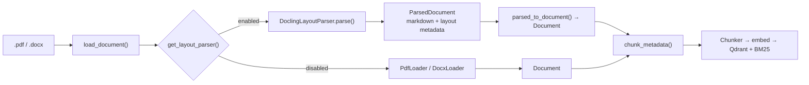

**Docling metadata** (on `Document.metadata` when layout parsing is active):

| Key | Content |
|---|---|
| `sections` | Ordered section headers from the document outline |
| `section` (`CHUNK_SECTION_KEY`) | First section title — promoted onto each chunk via `chunk_metadata()` |
| `tables` | List of `{table_id, text?, page?, bbox?}` entries for downstream table chunking (T-202) |
| `figures` | List of `{figure_id, caption?, page?, bbox?}` entries |
| `page_count` | Total pages detected by Docling |

Document-level keys (`tables`, `figures`, `sections`, `headings`, `slides`) are listed in `LAYOUT_DOCUMENT_METADATA_KEYS` and **stripped** from per-chunk metadata by `chunk_metadata()` so large layout structures are not duplicated on every indexed chunk. Plain DOCX/Markdown loaders also populate `sections`/`headings` and promote the first title to `CHUNK_SECTION_KEY` when layout parsing is off. PPTX loaders additionally attach `slides` (`{title, text}` per slide) for section-boundary chunking.

**Enable layout parsing:**

```bash
# Install Docling (optional runtime dependency — not in base uv sync)
uv pip install docling

# Enable via env or configs/parsing.yaml
PARSING__LAYOUT_PARSER__ENABLED=true
PARSING__LAYOUT_PARSER__PROVIDER=docling

# Re-ingest PDFs/DOCXs to pick up layout metadata
make ingest SOURCE=data/raw/
```

| Component | Location | Role |
|---|---|---|
| `DoclingLayoutParser` | `src/infrastructure/parsers/docling_parser.py` | Docling-backed `LayoutParserRepository` for PDF/DOCX |
| Parser factory | `src/infrastructure/parsers/__init__.py` | `get_layout_parser()` (cached by `(enabled, provider)`), `clear_layout_parser_cache()`, `parsed_to_document()` |
| Loader routing | `src/infrastructure/loaders/__init__.py` | `load_document()` delegates PDF/DOCX to layout parser when enabled |
| Chunk metadata filter | `src/rag/chunking/metadata.py` | `chunk_metadata()` — filters doc-level keys, promotes `CHUNK_SECTION_KEY` |

**Trade-offs:** Docling adds a heavyweight optional dependency and slower ingest for PDF/DOCX compared to plain loaders. Scanned PDFs may yield empty text from plain loaders; enable `parsing.ocr.enabled=true` and re-ingest — see [Scanned-PDF OCR Fallback (T-223)](#scanned-pdf-ocr-fallback-t-223).

**Tests:** `tests/unit/test_docling_parser.py` (parser, metadata extraction, factory cache, settings reload), `tests/unit/test_chunk_metadata.py` (filtering and section promotion), plus routing coverage in `tests/unit/test_loaders.py` and `tests/unit/test_ingestion.py`.

#### Scanned-PDF OCR Fallback (T-223)

When `parsing.ocr.enabled=true`, `IngestionPipeline.ingest_file` recovers text from low-text / empty PDF loads after `load_document`. Detection uses `should_attempt_ocr` / `document_needs_ocr`: extractable text below `parsing.ocr.min_chars` **non-whitespace** characters (every page when `metadata.pages` is present). Whole-file OCR via `get_ocr_provider().ocr(path)` replaces document content and sets `ocr_applied=true`. Born-digital and mixed born-digital + scanned PDFs skip OCR before the provider is constructed. Runtime failures, empty OCR output, and a misconfigured provider (`ConfigurationError`, e.g. missing Azure DI credentials) keep the original text.

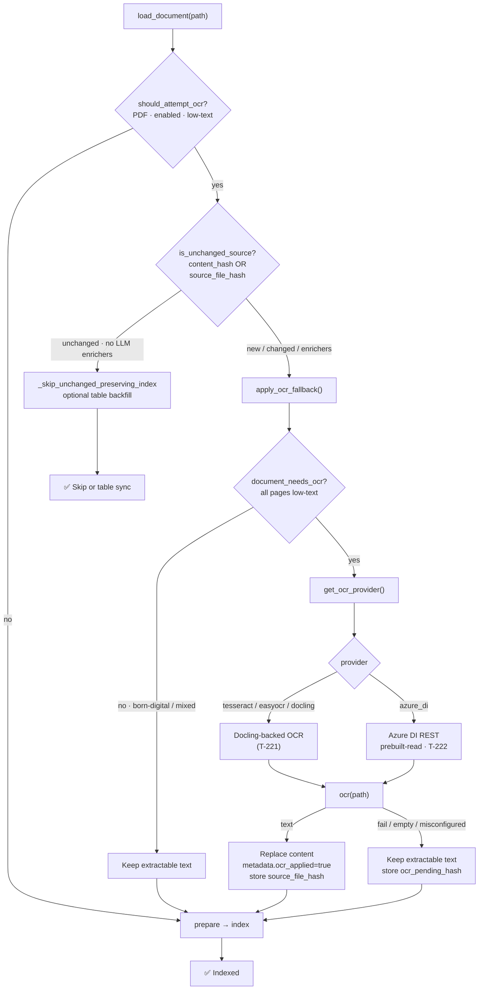

```bash
# Install Docling (OCR engines are Docling-backed — T-221)
uv pip install docling

# Enable OCR fallback (Tesseract CLI by default)
PARSING__OCR__ENABLED=true
PARSING__OCR__PROVIDER=tesseract   # tesseract | easyocr | docling | azure_di
PARSING__OCR__MIN_CHARS=50

# Optional: Azure Document Intelligence (T-222) — see docs/ocr-providers.md
# PARSING__OCR__PROVIDER=azure_di
# PARSING__OCR__AZURE_DI__ENDPOINT=https://<resource>.cognitiveservices.azure.com
# PARSING__OCR__AZURE_DI__API_KEY=<key>

# Re-ingest scanned PDFs (empty scans ingested without OCR re-run after enabling)
make ingest SOURCE=data/raw/
```

```yaml
# configs/parsing.yaml
parsing:
  ocr:
    enabled: false              # T-220–T-223 OCR factory + scanned-PDF fallback
    provider: tesseract         # tesseract | easyocr | docling | azure_di
    min_chars: 50               # non-whitespace char threshold
    azure_di:                   # T-222 credentials (when provider=azure_di)
      endpoint: ""
      api_key: ""
      api_version: "2024-11-30"
      model_id: prebuilt-read
      timeout_seconds: 120
      poll_interval_seconds: 1
```

| Component | Location | Role |
|---|---|---|
| `apply_ocr_fallback` / `should_attempt_ocr` | `src/rag/ingestion/ocr_fallback.py` | Low-text detection + provider call; sets `OCR_APPLIED_KEY` |
| Dual-hash helpers | `src/rag/pipelines/ingestion_pipeline.py` | `source_file_hash`, `ocr_pending_hash`, `is_unchanged_source`, `hash_after_ocr` |
| Skip-path preserve | `IngestionPipeline._skip_unchanged_preserving_index` | Keeps OCR chunks; table backfill when layout tables exist |
| OCR factory | `src/infrastructure/ocr/` | `get_ocr_provider()` — T-220/T-221/T-222; identity cache + `close()` disposal |
| Azure DI provider | `src/infrastructure/ocr/azure_di_provider.py` | REST `prebuilt-read`; polls `Operation-Location` |
| Config | `configs/parsing.yaml` + `OcrSettings` | `enabled`, `provider`, `min_chars`, `azure_di.*` — off by default |

**Dual-hash / skip-path behavior:** Skip detection accepts either text `content_hash` or PDF `source_file_hash` (file bytes), so toggling `parsing.ocr.enabled` / `min_chars` does not wipe OCR-derived chunks or force whole-file OCR over already-indexed extractable text. Successful OCR stores `source_file_hash`; failed OCR stores a pending hash so the next ingest retries. File-keyed scans with OCR disabled (or OCR that fails on reindex) preserve the existing index instead of re-preparing from empty loader text. Empty OCR candidates without layout tables skip table backfill so prior table chunks are not purged as "all removed."

**Trade-offs:** Adds latency only on low-text PDFs. Self-hosted providers require Docling (+ Tesseract CLI for the default); `azure_di` needs Azure credentials and accepts cloud egress instead. Mixed-page PDFs are not overwritten (whole-file OCR only when every page is low-text). Re-ingest after enabling — empty scans previously stored without OCR re-run automatically.

**Tests:** `tests/unit/test_ocr_fallback.py` (detection, pipeline wiring, dual-hash skip/retry, pending hash, file-keyed preserve, table backfill with OCR skip, LLM-enricher reindex without OCR on text-keyed PDFs); `tests/unit/test_ocr_provider.py` (factory, self-hosted, Azure DI HTTP mocks, identity cache / disposal).

#### Figure Asset Extraction & Storage (T-230)

When `parsing.figure_assets.enabled=true`, the ingestion pipeline persists figure image bytes after OCR and before chunking. Sources:

- **Docling PDF/DOCX** — re-exports layout `figures[]` via Docling `generate_picture_images` (`PdfFormatOption` / `WordFormatOption` + `PaginatedPipelineOptions`) and `PictureItem.get_image()`; DOCX also backfills from embedded `python-docx` image parts when Docling is unavailable, conversion fails, or `get_image()` returns no raster bytes, aligning each figure slot in document order (page/bbox match, then remaining order)
- **PPTX** — extracts `MSO_SHAPE_TYPE.PICTURE` blobs from slides, including pictures nested in group shapes (builds `figures[]` when missing)

Assets land under `{store_dir}/{document_key}/{figure_id}.{ext}` (default root `data/assets`, gitignored). Each successful export sets `figures[].asset_path`. `build_figure_chunks()` produces `Chunk` objects with `modality=figure`, `asset_path`, and `metadata.figure_id` (caption text when present; otherwise `[figure]`). Soft-fails per figure / whole-document so ingest continues. Caption VLM enrichment (T-231) runs after assets are stored when enabled; indexing `type=caption` chunks is [Image Caption Chunks (T-232)](#image-caption-chunks-t-232).

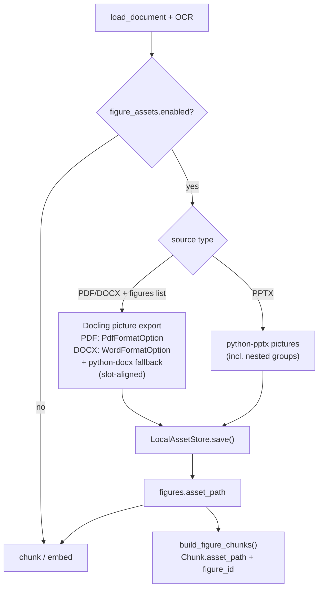

```bash
# PDF/DOCX: enable layout parser so figures[] metadata exists
PARSING__LAYOUT_PARSER__ENABLED=true
PARSING__FIGURE_ASSETS__ENABLED=true
PARSING__FIGURE_ASSETS__STORE_DIR=data/assets

# PPTX works without the layout parser
make ingest SOURCE=data/raw/
```

```yaml
# configs/parsing.yaml
parsing:
  figure_assets:
    enabled: false              # T-230 persist figure bytes + asset_path
    store_dir: data/assets
```

| Component | Location | Role |
|---|---|---|
| `LocalAssetStore` | `src/rag/ingestion/local_asset_store.py` | Writes figure bytes under a local root |
| `apply_figure_assets` / `build_figure_chunks` | `src/rag/ingestion/figure_extractor.py` | Extract, persist, build figure `Chunk`s |
| Pipeline wiring | `IngestionPipeline.ingest_file` | Runs after OCR on full ingest and skip path |
| Config | `configs/parsing.yaml` + `FigureAssetSettings` | `enabled`, `store_dir` — off by default |

**Trade-offs:** PDF/DOCX asset export re-converts with Docling picture images (extra latency; requires `docling`). PPTX extraction is cheap. Assets are storage-only until caption chunks (T-232) or multimodal embeddings (T-250+) index them for retrieval.

**Tests:** `tests/unit/test_local_asset_store.py`; `tests/unit/test_figure_extractor.py` (PPTX incl. nested groups, Docling/DOCX fallback + slot alignment, soft-fail, chunk builders).

**Next steps:** Page-aware chunking (**T-241**) — see [specs/TODO.md](specs/TODO.md).

#### VLM Captioning at Ingest (T-231)

When `parsing.figure_captions.enabled=true`, ingest calls a vision-language model after figure assets are stored and writes captions onto `figures[].caption`. Successful captions are also written next to the asset as `{stem}.caption.txt`, bound to the asset SHA-256; later full or skip-path re-ingests reload a matching sidecar instead of re-calling the VLM, and overwritten assets at the same path re-caption. Providers: OpenAI (`gpt-4o-mini` by default) or Gemini (`gemini-2.0-flash`). Off by default; soft-fails when the VLM is misconfigured or a single figure fails so ingest continues. Requires `figures[].asset_path` from T-230 and `uv sync --extra api-embeddings`.

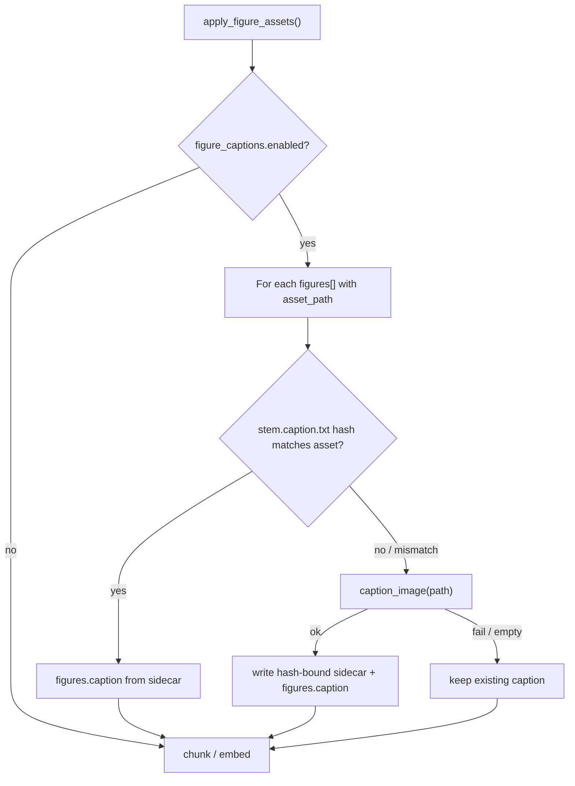

```bash
PARSING__FIGURE_ASSETS__ENABLED=true
PARSING__FIGURE_CAPTIONS__ENABLED=true
PARSING__FIGURE_CAPTIONS__PROVIDER=openai
PARSING__FIGURE_CAPTIONS__OPENAI__API_KEY=sk-...
# or:
# PARSING__FIGURE_CAPTIONS__PROVIDER=gemini
# PARSING__FIGURE_CAPTIONS__GEMINI__API_KEY=...

make ingest SOURCE=data/raw/
```

```yaml
# configs/parsing.yaml
parsing:
  figure_captions:
    enabled: false              # T-231 VLM captions
    provider: openai            # openai | gemini
    openai:
      api_key: ""
      model: gpt-4o-mini
    gemini:
      api_key: ""
      model: gemini-2.0-flash
```

| Component | Location | Role |
|---|---|---|
| `VisionRepository` | `src/domain/repositories/vision_repository.py` | ABC: `caption_image(path) -> str` |
| OpenAI / Gemini providers | `src/infrastructure/vision/` | Chat/vision API clients + factory |
| `apply_figure_captions` | `src/rag/ingestion/figure_captioner.py` | Soft-fail caption enrichment |
| Pipeline wiring | `IngestionPipeline.ingest_file` | Runs after `apply_figure_assets` on full + skip paths |
| Config | `configs/parsing.yaml` + `FigureCaptionSettings` | `enabled`, `provider`, API keys — off by default |

**Trade-offs:** Adds API latency/cost per figure on first caption (or after the asset bytes change / sidecar is deleted). Existing Docling captions are overwritten only when the VLM returns non-empty text. Skip-path re-ingests reuse hash-matching sidecars so captions survive without re-calling the VLM; enable T-232 to index them as retrieval points.

**Tests:** `tests/unit/test_figure_captioner.py`; `tests/unit/test_vision_providers.py`.

**Next steps:** Enable [Image Caption Chunks (T-232)](#image-caption-chunks-t-232) to index captions.

#### Image Caption Chunks (T-232)

When `parsing.caption_chunks.enabled=true`, the ingestion pipeline emits dedicated `type=caption` chunks (with `figure_id`, optional `page`/`bbox`/`asset_path`, `modality=caption`) from non-empty `figures[].caption` values produced by T-231 (or layout captions). Caption chunks are indexed in **both** Qdrant and BM25, mirroring T-202 table chunks.

Chunk IDs are **stable UUIDv5** values derived from `source:figure_id` (resolved file path), so re-ingests and skip-path backfills upsert the same points instead of creating duplicates. Removing a caption purges the prior caption point; embedding failures retain previously indexed caption IDs.

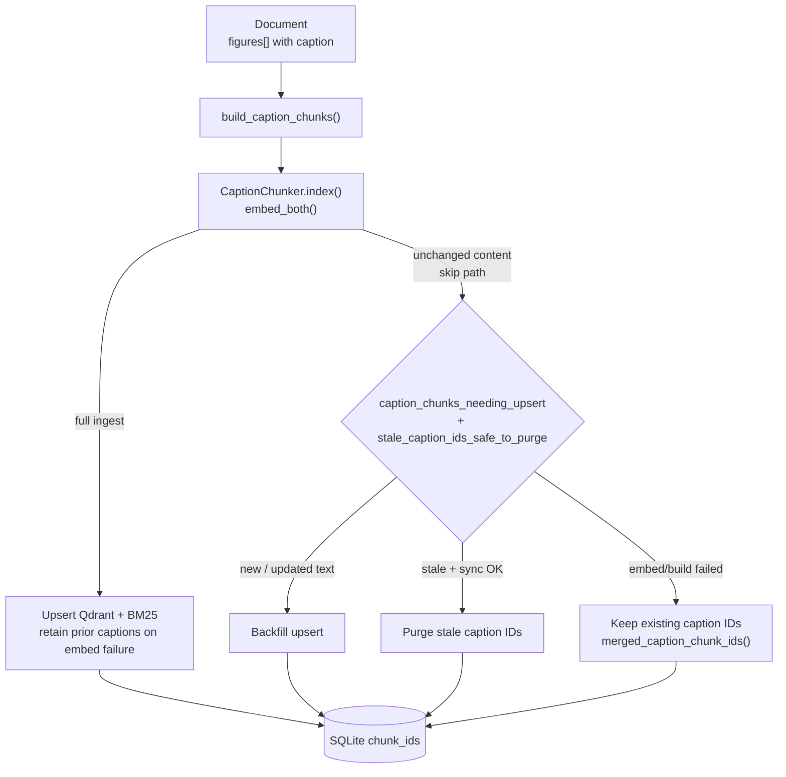

```bash
# Captions from T-231 (or layout) + index as type=caption
PARSING__FIGURE_ASSETS__ENABLED=true
PARSING__FIGURE_CAPTIONS__ENABLED=true
PARSING__CAPTION_CHUNKS__ENABLED=true

make ingest SOURCE=data/raw/
# Unchanged docs backfill missing caption chunks on re-ingest
```

```yaml
# configs/parsing.yaml
parsing:
  caption_chunks:
    enabled: false              # T-232 structured type=caption chunks
```

| Component | Location | Role |
|---|---|---|
| `build_caption_chunks` / `CaptionChunker` | `src/rag/ingestion/caption_chunker.py` | Build + embed `CHUNK_TYPE_CAPTION` points; stable `caption_chunk_id()` |
| Shared sync helpers | `src/rag/ingestion/structured_chunk_sync.py` | Shared build/embed/upsert helpers for tables + captions |
| Caption sync wrappers | `src/rag/ingestion/caption_chunker.py` | `caption_chunks_needing_upsert`, `retained_caption_chunk_ids_on_embed_failure`, `merged_caption_chunk_ids`, `stale_caption_ids_safe_to_purge` |
| Pipeline wiring | `src/rag/pipelines/ingestion_pipeline.py` | `_build_caption_chunker()`, full-path index + `_backfill_caption_chunks_on_skip()` |
| Config | `configs/parsing.yaml` + `CaptionChunkSettings` | `parsing.caption_chunks.enabled` — off by default |

**Skip-path behavior:** When content hash is unchanged and no LLM enrichers force a full reindex, the pipeline still builds/embeds caption chunks, upserts only new or text-changed captions, and purges stale caption IDs only after a successful build+embed sync. Failed embeds retain previously indexed caption points. Figures without captions are skipped (not treated as build failures); caption removal purges the prior caption point when sync succeeds.

**Trade-offs:** Adds one embedded point per captioned figure (Qdrant + BM25). Requires captions to exist first (T-231 recommended). Skip-path backfill is skipped when LLM enrichers are enabled (those require a full `prepare()`). Re-ingest after enabling — unchanged documents backfill missing caption chunks automatically.

**Tests:** `tests/unit/test_caption_chunker.py` (chunk building, stable IDs, skip-path backfill/purge, embed-failure retention, pipeline integration).

**Next steps:** Page-aware chunking (**T-241**) — see [specs/TODO.md](specs/TODO.md).

#### Structured Table Chunks at Ingest (T-202)

When `parsing.table_chunks.enabled=true`, the ingestion pipeline emits dedicated `type=table` chunks (with `table_id`, optional `page`/`bbox`) alongside regular text chunks. Table text comes from Docling layout metadata (`tables[].text`) or, as a fallback, markdown tables parsed from document content. Table chunks are indexed in **both** Qdrant and BM25 (unlike HyPE/summary extras).

Chunk IDs are **stable UUIDv5** values derived from `source:table_id` (resolved file path), so re-ingests and skip-path backfills upsert the same points instead of creating duplicates.

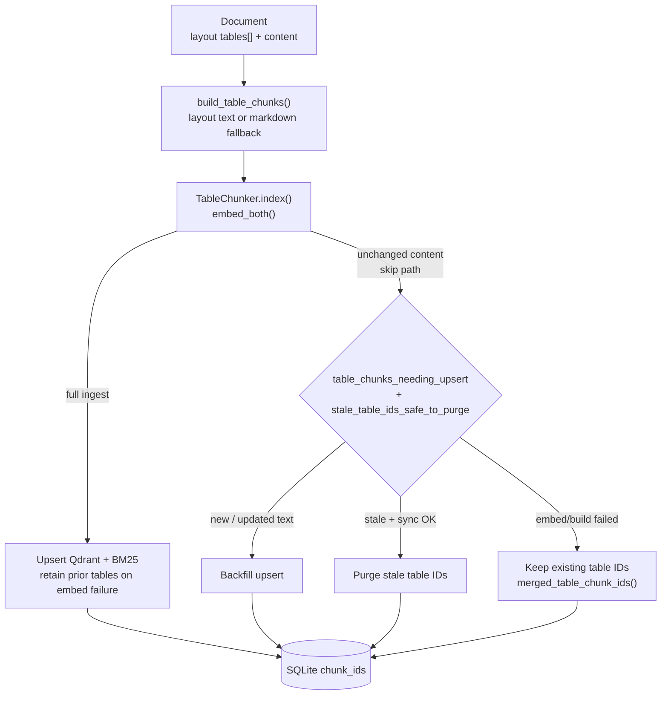

```bash
# Requires layout metadata from T-200 (enable layout parser first)
PARSING__LAYOUT_PARSER__ENABLED=true
PARSING__TABLE_CHUNKS__ENABLED=true

# Re-ingest to pick up table chunks (unchanged docs backfill missing tables)
make ingest SOURCE=data/raw/
```

```yaml
# configs/parsing.yaml
parsing:
  table_chunks:
    enabled: false              # T-202 structured type=table chunks at ingest
```

| Component | Location | Role |
|---|---|---|
| `TableChunker` / `build_table_chunks()` | `src/rag/ingestion/table_chunker.py` | Builds and embeds `CHUNK_TYPE_TABLE` index points; stable `table_chunk_id()` |
| Shared sync helpers | `src/rag/ingestion/structured_chunk_sync.py` | Shared build/embed/upsert helpers for tables + captions |
| Table sync wrappers | `src/rag/ingestion/table_chunker.py` | `table_chunks_needing_upsert`, `retained_table_chunk_ids_on_embed_failure`, `merged_table_chunk_ids`, `stale_table_ids_safe_to_purge` |
| Pipeline wiring | `src/rag/pipelines/ingestion_pipeline.py` | `_build_table_chunker()`, full-path index + `_backfill_table_chunks_on_skip()` |
| Docling table text | `src/infrastructure/parsers/docling_parser.py` | `tables[].text` via `export_to_markdown()` |
| Config | `configs/parsing.yaml` + `TableChunkSettings` | `parsing.table_chunks.enabled` — off by default |

**Skip-path behavior:** When content hash is unchanged and no LLM enrichers (augmentation / HyPE / hierarchical) force a full reindex, the pipeline still builds/embeds table chunks, upserts only new or text-changed tables, and purges stale table IDs only after a successful build+embed sync. Failed embeds retain previously indexed table points so a transient embedding error does not wipe tables. Empty OCR candidates (T-223) without layout `tables[]` skip backfill so prior table chunks are not treated as removed.

**Trade-offs:** Needs T-200 layout `tables[]` (or markdown tables in content as fallback). Extra embed calls proportional to table count. Skip-path backfill is skipped when LLM enrichers are enabled (those require a full `prepare()`). Re-ingest after enabling — unchanged documents backfill missing table chunks automatically.

**Tests:** `tests/unit/test_table_chunker.py` (chunk building, markdown fallback, stable IDs, skip-path backfill/purge, embed-failure retention, pipeline integration).

#### Multimodal Domain Model (T-210)

Phase 21 extends domain entities for multimodal retrieval and attribution. No feature flag — defaults preserve text-only behavior. Ingestion and API wiring land in later phases (T-230+, T-272).

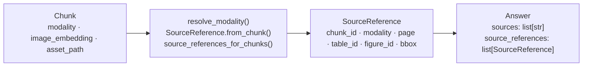

| Artifact | Location | Role |
|---|---|---|
| `SourceReference` | `src/domain/entities/source_reference.py` | Frozen citation with modality + layout provenance |
| `resolve_modality` | same | Maps explicit modality / `metadata.type` → modality label |
| `Chunk` multimodal fields | `src/domain/entities/chunk.py` | `modality` (default `text`), `image_embedding`, `asset_path` |
| `Answer.source_references` | `src/domain/entities/answer.py` | Optional structured citations alongside `sources` |
| Modality constants | `src/core/constants.py` | `MODALITY_*`, `KNOWN_MODALITIES`, `CHUNK_TYPE_TO_MODALITY`, `ASSET_PATH_KEY` |

**Backward compatibility:** Existing `Answer(sources=[...])` callers need no changes. Table chunks that only set `metadata.type=table` still resolve to `modality=table` via `SourceReference.from_chunk`. `image_embedding` / `asset_path` stay `None` until figure extraction (T-230) and multimodal embeddings (T-250+).

**Tests:** `tests/unit/test_source_reference.py` (helpers, round-trips, inference from metadata, Answer wiring); entity defaults also covered in `tests/unit/test_entities.py`.

**Next steps:** Page-aware chunking (**T-241**) — see [specs/TODO.md](specs/TODO.md).

### Start the API Server

```bash
make serve
# Server starts at http://localhost:8000
# Interactive docs: http://localhost:8000/docs
```

### Chat

**Streaming (SSE):**
```bash
curl -X POST http://localhost:8000/chat \
  -H "Content-Type: application/json" \
  -d '{"question": "How do IAM roles work in EKS?"}' \
  --no-buffer
```

**Non-streaming:**
```bash
curl -X POST http://localhost:8000/chat/full \
  -H "Content-Type: application/json" \
  -d '{"question": "How do IAM roles work in EKS?"}'
```

**Non-streaming with retrieval explanations:**
```bash
curl -X POST "http://localhost:8000/chat/full?explain=true" \
  -H "Content-Type: application/json" \
  -d '{"question": "What was Q3 revenue?"}'
```

**Non-streaming with source highlights:**
```bash
curl -X POST "http://localhost:8000/chat/full?highlights=true" \
  -H "Content-Type: application/json" \
  -d '{"question": "What was Q3 revenue?"}'
```

**Non-streaming with both explanations and highlights** (one combined LLM call when both succeed; dedicated fallbacks otherwise):
```bash
curl -X POST "http://localhost:8000/chat/full?explain=true&highlights=true" \
  -H "Content-Type: application/json" \
  -d '{"question": "What was Q3 revenue?"}'
```

Example response (excerpt):
```json
{
  "answer": "Q3 revenue was $12.4M...",
  "sources": ["chunk-abc", "chunk-def"],
  "latency_ms": 3100.2,
  "token_count": 48,
  "explanations": [
    {
      "chunk_id": "chunk-abc",
      "reason": "Contains the Q3 revenue figure and year-over-year comparison cited in the answer."
    },
    {
      "chunk_id": "chunk-def",
      "reason": "Provides regional breakdown that supports the total revenue claim."
    }
  ],
  "highlights": {
    "chunk-abc": ["Q3 revenue was $12.4M, up 12% year over year."],
    "chunk-def": ["North America contributed $7.1M of the total."]
  }
}
```

> `explain` and `highlights` default to `false`. When disabled or when post-generation steps cannot produce output, the corresponding fields are omitted (`response_model_exclude_none`). Streaming `/chat` and agent endpoints do not support explanations or highlights — use `/chat/full`.

#### Scoped retrieval filters (T-134)

Both `/chat` and `/chat/full` accept optional filter fields on the request body. Omit them for unchanged default behavior.

| Field | Type | Effect |
|---|---|---|
| `document_ids` | `list[str]` | Restrict hits to chunks belonging to these documents |
| `metadata_filters` | `dict[str, str]` | Exact-match filters on chunk metadata (e.g. `source`, `section`) |
| `min_score` | `float` (0–1) | Drop dense/Qdrant hits below this cosine similarity threshold |

```bash
# Scope to two documents and require strong dense matches
curl -X POST http://localhost:8000/chat/full \
  -H "Content-Type: application/json" \
  -d '{
    "question": "What was Q3 revenue?",
    "document_ids": ["annual-report-2023", "investor-deck-q3"],
    "metadata_filters": {"section": "revenue"},
    "min_score": 0.72
  }'
```

Filters are applied consistently across hybrid retrieval:

- **Dense / HyPE / HyDE / hierarchical** — Qdrant payload filters at search time; `min_score` applied post-search on cosine scores
- **BM25** — document scope and metadata enforced during lexical ranking (`min_score` is not applied — BM25 scores use a different scale)
- **Graph RAG** — out-of-scope chunks dropped after entity→chunk lookup

Synthetic-question hits (T-121) are resolved to source chunks first; filters are re-checked on the resolved chunk so scoped queries cannot leak via augmentation.

> Agent endpoints (`/chat/agent`, `/chat/agent/full`) do not yet accept filter fields — use standard chat for scoped retrieval.

#### Corrective RAG in standard chat (T-142)

When `quality.crag.enabled=true`, standard chat (`/chat`, `/chat/full`) and the E2E benchmark run an optional **Corrective RAG** step after retrieval and before generation. The step uses mean `relevance_score` from Reliable RAG (T-140) metadata on retrieved chunks to choose a branch — so **enable Reliable RAG first** or CRAG skips correction and passes retrieval context through unchanged.

| Branch | When | Generation context |
|---|---|---|
| `use_retrieval` | Mean score **>** `upper_threshold` | Retrieved context as-is |
| `combine_and_refine` | Score between thresholds | LLM merges retrieval + web results |
| `web_only` | Mean score **<** `lower_threshold` | LLM refines web results only (sources cleared) |

Configure thresholds in `configs/retrieval.yaml` and a web provider in `configs/web_search.yaml`. See the full flow, providers, fallbacks, and benchmark behavior in [Corrective RAG — Web Search Fallback (T-142)](#corrective-rag--web-search-fallback-t-142).

> Agent endpoints (`/chat/agent`, `/chat/agent/full`) do not run CRAG — use Self-RAG (T-141) for agent-side quality gates.

#### Explainable retrieval in standard chat (T-143)

`POST /chat/full` accepts an optional query parameter `explain=true`. After the answer is generated, the pipeline runs an LLM call that returns a human-readable reason for each source chunk ID in `sources`.

When highlighting is also requested (`?highlights=true` or `quality.source_highlighting.enabled`), the pipeline tries `explain_and_highlight()` first (one combined call). If explanations are still missing, it falls back to `explain_chunks()`.

Explanations use the same passage text the generator saw — `chunk_context_text()` after optional enrichment (parent context, RSE merges, contextual headers `raw_text`). Sibling child chunks that share expanded parent context are grouped into one passage for the explain prompt; the returned reason is replicated for each citation ID in that group.

| Condition | Behavior |
|---|---|
| `explain=false` (default) | No explain LLM call; `explanations` omitted |
| `explain=true`, sources present, highlight not requested | One `explain_chunks` LLM call → one reason per source chunk |
| `explain=true` and highlighting requested | Combined `explain_and_highlight` call first; `explain_chunks` fallback if explanations still empty |
| CRAG refines context (web merge, not fallback) | Explanations omitted — chunk text no longer matches what generation used |
| CRAG falls back to retrieval context | Explanations still generated from retrieved chunks |
| LLM or parse failure (including after fallback) | `explanations` omitted; answer still returned |

See [Explainable Retrieval (T-143)](#explainable-retrieval-t-143) in Retrieval Pipeline Details for the full flow diagram and implementation notes.

#### Source highlighting in standard chat (T-144)

`POST /chat/full` accepts `?highlights=true` per request, or you can enable highlighting for all `/chat/full` calls via `quality.source_highlighting.enabled: true` in `configs/retrieval.yaml`. After generation, a structured LLM call identifies supporting sentence spans in each cited passage.

When explain is also requested (`?explain=true`), the pipeline tries `explain_and_highlight()` first (one combined call). If highlights are still missing, it falls back to `extract_highlights()`.

**Passage text contract:** spans are validated as substrings of `chunk_context_text()` — the same text the generator and highlight prompt see (parent context, RSE merges, CCH `raw_text`). They are keyed by citation chunk ID but may not appear in `Chunk.text` when sibling children share expanded parent context. UI clients must search spans in `chunk_context_text`, not embedded slice text alone.

| Condition | Behavior |
|---|---|
| `highlights=false` and config disabled (default) | No highlight LLM call; `highlights` omitted |
| `highlights=true` or config enabled, sources present, explain not requested | One `extract_highlights` LLM call → span lists per source chunk |
| highlighting requested and `explain=true` | Combined `explain_and_highlight` call first; `extract_highlights` fallback if highlights still empty |
| `?explain=true` with `quality.source_highlighting.enabled=true` | Treated as both requested — combined path, with per-side fallbacks |
| CRAG refines context (web merge, not fallback) | Highlights omitted — same gate as explanations |
| LLM or parse failure (including after fallback) | `highlights` omitted; answer still returned |

```yaml
# configs/retrieval.yaml
quality:
  source_highlighting:
    enabled: false   # set true to attach highlights on every /chat/full call
```

See [Source Highlighting (T-144)](#source-highlighting-t-144) in Retrieval Pipeline Details.

#### Retrieval feedback (T-145)

When `quality.feedback_loop.enabled=true`, clients can submit relevance votes on retrieved chunks via `POST /feedback`. Use `query_id` and source chunk IDs from a `/chat/full` response (`Answer.query_id`, `Answer.sources`). Positive votes add `+1.0` to the chunk's accumulated `feedback_score`; negative votes subtract `1.0`. Scores persist in Qdrant chunk metadata and boost future retrieval for that chunk (additive boost after RRF fusion and again after cross-encoder reranking so feedback survives reranking).

| Condition | Behavior |
|---|---|
| `quality.feedback_loop.enabled=false` (default) | `POST /feedback` still records scores in Qdrant, but retrieval does not apply boosts |
| Boost enabled, chunk has positive `feedback_score` | Fused RRF / reranker scores increased by `boost_multiplier × feedback_score` |
| Chunk not found in Qdrant | `404` |
| Vector store error | `502` |
| Success | `204 No Content` |

```yaml
# configs/retrieval.yaml
quality:
  feedback_loop:
    enabled: false         # set true to apply feedback boost during retrieval
    boost_multiplier: 0.05 # additive boost per unit of positive feedback_score
    backend: qdrant        # qdrant | redis | postgres (T-146)
    postgres_url: ""       # SQLite file path when backend=postgres
```

```bash
# After POST /chat/full — use query_id and a source chunk_id from the response
curl -X POST http://localhost:8000/feedback \
  -H "Content-Type: application/json" \
  -H "X-API-Key: $API_KEY" \
  -d '{"query_id": "<query_id>", "chunk_id": "<chunk_id>", "relevant": true}'
```

See [Retrieval Feedback Loop (T-145)](#retrieval-feedback-loop-t-145) and [Multi-Replica Feedback (T-146)](#multi-replica-feedback-t-146) in Retrieval Pipeline Details. Enable [API Rate Limiting (T-160)](#api-rate-limiting-t-160) before exposing `/feedback` on a public API with HPA ≥ 2.

**Python client:**
```python
import httpx, json

with httpx.Client() as client:
    with client.stream("POST", "http://localhost:8000/chat",
                       json={"question": "What is EKS?"}) as r:
        for line in r.iter_lines():
            if line.startswith("data: ") and line != "data: [DONE]":
                token = json.loads(line[6:])["token"]
                print(token, end="", flush=True)
```

**Agentic RAG (multistep retrieval — streaming):**
```bash
curl -X POST http://localhost:8000/chat/agent \
  -H "Content-Type: application/json" \
  -d '{"question": "How do IAM roles work in EKS?", "max_iterations": 3}' \
  --no-buffer
```

**Agentic RAG (full response with iteration metadata):**
```bash
curl -X POST http://localhost:8000/chat/agent/full \
  -H "Content-Type: application/json" \
  -d '{"question": "How do IAM roles work in EKS?", "max_iterations": 3}'
```

Example response from `/chat/agent/full` (standard agent loop — `quality.self_rag.enabled=false`):
```json
{
  "answer": "...",
  "sources": ["chunk-id-1", "chunk-id-2"],
  "latency_ms": 4200.5,
  "token_count": 312,
  "iterations": 2,
  "actions": ["RETRIEVE_MORE", "ANSWER"],
  "self_rag_decisions": []
}
```

With Self-RAG enabled (`quality.self_rag.enabled=true`), the same endpoint adds a populated `self_rag_decisions` array (one object per iteration) with `need_retrieval`, `supported`, `utility_score`, `utility_action`, and optional `refined_query`. See [Self-RAG Decision Loop (T-141)](#self-rag-decision-loop-t-141).

See [Agentic RAG](#agentic-rag) for action types and when to use the agent endpoints vs standard chat.

### Run Evaluations

Golden eval datasets live under `datasets/goldens/`. The repo ships a starter corpus (22 QA pairs); regenerate from your own ingested documents before production benchmarking.

```bash
# 1. Ingest documents (prerequisite — populates BM25 + Qdrant)
make ingest SOURCE=data/raw/

# 2. Generate ≥ 20 evaluable QA pairs (auto-syncs retrieval goldens)
make evals

# 3. Re-sync retrieval rows after manual QA edits (no LLM regeneration)
make sync-retrieval-goldens

# With options
uv run python scripts/run_evals.py \
  --n-pairs 5 \
  --min-pairs 20 \
  --max-chunks 100
```

`make evals` writes:

| File | Purpose |
|------|---------|
| `datasets/goldens/qa_dataset.json` | End-to-end RAG benchmark (`POST /evals/run`, `make benchmark`) |
| `datasets/goldens/retrieval_dataset.json` | Retrieval-only Recall@K regression (`tests/benchmarks/test_retrieval_evals.py`) |
| `datasets/goldens/retrieval_baseline.json` | Committed regression thresholds (`min_samples`, `min_recall_at_5`) for CI |

Placeholder rows (e.g. `chunk-placeholder-1`) are filtered at generation and eval time via `src/evals/golden_dataset.py`. `make sync-retrieval-goldens` rebuilds `retrieval_dataset.json` from evaluable QA rows when you edit QA goldens by hand.

See [Golden Dataset & Eval Regression Gates (T-152)](#golden-dataset--eval-regression-gates-t-152) for the full workflow and CI gate behavior.

### Rebuild Embeddings

Use this when you switch to a different embedding model or need to recover a corrupted Qdrant collection. The BM25 index (which persists chunk text) is used as the source of truth. Works with any provider — self-hosted or API-based.

```bash
# Preview: count chunks without writing anything
uv run python scripts/rebuild_embeddings.py --dry-run

# Full rebuild using current embedding model from configs/embeddings.yaml
uv run python scripts/rebuild_embeddings.py

# Start fresh: drop Qdrant collection, re-embed everything
uv run python scripts/rebuild_embeddings.py --recreate-collection

# Custom batch size (default: 32; API providers default to 32 with rate-limit pacing)
uv run python scripts/rebuild_embeddings.py --batch-size 16
```

> **Model mismatch guard:** Before writing, the script checks the collection's tracked `embedding_model_name` (collection metadata, or the first tagged point on legacy collections). If it differs from the current config — including API model or dimension changes — the script aborts with a clear error. Use `--recreate-collection` to re-index from scratch.

> **Memory-safe chunk iteration (T-165):** `rebuild_embeddings.py`, `run_evals.py`, and `compare_embedding_providers.py` stream chunks via `BM25Index.iter_chunks()` instead of loading the full corpus into RAM — required for the disk backend on large indexes. Per-size eval caches (`data/chunks/{size}/bm25_index.json`) still use the JSON memory index via `BM25Retriever.from_disk()`.

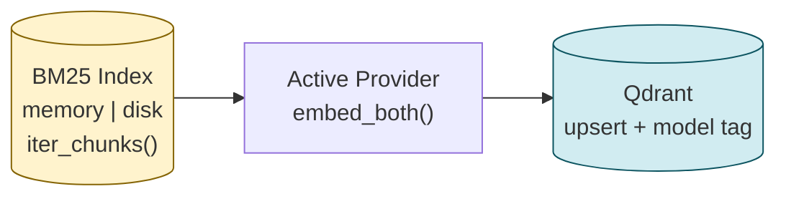

### Run Evaluations via API

Once documents are ingested and `make evals` has generated the golden QA dataset, the live endpoint runs the full benchmark:

```bash
curl -X POST http://localhost:8000/evals/run
```

**Response when QA dataset is empty** (`204 No Content`):
```
QA dataset is empty — generate samples with `make evals` first.
```

**Response when QA pairs are present** (`200 OK`):
```json
{
  "status": "passed",
  "timestamp": "20250623T143012",
  "total_samples": 42,
  "mean_recall_at_5": 0.81,
  "mean_faithfulness": 0.88,
  "mean_relevance": 0.84,
  "passed": true,
  "report_path": "data/exports/benchmark_20250623T143012.json",
  "message": "All metrics above threshold ✓"
}
```

The report is also saved to `data/exports/` for offline analysis.

### Benchmark

```bash
# End-to-end RAG benchmark (exits 0 if all metrics above threshold)
make benchmark

# With a specific LLM profile
uv run python scripts/benchmark.py \
  --llm-config configs/llm/qwen3-14b.yaml

# With custom thresholds
uv run python scripts/benchmark.py \
  --recall-threshold 0.5 \
  --faith-threshold 0.8 \
  --relev-threshold 0.75
```

For infrastructure latency baselines (streaming, concurrency, BM25 @ 100K, graph) rather than RAG quality metrics, use `make benchmark-infra` — see [Infrastructure Performance Baseline (T-172)](#infrastructure-performance-baseline-t-172).

### Compare Models

Run the same benchmark against multiple LLM profiles and see a side-by-side results table:

```bash
uv run python scripts/compare_models.py \
  --configs configs/llm/qwen3-30b.yaml \
           configs/llm/qwen3-14b.yaml \
           configs/llm/ollama-glm52.yaml \
  --max-samples 50
```

**Output:**

```
┌─────────────────────────────────────────────────────────────────────┐
│                        Model Comparison                             │
├──────────────────────┬──────────┬─────────────┬──────────┬─────────┤
│ Model                │ Recall@5 │ Faithfulness │ Relevance│ Status  │
├──────────────────────┼──────────┼─────────────┼──────────┼─────────┤
│ models/llm/qwen3-30b │  0.821   │    0.883     │  0.847   │ PASS ✓  │
│ models/llm/qwen3-14b │  0.798   │    0.861     │  0.822   │ PASS ✓  │
│ glm4:latest          │  0.774   │    0.840     │  0.801   │ PASS ✓  │
└──────────────────────┴──────────┴─────────────┴──────────┴─────────┘
```

The winning model is determined by real evaluation data — Faithfulness + Relevance + Recall@5 + Context Precision on **your** documents, not generic benchmarks.

When Corrective RAG (T-142) is enabled, benchmark faithfulness and context precision score against the **same context generation used** — raw chunk texts for standard retrieval, a single refined passage after web correction, or an empty context list when CRAG could not supply usable information (matching the *"I don't have information about this."* no-info reply).

---

### Compare RAG Techniques (T-150)

Benchmark optional retrieval and quality techniques **independently** on the same golden QA dataset. Each run applies a single technique via env overrides (baseline disables all Phase 11–14 flags first), rebuilds the pipeline from reloaded settings, and scores Recall@5, Faithfulness, Relevance, and end-to-end latency.

```bash
# Default matrix: baseline, multi_query, hyde, cch, reliable_rag, feedback_loop
make benchmark-techniques

# Custom technique list and sample cap
uv run python scripts/benchmark_techniques.py \
  --techniques baseline,multi_query,hyde,cch,reliable_rag,self_rag,feedback_loop \
  --max-samples 50

# Swap LLM profile before the matrix (same as make benchmark)
uv run python scripts/benchmark_techniques.py \
  --llm-config configs/llm/qwen3-14b.yaml \
  --techniques baseline,reliable_rag
```

**Techniques** (defined in `configs/evals.yaml` → `evals.technique_benchmark.configs`):

| Technique | What it toggles | Pipeline |
|---|---|---|
| `baseline` | All optional techniques off | `ChatPipeline` |
| `multi_query` | `query_expansion.enabled` + 3 variants | `ChatPipeline` |
| `hyde` | `retrieval.hyde.enabled` | `ChatPipeline` |
| `cch` | Contextual compression | `ChatPipeline` |
| `reliable_rag` | LLM relevancy grading (T-140) | `ChatPipeline` |
| `self_rag` | Self-RAG gates (T-141) | `AgentPipeline` |
| `feedback_loop` | Pre-seeds chunk feedback, compares Recall@5 with boost off vs on | `ChatPipeline` |

The `feedback_loop` technique uses `temporary_feedback_seed` to write positive scores for golden `relevant_chunks`, then runs two passes at identical fusion pool size (`expand_candidate_pool=false`): boost disabled, then boost enabled. Original scores are restored after the run.

**Output:**

```
┌────────────────────────────────────────────────────────────────────────────┐
│                        RAG Technique Comparison                            │
├──────────────────┬──────────┬──────────────┬───────────┬────────────┬───────┤
│ Technique        │ Recall@5 │ Faithfulness │ Relevance │ Latency ms │ Status│
├──────────────────┼──────────┼──────────────┼───────────┼────────────┼───────┤
│ baseline         │  0.742   │    0.861     │   0.822   │   1840.2   │  OK   │
│ multi_query      │  0.798   │    0.874     │   0.841   │   2210.5   │  OK   │
│ reliable_rag     │  0.781   │    0.902     │   0.858   │   2455.1   │  OK   │
│ feedback_loop    │  0.812   │    0.868     │   0.835   │   1920.0   │  OK   │
└──────────────────┴──────────┴──────────────┴───────────┴────────────┴───────┘
```

When the golden file contains only placeholder `chunk_id_*` rows, the script exits 0 with a skip report (populate real pairs via `make evals` first). Full results save to `data/exports/technique_benchmark_{timestamp}.json`.

---

### Chunk Size Optimization Sweep (T-151)

Sweep configured `chunk_size` values and recommend the best for your corpus. Each size runs in isolation: a dedicated Qdrant collection (`rag_documents_cs{size}`), per-size BM25 index, and optional on-disk chunk cache under `data/chunks/{size}/`. The sweep scores Recall@5, Faithfulness, Relevance, and end-to-end latency, then ranks sizes by a weighted score (defaults in `configs/evals.yaml` → `evals.chunk_size_sweep.weights`).

```bash
# Preview planned steps (collections, cache paths, actions) without executing
uv run python scripts/benchmark_chunk_sizes.py --dry-run

# Full sweep — requires real golden QA pairs and an ingest source when cache is cold
uv run python scripts/benchmark_chunk_sizes.py \
  --ingest-source data/raw/ \
  --max-samples 20

# Or use the Makefile default (no extra flags)
make benchmark-chunk-sizes

# Custom sizes and force re-chunk from source (ignores cached chunks)
uv run python scripts/benchmark_chunk_sizes.py \
  --sizes 256,500,768 \
  --ingest-source data/raw/ \
  --force-rechunk \
  --max-samples 50

# Swap LLM profile before the sweep (same as make benchmark)
uv run python scripts/benchmark_chunk_sizes.py \
  --llm-config configs/llm/qwen3-14b.yaml \
  --ingest-source data/raw/
```

**Per-size workflow** (see flow diagram in [Evaluation Framework](#evaluation-framework)):

| Step | What happens |
|---|---|
| Chunk | Load `data/chunks/{size}/chunks.json` cache, or chunk `--ingest-source` at the target size |
| Index | Embed chunks, `recreate_collection()` on the per-size Qdrant collection, upsert + rebuild BM25 |
| Evaluate | Run `ChatPipeline` against golden QA pairs; remap `relevant_chunks` when chunk boundaries shift |
| Recommend | Weighted score across Recall@5, Faithfulness, Relevance, and normalized latency |

**Output:**

```
┌──────────────────────────────────────────────────────────────────────────────┐
│                         Chunk Size Comparison                                │
├────────────┬──────────┬──────────────┬───────────┬────────────┬──────────────┤
│ Chunk Size │ Recall@5 │ Faithfulness │ Relevance │ Latency ms │ Weighted     │
├────────────┼──────────┼──────────────┼───────────┼────────────┼──────────────┤
│ 256        │  0.712   │    0.841     │   0.802   │   1620.4   │   0.782      │
│ 500 ★      │  0.768   │    0.878     │   0.835   │   1785.1   │   0.841      │
│ 768        │  0.754   │    0.862     │   0.821   │   1942.8   │   0.809      │
│ 1024       │  0.731   │    0.849     │   0.814   │   2105.3   │   0.776      │
└────────────┴──────────┴──────────────┴───────────┴────────────┴──────────────┘

Recommended chunk_size: 500
```

When the golden file contains only placeholder `chunk_id_*` rows, the script exits 0 with a skip report (populate real pairs via `make evals` first). `--dry-run` always succeeds and writes the planned sweep to `data/exports/chunk_size_sweep_{timestamp}.json`. Full results use the same path pattern.

**Default sizes** (defined in `configs/evals.yaml` → `evals.chunk_size_sweep.sizes`): `256`, `500`, `768`, `1024`.

---

### Infrastructure Performance Baseline (T-172)

Establish infrastructure latency baselines for Phase 16 optimization work: LLM streaming inter-token delay, concurrent chat event-loop health, disk BM25 search at 100K chunks (memory + latency), and Neo4j graph retrieval. `InfraBenchmark` (`src/evals/e2e/infra_benchmark.py`) orchestrates scenarios; the CLI is `scripts/benchmark_infra.py`. Scenario 5 — concurrent feedback on the same `chunk_id` across simulated API pods — lives in `tests/benchmarks/test_feedback_concurrency.py` (T-146).

**Workflow** (see also [Evaluation Framework](#evaluation-framework)):

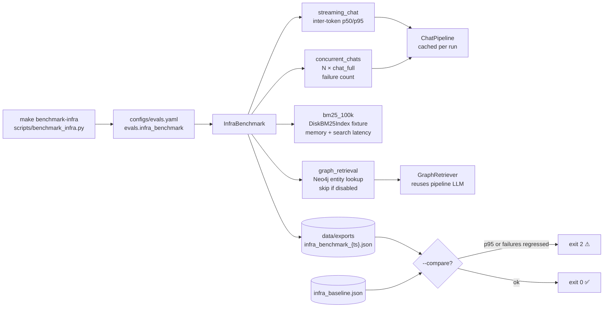

```bash
# Default scenarios: streaming_chat, concurrent_chats, bm25_100k, graph_retrieval
make benchmark-infra

# Compare against committed baseline (exit 2 on regression)
uv run python scripts/benchmark_infra.py --compare

# Refresh committed baseline after a full live run (merges into existing entries)
uv run python scripts/benchmark_infra.py --save-baseline

# Run a subset (BM25 only — no LLM/Qdrant required)
uv run python scripts/benchmark_infra.py --scenarios bm25_100k

# Swap LLM profile before pipeline scenarios (same as make benchmark)
uv run python scripts/benchmark_infra.py --llm-config configs/llm/qwen3-14b.yaml

# Optional live integration tests (skipped in CI by default)
RUN_INFRA_BENCHMARK=1 uv run pytest tests/benchmarks/test_infra_benchmark.py -v -s

# Fast unit coverage (no live services)
uv run pytest tests/unit/test_infra_benchmark.py tests/unit/test_benchmark_infra_cli.py -v
```

**Scenarios** (thresholds in `configs/evals.yaml` → `evals.infra_benchmark`):

| Scenario | What it measures |
|---|---|
| `streaming_chat` | Inter-token p50/p95 on a single streamed `chat()` (time-to-first-token excluded) |
| `concurrent_chats` | End-to-end latency for N parallel `chat_full` calls; failure count |
| `bm25_100k` | Temp `DiskBM25Index` build + search on a 100K-chunk fixture; resident memory |
| `graph_retrieval` | Neo4j entity lookup latency (skipped when graph is disabled/unreachable) |
| *(scenario 5)* | Concurrent feedback CAS — `tests/benchmarks/test_feedback_concurrency.py` |

**Default thresholds** (`configs/evals.yaml` → `evals.infra_benchmark`):

| Key | Default | Purpose |
|---|---|---|
| `regression_p95_pct` | `10` | `--compare` warns when p95 increases more than this % vs baseline |
| `concurrent_chat_count` | `10` | Parallel `chat_full` requests in scenario 2 |
| `concurrent_chat_timeout_s` | `120` | Per-request generation budget; batch timeout scales × N for serialized LLM |
| `bm25_fixture_chunks` | `100000` | Fixture corpus size for `bm25_100k` |
| `bm25_search_iterations` | `20` | Search repetitions measured for p50/p95 |
| `graph_search_iterations` | `10` | Graph lookup repetitions |
| `baseline_path` | `data/exports/infra_baseline.json` | Committed comparison file |

**Exit codes:**

| Code | Meaning |
|---|---|
| `0` | Run completed; `--compare` found no regressions |
| `1` | CLI or runtime error |
| `2` | `--compare` detected p95 regression (>10%), failure-count increase, or a baselined scenario skipped/errored |

**Output:** Rich summary table + `data/exports/infra_benchmark_{timestamp}.json`. Committed comparison baseline: `data/exports/infra_baseline.json` (BM25 captured at 100K chunks; refresh streaming/concurrent/graph entries via `--save-baseline` on your target hardware — merges without dropping unrelated scenario entries).

**Implementation notes:** `ChatPipeline.chat_full` and `AgentPipeline.chat_full` offload blocking LLM work via `asyncio.to_thread` so concurrent chat scenarios measure event-loop health under parallel requests. `InfraBenchmark` caches one pipeline per run and reuses its LLM for `GraphRetriever` when available. The concurrent batch deadline is `concurrent_chat_timeout_s × concurrent_chat_count` because llama.cpp serializes inference behind a process-wide lock.

---

### Golden Dataset & Eval Regression Gates (T-152)

Operationalize evaluation with real golden data, QA/retrieval sync validation, and modular CI regression gates.

**Workflow:**

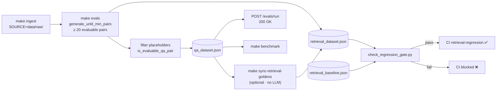

1. **Ingest** — `make ingest SOURCE=...` populates BM25 (required by `SyntheticDatasetBuilder`).
2. **Generate goldens** — `make evals` progressively expands chunk coverage (`generate_until_min_pairs`) until ≥ 20 evaluable QA pairs are produced; placeholder rows are filtered; retrieval rows are auto-synced from QA content.
3. **Manual QA edits** — after editing `qa_dataset.json` by hand, run `make sync-retrieval-goldens` to rebuild `retrieval_dataset.json` without LLM regeneration.
4. **Run live evals** — `POST /evals/run` returns `200` with metric summary when real pairs are present (`204` when empty/placeholder-only).
5. **CI regression** — the `retrieval-regression` job runs `scripts/check_regression_gate.py`, which skips gracefully on placeholder-only data and otherwise enforces:
   - minimum real sample counts in both QA and retrieval datasets
   - `retrieval_rows_match_qa` sync between datasets
   - per-row oracle Recall@5 ≥ `min_recall_at_5` (ground-truth `relevant_chunk_ids` via `oracle_recall_at_k`)

**Key modules:**

| Module | Role |
|--------|------|
| `src/evals/golden_dataset.py` | Placeholder detection, evaluable QA filtering, QA→retrieval conversion, chunk expansion, sync helpers |
| `src/evals/regression_gate.py` | `check_regression_gate()` — sample counts, sync check, oracle Recall@5 floors |
| `scripts/check_regression_gate.py` | CI entrypoint (exit 1 on failure) |
| `scripts/sync_retrieval_golden.py` | CLI for `make sync-retrieval-goldens` |

**Human-in-the-loop extensions:** seed chunk relevance via [Retrieval Feedback Loop (T-145)](#retrieval-feedback-loop-t-145) (`POST /feedback`) and follow [docs/operations/feedback-multi-replica.md](docs/operations/feedback-multi-replica.md) for multi-replica feedback before relying on feedback-driven ranking in production evals.

**Regression config** (`configs/evals.yaml` + `datasets/goldens/retrieval_baseline.json`):

```yaml
evals:
  min_qa_pairs: 20
  retrieval:
    regression:
      min_recall_at_5: 0.5
```

```json
{
  "min_samples": 20,
  "min_recall_at_5": 0.5,
  "oracle_recall_at_5": 1.0
}
```

---

### Compare Embedding Providers

Benchmark multiple embedding providers against the same golden QA dataset and get a side-by-side quality, latency, and estimated cost table:

```bash
# Self-hosted only (no API key required)
uv run python scripts/compare_embedding_providers.py --providers bge_m3

# Compare local vs API providers
uv run python scripts/compare_embedding_providers.py \
  --providers bge_m3 openai voyage \
  --max-samples 50

# Save results to a custom path
uv run python scripts/compare_embedding_providers.py \
  --providers bge_m3 openai voyage cohere \
  --output data/exports/embedding_comparison.json
```

**Output:**

```
┌───────────────────┬──────────┬──────────┬──────────┬─────────────┬───────────┐
│ Provider          │ Recall@5 │ NDCG@5   │ Latency  │ Cost/1K tok │ Status    │
├───────────────────┼──────────┼──────────┼──────────┼─────────────┼───────────┤
│ bge_m3 (local)    │  0.843   │  0.871   │  18 ms   │  $0.000     │ OK ✓      │
│ openai            │  0.861   │  0.889   │  210 ms  │  $0.130     │ OK ✓      │
│ voyage            │  0.878   │  0.902   │  185 ms  │  $0.120     │ OK ✓      │
└───────────────────┴──────────┴──────────┴──────────┴─────────────┴───────────┘
```

API providers that are not configured (no key set) are skipped with a warning rather than aborting the run. Results are saved to `data/exports/embedding_comparison_{timestamp}.json`.

---

## Docker Compose

The full local stack is defined in `docker-compose.yml`. All services start with a single command; the API server, Qdrant, Ollama, Redis, Prometheus, and the OTel collector are all included.

### Full Stack

```bash
# First run — build images from source
make docker-build

# Start all services in the background
make docker-up

# Verify the API is healthy
curl http://localhost:8000/health

# Tail API logs
make docker-logs

# Stop (containers removed, volumes kept)
make docker-down
```

**Services and ports:**

| Service | Port | Notes |
|---|---|---|
| `api` | 8000 | FastAPI — built from `docker/Dockerfile.api` |
| `qdrant` | 6333 / 6334 | Vector DB |
| `ollama` | 11434 | LLM server (replaces llama.cpp in Docker) |
| `redis` | 6379 | Embedding cache, feedback backend (T-146), rate-limit counter (T-160) |
| `prometheus` | 9090 | Scrapes `api:8000/metrics` |
| `otel-collector` | 4317 / 4318 | OTLP gRPC / HTTP |

> **Metal / MPS note:** Docker on macOS runs inside a Linux VM and cannot access the Metal GPU. The Compose file sets `EMBEDDINGS__DEVICE=cpu` and routes LLM inference through Ollama instead of llama.cpp. For full Metal performance run the API natively with `make serve` and start only infrastructure via `docker compose up qdrant redis otel-collector prometheus`.

### Development Hot-Reload

`docker-compose.override.yml` is picked up automatically by Compose. It live-mounts `src/` and `configs/` into the container and enables `uvicorn --reload`, so code changes are reflected without rebuilding the image.

```bash
# Pull the lighter dev model once
docker compose exec ollama ollama pull qwen3:14b

# Start stack — override applied automatically
make docker-up

# Edit any file under src/ → server reloads within ~1 s
make docker-logs
```

### Ingestion via Docker

```bash
# Ingest everything in data/raw/ (default)
make docker-ingest

# Ingest a specific file
make docker-ingest SOURCE=/app/data/raw/manual.pdf
```

---

## Kubernetes & Production

### Helm Chart

The chart lives in `helm/rag-platform/`. All tunables are in `values.yaml`; templates reference them — nothing is hardcoded.

```bash
# Install locally (dry-run against a k3d or kind cluster)
helm install rag-platform helm/rag-platform \
  --namespace rag-platform \
  --create-namespace \
  --dry-run

# Production deploy on EKS
helm install rag-platform helm/rag-platform \
  --namespace rag-platform \
  --create-namespace \
  --set image.api.repository=<ECR_URI>/rag-platform-api \
  --set image.worker.repository=<ECR_URI>/rag-platform-worker \
  --set ingress.enabled=true \
  --set ingress.host=api.yourdomain.com \
  --set ingress.certificateArn=<ACM_ARN> \
  --set persistence.models.storageClass=efs-sc

# Upgrade (e.g. new image tag)
helm upgrade rag-platform helm/rag-platform \
  --namespace rag-platform \
  --reuse-values \
  --set image.api.tag=<new-tag>
```

**Chart contents:**

| Template | Purpose |
|---|---|
| `deployment-api.yaml` | API Deployment — liveness/readiness probes on `GET /health` |
| `deployment-worker.yaml` | Worker Deployment — 1 replica, no autoscale |
| `service-api.yaml` | ClusterIP Service on port 8000 |
| `hpa-api.yaml` | HPA — scales api on CPU ≥ 70% (min 2, max 10 replicas) |
| `ingress.yaml` | AWS ALB Ingress — toggle via `ingress.enabled` |
| `configmap.yaml` | Non-sensitive env vars → injected via `envFrom` |
| `secret.yaml` | Sensitive values (Qdrant API key) → K8s Secret |
| `pvc-qdrant.yaml` | 50 Gi `ReadWriteOnce` volume for Qdrant data |
| `pvc-models.yaml` | 30 Gi `ReadOnlyMany` volume for model files (EFS on EKS) |

**Key `values.yaml` overrides:**

```yaml
# Pin api pods to GPU node group (llama.cpp / CUDA)
scheduling:
  api:
    nodeSelector: { eks.amazonaws.com/nodegroup: gpu }
    tolerations:
      - key: nvidia.com/gpu
        operator: Exists
        effect: NoSchedule

# Switch embedding device to CUDA on GPU nodes
env:
  embeddingsDevice: cuda
  
# Add nvidia.com/gpu to resource limits
resources:
  api:
    limits:
      cpu: "2"
      memory: "8Gi"
      nvidia.com/gpu: "1"
```

### Multi-Replica Feedback (T-146)

When running multiple API replicas (Helm HPA defaults to `minReplicas: 2`), feedback scores must stay consistent across pods. The platform addresses this with:

| Concern | Mitigation |
|---|---|
| BM25 rewrite on every vote | Feedback path never touches BM25; shutdown save skips unchanged indexes (`BM25Index._dirty`) |
| Non-atomic score updates | Pluggable `FeedbackStore` — Qdrant CAS (default), Redis `HINCRBYFLOAT`, or SQL `UPSERT … score += delta` |
| Stale in-pod metadata | Boost reads live scores via `vector_store.get_feedback_scores()` at retrieval time |
| Abuse under scale | Enable `api.rate_limit.enabled` — `/feedback` is a protected route (**T-160**) |

**Backend selection** (`quality.feedback_loop.backend` in `configs/retrieval.yaml`):

| Backend | Storage | Multi-replica |
|---|---|---|
| `qdrant` (default) | Chunk payload `feedback_score` + CAS `feedback_revision` | CAS retries (20 attempts) |
| `redis` | Hash `rag:feedback:scores` | Truly atomic `HINCRBYFLOAT` — use under heavy same-chunk contention |
| `postgres` | SQLite file (`data/processed/feedback.db`) or future DSN | Single-node SQLite only; use Redis for pods |

```yaml
# configs/retrieval.yaml — HPA ≥ 2 with business-critical feedback ranking
quality:
  feedback_loop:
    enabled: true
    backend: redis
    boost_multiplier: 0.05

# configs/app.yaml — public-facing API
api:
  rate_limit:
    enabled: true
    requests_per_minute: 60
    burst: 10
```

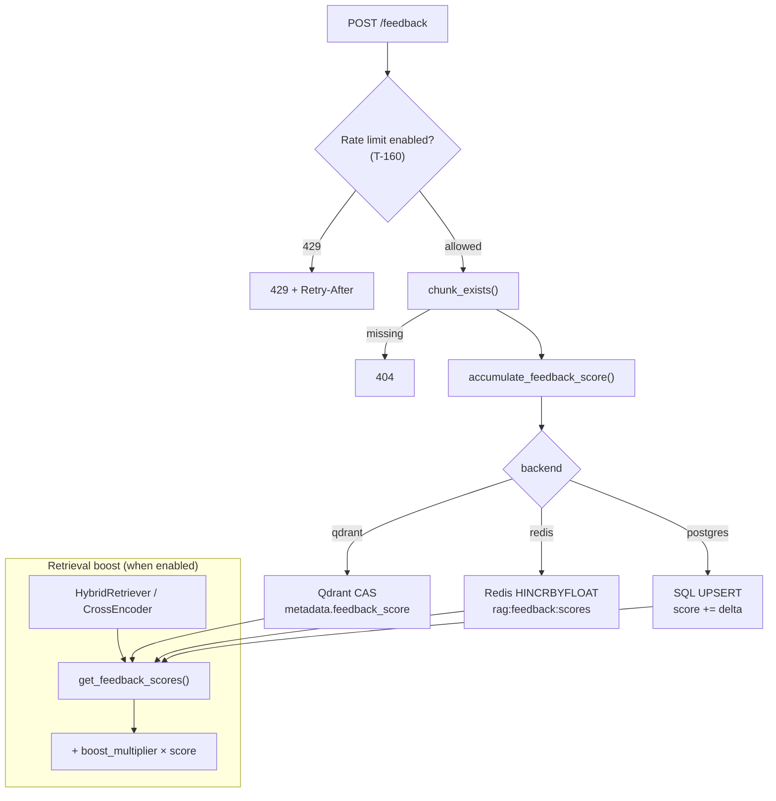

Full deployment modes, gap tracker, and pre-HPA checklist: **[docs/operations/feedback-multi-replica.md](docs/operations/feedback-multi-replica.md)**.

Run the concurrency regression before enabling HPA in production:

```bash
uv run pytest tests/benchmarks/test_feedback_concurrency.py -v
```

### API Rate Limiting (T-160)

Sliding-window rate limiting middleware protects sensitive routes from abuse. It runs on every request before routing; `OPTIONS` preflight and exempt paths (`/health`, `/metrics`) pass through unchanged.

**Protected routes:** `/ingest`, `/chat`, `/chat/agent`, `/evals/run`, `/feedback` (prefix match — subpaths included).

**Client identity:** `X-API-Key` header when present, else first `X-Forwarded-For` hop, else direct client IP.

**Backend:** tries Redis sorted-set sliding window (`rag:rate_limit:*` keys); falls back to per-process in-memory limiter with a warning log if Redis is unreachable.

```yaml
# configs/app.yaml
api:
  rate_limit:
    enabled: false               # no behavior change for local dev
    requests_per_minute: 60
    burst: 10                    # effective limit = rpm + burst per 60 s window
```

```bash
API__RATE_LIMIT__ENABLED=true
API__RATE_LIMIT__REQUESTS_PER_MINUTE=60
API__RATE_LIMIT__BURST=10
```

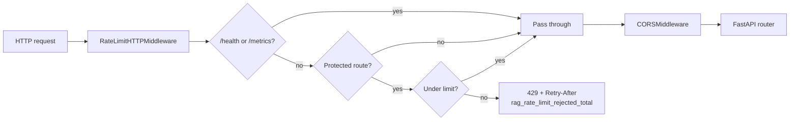

Rejected requests increment `rag_rate_limit_rejected_total{path="..."}` on `/metrics`.

**429 body:** `{"detail": "Rate limit exceeded"}` with a numeric `Retry-After` header (seconds until the sliding window allows the next request).

```bash
# Rate limit middleware unit tests (in-memory + Redis backends, no live services)
uv run pytest tests/unit/test_rate_limit.py -v
```

Covers all protected routes, burst allowance, per-`X-API-Key` isolation, exempt/public paths, CORS on 429 responses, and regression checks that middleware test apps do not share limiter state.

### Automated Dependency Scanning (T-161)

Every pull request runs pip-audit inside the **Quality** CI job (merged from the former `dependency-scan` job) that audits the resolved dependency graph from `uv.lock` with [pip-audit](https://pypi.org/project/pip-audit/). High and critical findings (CVSS v3 base score ≥ 7.0) fail the build; medium and low findings are reported only.

Known unfixable or accepted risks are recorded in `configs/cve-allowlist.yaml` with a mandatory `review_date`. Expired entries are ignored automatically — the scan fails until the CVE is fixed or the entry is renewed.

```bash
make audit-deps
# or
./scripts/check_dependencies.sh
```

Policy details: [docs/dependency-policy.md](docs/dependency-policy.md).

```bash
# Dependency audit unit tests (allowlist parsing, severity gate)
uv run pytest tests/unit/test_dependency_audit.py -v
```

### diskcache CVE Mitigation (T-162)

[CVE-2025-69872](https://nvd.nist.gov/vuln/detail/CVE-2025-69872) affects `diskcache` ≤ 5.6.3 (transitive via `llama-cpp-python`). Pickle-based disk prompt caches are the exposure path; this platform mitigates as follows:

| Control | Detail |
|---------|--------|
| Fork override | `pyproject.toml` redirects transitive `diskcache` to `diskcache-weave>=5.6.3.post1` |
| RAM-only cache | `LlamaCppProvider` uses `LlamaRAMCache` — never `LlamaDiskCache` |
| Kill switch | `LLM__DISABLE_DISK_CACHE=true` disables all llama.cpp prompt caching |
| Upstream monitor | `./scripts/check_diskcache_cve.sh` — exit 0 while no PyPI fix; exit 2 when a patched release is available but not applied |
| Dependabot | Weekly `llama-cpp-python` update PRs (`.github/dependabot.yml`) |

Formal risk acceptance, CVSS, and operator actions: [docs/security-advisories.md](docs/security-advisories.md). Allowlist entry in `configs/cve-allowlist.yaml` (next review **2026-09-01**).

```bash
LLM__DISABLE_DISK_CACHE=true   # emergency disable prompt caching
./scripts/check_diskcache_cve.sh
```

```bash
# diskcache CVE monitor + llama.cpp cache policy tests
uv run pytest tests/unit/test_diskcache_cve_check.py tests/unit/test_llm.py -v -k "disk_cache or PromptCache or Diskcache"
```

When upstream `diskcache` publishes a fixed release above 5.6.3, upgrade the override in `pyproject.toml`, renew or remove the allowlist entry, and re-run `make audit-deps`.

### Disk-Backed BM25 (T-165)

Lexical retrieval defaults to an **in-memory** Okapi BM25 index (`rank-bm25`) persisted as JSON at `data/processed/bm25_index.json`. That remains the right choice for typical enterprise corpora.

Switch to the **disk** backend when BM25 RSS becomes a problem (approaching ~100K–1M+ chunks, or multi-replica pods that cannot afford a full Okapi model in RAM):

| Setting | Default | Purpose |
|---|---|---|
| `retrieval.bm25.backend` | `memory` | `memory` = current T-014 behavior; `disk` = segmented/mmap index |
| `retrieval.bm25.disk_path` | `data/processed/bm25_disk` | Directory for manifest, IDF, id map, and segment files |
| `retrieval.bm25.segment_size` | `10000` | Chunks per on-disk segment |

```yaml
# configs/retrieval.yaml
retrieval:
  bm25:
    backend: disk
    disk_path: data/processed/bm25_disk
    segment_size: 10000
```

```bash
RETRIEVAL__BM25__BACKEND=disk
RETRIEVAL__BM25__DISK_PATH=data/processed/bm25_disk
RETRIEVAL__BM25__SEGMENT_SIZE=10000
```

**Behavior:** `BM25Index.load_or_create()` (no path) selects the backend from settings. An explicit `index_path` without `backend=` always opens the JSON memory index so eval caches and `BM25Retriever.from_disk` stay compatible when the global setting is `disk`; pass `backend="disk"` to use a segmented directory at that path. Disk mode stores chunk payloads + inverted postings per segment; doc lengths are memmapped; scoring matches in-memory Okapi (`k1=1.5`, `b=0.75`, epsilon floor), including soft-view search during `deferred_rebuild`. Incremental `add` / `remove_by_ids` / document-id deletion work the same as memory mode. Search memory stays bounded (IDF/DF + id map + one segment of postings), not the full corpus model.

**Ingestion:** single-document ingest wraps chunking, optional hierarchical/HyPE indexing, Qdrant upsert, and BM25 updates in one `deferred_rebuild()` block. On re-ingest, superseded chunk IDs are purged from Qdrant and BM25 before new chunks are added — HyPE and summary vectors stay aligned with passage chunks. Directory ingest still defers one rebuild until the batch completes.

**Tooling:** `iter_chunks()` yields indexed chunks one at a time for `rebuild_embeddings.py`, `run_evals.py`, and `compare_embedding_providers.py` so large disk indexes do not require a full in-memory copy. `BM25Retriever.from_disk(path)` always opens the JSON memory backend at `path` (eval sweep caches, explicit `.json`/`.pkl` paths).

**When to stay on `memory`:** local dev, Docker Compose single API, and corpora well under ~1M chunks — zero extra I/O and identical scores.

**Migration:** backends are not interchangeable on disk. Changing `backend` requires a fresh ingest (or rebuilding the chosen store). Feedback scores still never rewrite BM25 (T-145/T-146).

### EKS Setup

See **[infra/eks/README.md](infra/eks/README.md)** for the complete end-to-end guide covering:

- EKS cluster provisioning with `eksctl`
- Required add-ons: EBS CSI driver, EFS CSI driver, AWS Load Balancer Controller, metrics-server
- ECR image push
- Helm deploy with all production flags
- Lens Desktop connection (kubeconfig import, key views, port-forward)
- Common operations (scale, exec, log tailing, one-shot ingestion job)
- Teardown

---

## Knowledge Graph (Graph RAG)

Graph RAG augments the retrieval pipeline with a Neo4j knowledge graph that stores entity relationships extracted from ingested documents. Chunks that mention query-relevant entities are surfaced alongside dense and BM25 results.

### How it works

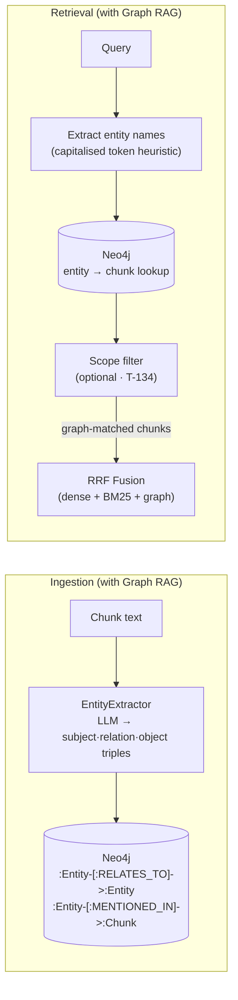

### Setup

```bash
# 1. Install optional Neo4j driver
uv sync --extra graph

# 2. Start Neo4j (Docker)
docker run -d --name neo4j \
  -p 7474:7474 -p 7687:7687 \
  -e NEO4J_AUTH=neo4j/yourpassword \
  neo4j:5

# 3. Enable in .env (or configs/neo4j.yaml)
NEO4J__ENABLED=true
NEO4J__URI=bolt://localhost:7687
NEO4J__USER=neo4j
NEO4J__PASSWORD=yourpassword
NEO4J__MAX_CONNECTION_POOL_SIZE=100      # optional; AsyncGraphDatabase pool (T-164)
NEO4J__EXTRACT_ENTITIES_ON_INGEST=true   # populate graph during ingestion
```

### Enabling Graph RAG in the pipeline

Graph RAG is wired automatically when `neo4j.enabled=true`:

- **Retrieval:** `RetrievalPipeline.from_settings()` attaches `GraphRetriever` to `HybridRetriever`; graph-matched chunks participate in RRF fusion alongside dense + BM25 results. The graph leg is awaited natively in `asyncio.gather` with dense + BM25 (T-164).
- **Ingestion:** when `extract_entities_on_ingest=true`, the ingestion pipeline extracts entity triples per document and upserts them to Neo4j via `GraphIndexer` (sync CLI path bridged with `async_bridge.run_async`).
- **Degradation:** if Neo4j is disabled or unreachable, the pipeline logs a warning and continues with dense + BM25 only.

No manual wiring is required for the default API server (`make serve`) or CLI ingestion (`scripts/ingest.py`).

### Async Neo4j driver (T-164)

Graph operations use Neo4j's **`AsyncGraphDatabase`** so entity lookup and upsert do not block the FastAPI event loop when Graph RAG is enabled.

| Surface | Behavior |
|---|---|
| `Neo4jGraphRepository` | Async `upsert` / `search_by_entities` / `close`; sync wrappers `upsert_sync` / `close_sync` for non-async callers |
| `GraphRetriever.search` | `async` — awaited by `HybridRetriever` and `AgentPipeline.GRAPH_LOOKUP` |
| `HybridRetriever` | Dense + BM25 via `asyncio.to_thread`; graph via native await in the same `asyncio.gather` |
| CLI / ingestion | `GraphIndexer.index_chunks` and shutdown hooks call `run_async()` from `src/core/async_bridge.py` (dedicated daemon loop safe under an already-running event loop) |
| Pool | `neo4j.max_connection_pool_size` in `configs/neo4j.yaml` (env: `NEO4J__MAX_CONNECTION_POOL_SIZE`, default `100`) |

```python
# Async retrieval path (API / hybrid)
chunks = await graph_retriever.search(query, top_k=5)

# Sync ingestion / shutdown
repo.upsert_sync(relations, chunk_id=chunk.id, document_id=doc_id)
repo.close_sync()
```

<details>
<summary>Advanced: manual GraphRetriever wiring</summary>

```python
from src.rag.retrieval.graph_retriever import GraphRetriever
from src.rag.retrieval.bm25_retriever import BM25Retriever
from src.infrastructure.llm.llama_cpp_provider import LlamaCppProvider

llm = LlamaCppProvider.from_settings()
bm25 = BM25Retriever.from_disk()
graph_retriever = GraphRetriever.from_settings(llm=llm, bm25=bm25)

from src.rag.retrieval.hybrid_retriever import HybridRetriever
hybrid = HybridRetriever(dense=dense, bm25=bm25, graph_retriever=graph_retriever)
```

</details>

---

## Agentic RAG

`AgentPipeline` adds an iterative reasoning loop on top of the existing retrieval + generation stack. Two modes are available:

| Mode | Config | Loop |
|---|---|---|
| **Standard agent** (default) | `quality.self_rag.enabled=false` | LLM chooses `ANSWER` / `RETRIEVE_MORE` / `GRAPH_LOOKUP` / `CLARIFY` after each retrieval (`agent_decision.txt`) |
| **Self-RAG** (T-141) | `quality.self_rag.enabled=true` | Structured gates: retrieval decision → draft → support check → utility score (`self_rag_*.txt`) |

Both modes share the same HTTP endpoints and `max_iterations` cap (default 3, API max 5). Self-RAG replaces — not augments — the standard agent decision loop when enabled.

### Standard agent loop

When `quality.self_rag.enabled=false`, after each retrieval the LLM decides whether the context is sufficient or whether to take a follow-up action before answering.

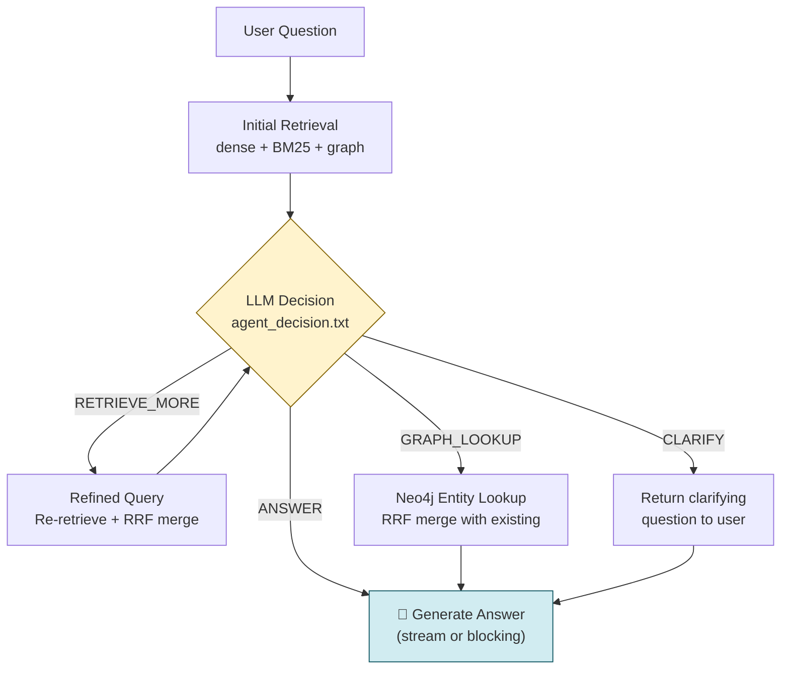

> The loop is capped at `max_iterations` (default: 3) to prevent runaway LLM calls. Any decision parsing failure falls back to `ANSWER` immediately.

### Self-RAG decision loop (T-141)

When `quality.self_rag.enabled=true`, `AgentPipeline` runs Self-RAG gates instead of `agent_decision.txt`. Each iteration:

1. **Retrieval decision** — LLM decides if document search is needed (`self_rag_decision.txt`). Greetings and chit-chat use `GenerationService.generate_direct()` (no RAG context wrapper).
2. **Retrieve** — standard `RetrievalPipeline` (includes Reliable RAG T-140 when that flag is also enabled).
3. **Draft** — generate a candidate answer from retrieved context.
4. **Support check** — LLM verifies the draft is grounded in context (`self_rag_support.txt`).
5. **Utility score** — LLM rates usefulness and returns `accept`, `reretrieve` (with optional `refined_query`), or `refuse` (`self_rag_utility.txt`).

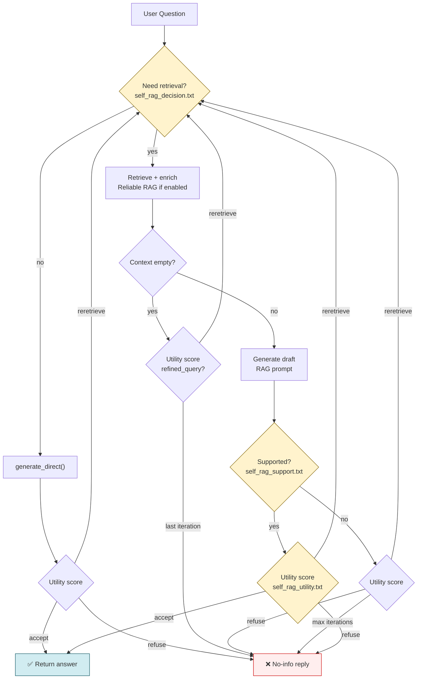

```yaml
# configs/retrieval.yaml
quality:
  self_rag:
    enabled: false    # set true to enable Self-RAG on agent endpoints
```

**Structured LLM output** uses Pydantic models (`RetrievalDecision`, `SupportCheck`, `UtilityScore`) parsed via the shared helper `src/rag/structured_output.py` (also used by Reliable RAG grading and adaptive query classification).

**Response metadata:** `/chat/agent/full` includes `self_rag_decisions[]` with per-iteration gate results:

| Field | Meaning |
|---|---|
| `need_retrieval` | Whether document search was required |
| `supported` | Whether the draft passed the support check |
| `utility_score` | 0.0–1.0 usefulness rating |
| `utility_action` | `accept`, `reretrieve`, or `refuse` |
| `refined_query` | Improved search query when action is `reretrieve` |

**When to use:** agent endpoints where hallucination risk is high; multi-hop questions that benefit from explicit re-retrieval; corpora where you already enable Reliable RAG (T-140) and want an additional generation-time critique.

**Trade-offs:** several extra LLM calls per agent iteration when enabled. Unsupported drafts after `max_iterations` return *"I don't have information about this."* LLM or parse failures on individual gates degrade gracefully (fallback to retrieve, assume supported, or accept draft — see `src/rag/quality/self_rag.py`).

```bash
QUALITY__SELF_RAG__ENABLED=true
# Optional: also enable passage filtering inside retrieval
QUALITY__RELIABLE_RAG__ENABLED=true
```

### Usage

**HTTP (recommended when the API server is running):**

```bash
# Streaming — same SSE format as POST /chat
curl -X POST http://localhost:8000/chat/agent \
  -H "Content-Type: application/json" \
  -d '{"question": "How do IAM roles work in EKS?", "max_iterations": 3}' \
  --no-buffer

# Full response — includes iterations and actions taken
curl -X POST http://localhost:8000/chat/agent/full \
  -H "Content-Type: application/json" \
  -d '{"question": "How do IAM roles work in EKS?", "max_iterations": 3}'
```

**Python (in-process):**

```python
from src.rag.pipelines.agent_pipeline import AgentPipeline

# Build from settings (creates ChatPipeline internally)
agent = AgentPipeline.from_settings(max_iterations=3)

# Streaming
async for token in await agent.chat("How do IAM roles work in EKS?"):
    print(token, end="", flush=True)

# Blocking — standard agent loop (quality.self_rag.enabled=false)
result = await agent.chat_full("How do IAM roles work in EKS?")
print(result.answer.text)
print("Sources:", result.answer.sources)
print("Actions:", [a.value for a in result.actions])

# Self-RAG — set QUALITY__SELF_RAG__ENABLED=true, then rebuild from settings
agent_self_rag = AgentPipeline.from_settings(max_iterations=3)
result = await agent_self_rag.chat_full("How do IAM roles work in EKS?")
print("Self-RAG steps:", result.self_rag_decisions)
```

### Agent actions (standard loop only)

| Action | When triggered | What happens |
|---|---|---|
| `ANSWER` | Context is sufficient | Proceeds to LLM generation |
| `RETRIEVE_MORE` | Context is incomplete | Re-retrieves with `refined_query`, merges via RRF |
| `GRAPH_LOOKUP` | Entity relationships needed | Queries Neo4j, merges entity-linked chunks |
| `CLARIFY` | Question is ambiguous | Returns clarifying question; falls back to no-info reply |

### Relationship to Graph RAG

`GRAPH_LOOKUP` is active when `NEO4J__ENABLED=true` — `RetrievalPipeline.from_settings()` wires `GraphRetriever` automatically, and the agent awaits the async Neo4j lookup (T-164). Without Neo4j, the agent still works; it skips graph lookups and relies on dense + BM25 (+ multi-query RRF fusion).

---

## Embedding Providers

Seven providers are available across two tiers. Switch via `EMBEDDINGS__PROVIDER` (env var or `configs/embeddings.yaml`). After switching, update `EMBEDDINGS__DENSE_DIM` to match the new model and run `python scripts/rebuild_embeddings.py --recreate-collection`.

### Self-hosted (no API key, run locally)

| Provider | `EMBEDDINGS__PROVIDER` | Dim | Sparse | Source |
|---|---|---|---|---|
| BGE-M3 **(default)** | `bge_m3` | 1024 | ✓ native | `models/embeddings/bge-m3` |
| Nomic-Embed-Text v1.5 | `nomic` | 768 | ✗ (BM25) | `nomic-ai/nomic-embed-text-v1.5` |
| Qwen3-Embedding-0.6B | `qwen_embedding` | 1024 | ✗ (BM25) | `Qwen/Qwen3-Embedding-0.6B` |

### API-based (requires key + `uv sync --extra api-embeddings`)

| Provider | `EMBEDDINGS__PROVIDER` | Dim | Default model | Key env var |
|---|---|---|---|---|
| OpenAI | `openai` | 3072 | `text-embedding-3-large` | `EMBEDDINGS__OPENAI__API_KEY` |
| Voyage AI | `voyage` | 1536 | `voyage-large-2` | `EMBEDDINGS__VOYAGE__API_KEY` |
| Cohere | `cohere` | 1024 | `embed-english-v3.0` | `EMBEDDINGS__COHERE__API_KEY` |
| Gemini | `gemini` | 768 | `text-embedding-004` | `EMBEDDINGS__GEMINI__API_KEY` |

All API providers are dense-only — BM25 continues to provide sparse retrieval. OpenAI's `text-embedding-3` family supports dimension truncation via `EMBEDDINGS__OPENAI__DIMENSIONS`; changing dimensions after indexing requires `--recreate-collection`.

When [MMR diversity (T-135)](#diversity-retrieval--mmr-t-135) is enabled and reranked chunks lack stored vectors, the pipeline calls `embed_passage()` to embed chunk text for pairwise similarity. Cohere (`search_document`), Voyage (`document`), and Gemini (`RETRIEVAL_DOCUMENT`) use their document embedding modes; self-hosted providers and OpenAI delegate to `embed()`.

```bash
# Switch to Voyage AI
EMBEDDINGS__PROVIDER=voyage
EMBEDDINGS__VOYAGE__API_KEY=your-key
EMBEDDINGS__DENSE_DIM=1536

uv run python scripts/rebuild_embeddings.py --recreate-collection

# Switch back to self-hosted BGE-M3
EMBEDDINGS__PROVIDER=bge_m3
EMBEDDINGS__DENSE_DIM=1024

uv run python scripts/rebuild_embeddings.py --recreate-collection
```

### Embedding cache

When `EMBEDDINGS__CACHE__ENABLED=true`, dense vectors are cached in Redis using a SHA-256 key of `text + model_identifier`. This eliminates redundant API calls during re-ingestion or repeated queries. Caching is disabled by default — set `EMBEDDINGS__CACHE__ENABLED=true` to activate it.

```bash
EMBEDDINGS__CACHE__ENABLED=true
EMBEDDINGS__CACHE__TTL_SECONDS=604800   # 7 days
REDIS__URL=redis://localhost:6379
```

Cache metrics are exposed on `/metrics`: `rag_embedding_cache_hits_total` and `rag_embedding_cache_misses_total`. If Redis is unavailable the provider falls through transparently — no error, no data loss.

### Embedding model versioning

Each upserted point carries an `embedding_model_name` payload field. New collections also store the same value in **Qdrant collection metadata** for O(1) validation. On startup (and in `rebuild_embeddings.py` preflight), `QdrantVectorStore` compares that tracked name to the current config and aborts on mismatch — preventing silent vector corruption when switching providers, models, or dimensions.

Identifiers follow `provider:model` for self-hosted providers and `provider:model@dim` for API providers (the `@dim` suffix captures OpenAI `text-embedding-3` truncation via `EMBEDDINGS__OPENAI__DIMENSIONS`):

```
VectorStoreError: Embedding model mismatch: collection 'rag_documents' was built with
'bge_m3:models/embeddings/bge-m3' but current config is 'openai:text-embedding-3-large@512'.
Run: python scripts/rebuild_embeddings.py --recreate-collection
```

Legacy collections without metadata fall back to the first tagged point payload; a successful match backfills collection metadata automatically.

> **Sparse vectors:** BGE-M3 produces both dense and sparse vectors in a single forward pass, enabling Qdrant native sparse search. All other providers are dense-only — BM25 (maintained independently of the embedding model) continues to provide lexical retrieval.

---

## API Reference

| Method | Endpoint | Description |
|---|---|---|
| `GET` | `/health` | Server status and model load state |
| `POST` | `/chat` | Stream answer as Server-Sent Events; optional `document_ids`, `metadata_filters`, `min_score` (T-134) |
| `POST` | `/chat/full` | Non-streaming chat, returns complete answer; same optional filter fields as `/chat`; optional `?explain=true` for per-source retrieval explanations (T-143); optional `?highlights=true` or `quality.source_highlighting.enabled` for supporting spans (T-144) |
| `POST` | `/chat/agent` | Agentic RAG — multistep retrieval, streaming answer (`max_iterations` 1–5) |
| `POST` | `/chat/agent/full` | Agentic RAG — complete answer plus `iterations`, `actions`, and `self_rag_decisions` metadata |
| `POST` | `/ingest/path` | Ingest a local file or directory |
| `POST` | `/ingest/upload` | Ingest an uploaded file (multipart) |
| `POST` | `/feedback` | Record user relevance feedback on a retrieved chunk — body: `{query_id, chunk_id, relevant}`; returns `204` / `404` / `502` (T-145); subject to rate limit when enabled (T-160) |
| `POST` | `/evals/run` | Run E2E benchmark — returns `204` until QA dataset is populated, `200` with Recall@5 / Faithfulness / Relevance / Context Precision report |
| `GET` | `/metrics` | Prometheus metrics (text format) |
| `GET` | `/docs` | Interactive OpenAPI documentation |

Protected routes (`/ingest`, `/chat`, `/chat/agent`, `/evals/run`, `/feedback`) return **`429 Too Many Requests`** with a `Retry-After` header when `api.rate_limit.enabled=true` and the client exceeds the configured window (T-160).

---

## Project Structure

```
rag_implementation/
├── configs/                    # YAML configuration
│   ├── app.yaml                # API host, CORS, rate limiting (T-160)
│   ├── llm/                    # Per-model LLM profiles (switch with --llm-config)
│   │   ├── qwen3-30b.yaml      # llama.cpp · Qwen3-30B (default baseline)
│   │   ├── qwen3-14b.yaml      # llama.cpp · Qwen3-14B
│   │   ├── ollama-glm52.yaml   # Ollama · GLM-5.2
│   │   ├── ollama-gemma3-27b.yaml
│   │   └── ollama-llama33-70b.yaml
│   ├── embeddings.yaml
│   ├── retrieval.yaml
│   ├── parsing.yaml            # Layout parser (T-200), table/caption chunks (T-202/T-232), figure assets/captions (T-230/T-231), OCR T-220–T-223; T-210 domain note
│   ├── web_search.yaml         # CRAG web providers: none · duckduckgo · tavily (T-142)
│   ├── neo4j.yaml              # Graph RAG (async driver pool T-164) + SQLite metadata store settings
│   ├── evals.yaml
│   ├── logging.yaml
│   ├── cve-allowlist.yaml      # Accepted CVE allowlist for dependency audit (T-161/T-162)
│   ├── prometheus.yml          # Prometheus scrape config (scrapes api:8000/metrics)
│   └── otel-collector.yaml     # OTel collector — OTLP gRPC/HTTP receiver, debug exporter
├── data/                       # Runtime data (gitignored)
│   ├── raw/                    # Source documents to ingest
│   ├── processed/              # BM25 memory JSON / optional bm25_disk/ (T-165)
│   └── exports/                # Benchmark results (.json); infra_baseline.json committed (T-172)
├── datasets/
│   ├── goldens/                # Golden QA + retrieval datasets + regression baseline (T-152)
│   │   ├── qa_dataset.json
│   │   ├── retrieval_dataset.json
│   │   └── retrieval_baseline.json
│   └── synthetic/              # LLM-generated QA pairs
├── docker/                     # Dockerfiles (one per service)
│   ├── Dockerfile.api          # Multi-stage build for FastAPI server
│   └── Dockerfile.worker       # Build for ingestion worker
├── helm/rag-platform/          # Helm chart for Kubernetes deployment
│   ├── Chart.yaml
│   ├── values.yaml             # All tunables — image tags, resources, ingress, PVCs
│   └── templates/
│       ├── _helpers.tpl        # Shared template helpers (fullname, labels, etc.)
│       ├── configmap.yaml      # Non-sensitive env vars
│       ├── secret.yaml         # Sensitive values (Qdrant API key)
│       ├── deployment-api.yaml # API Deployment + liveness/readiness probes
│       ├── deployment-worker.yaml
│       ├── service-api.yaml    # ClusterIP on port 8000
│       ├── hpa-api.yaml        # HPA — CPU ≥ 70%, min 2 / max 10 replicas
│       ├── ingress.yaml        # AWS ALB Ingress (toggle: ingress.enabled)
│       ├── pvc-qdrant.yaml     # 50 Gi gp3 for Qdrant
│       └── pvc-models.yaml     # 30 Gi ReadOnlyMany for model files (EFS on EKS)
├── docs/
│   ├── dependency-policy.md    # pip-audit severity gate + allowlist process (T-161)
│   ├── security-advisories.md  # Formal CVE risk acceptance (T-162 diskcache)
│   ├── type-safety.md          # Type-ignore audit + CI lint gate (T-170/T-171)
│   ├── ocr-providers.md        # OCR factory + Azure DI vs self-hosted (T-220–T-222)
│   └── operations/
│       └── feedback-multi-replica.md  # T-146 deployment guide (HPA, backends, rate limits)
├── infra/
│   └── eks/
│       └── README.md           # EKS cluster setup guide + Lens integration
├── models/                     # Downloaded model files (gitignored)
│   ├── embeddings/bge-m3/
│   ├── rerankers/bge-reranker-v2-m3/
│   └── llm/                    # GGUF models
├── scripts/
│   ├── _benchmark_utils.py     # Shared CLI utilities (load QA, apply LLM config)
│   ├── ingest.py               # Document ingestion CLI
│   ├── rebuild_embeddings.py   # Re-embed all chunks → Qdrant (streams via iter_chunks · T-165)
│   ├── run_evals.py            # QA dataset generation CLI (iter_chunks · T-152/T-165)
│   ├── sync_retrieval_golden.py # Sync retrieval goldens from QA without LLM (T-152)
│   ├── check_regression_gate.py # CI regression gate entrypoint (T-152)
│   ├── check_lint_gate.py      # Lint config alignment + mypy smoke (T-171)
│   ├── check_dependencies.py   # pip-audit wrapper (T-161)
│   ├── check_dependencies.sh   # CI/local dependency scan entrypoint (T-161)
│   ├── check_diskcache_cve.py  # diskcache upstream monitor (T-162)
│   ├── check_diskcache_cve.sh  # CI/local diskcache CVE check entrypoint (T-162)
│   ├── migrate_ci_checks.sh    # Branch protection migration helper (T-180)
│   ├── benchmark.py            # E2E benchmark CLI (--llm-config for model swap)
│   ├── benchmark_techniques.py # Technique matrix CLI (T-150)
│   ├── benchmark_chunk_sizes.py # Chunk size sweep CLI (T-151)
│   ├── benchmark_infra.py      # Infrastructure latency baseline CLI (T-172)
│   └── compare_models.py       # Multi-model comparison table
├── specs/
│   └── TODO.md                 # Specification-driven task list (SDD format)
├── src/
│   ├── api/                    # FastAPI routers + DI + rate_limit middleware (T-160)
│   ├── core/                   # Settings (+ ParsingSettings T-190), logging, exceptions, async_bridge (T-164), diskcache_cve_check (T-162), lint_gate (T-171)
│   ├── domain/                 # Entities (+ ParsedDocument T-190, SourceReference T-210), repository ABCs (+ LayoutParser/Ocr T-190), services
│   ├── evals/                  # Retrieval/generation metrics, benchmarks
│   │   ├── golden_dataset.py   # Placeholder filtering, QA→retrieval sync, chunk expansion (T-152)
│   │   ├── regression_gate.py  # CI regression gate logic (T-152)
│   │   ├── retrieval/          # Recall@K · Precision@K · NDCG · MRR · oracle_recall_at_k (T-152)
│   │   ├── generation/         # Faithfulness · Relevance · Context Precision · Hallucination
│   │   └── e2e/                # RAGBenchmark · TechniqueBenchmark (T-150) · ChunkSizeSweep (T-151) · InfraBenchmark (T-172) · benchmark_samples helpers
│   ├── infrastructure/         # BGE-M3, Qdrant, BM25 (+ disk backend T-165), feedback_store (T-146), Redis client, Neo4j AsyncGraphDatabase (T-164), SQLite metadata, llama.cpp, web search, parsers (T-200), OCR (T-220–T-222)
│   │   ├── cache/              # Redis client helper (embedding cache + rate limit + feedback backend)
│   │   ├── loaders/            # PDF/DOCX/HTML/Markdown loaders; load_document() routes to layout parser (T-200)
│   │   ├── metadata/           # SQLiteMetadataStore (ingestion history + dedup)
│   │   ├── ocr/                # get_ocr_provider() + Tesseract/EasyOCR/Docling/Azure DI (T-220–T-222)
│   │   ├── parsers/            # DoclingLayoutParser factory + cache (T-200)
│   │   └── search/             # DuckDuckGo · Tavily · Null web search providers (T-142)
│   ├── observability/          # OTel tracing, Prometheus metrics
│   ├── prompts/                # Prompt templates (string.Template)
│   │   ├── ingestion/          # chunk_header_template · extract_propositions · generate_chunk_questions · generate_document_summary
│   │   ├── quality/              # relevance_grading (T-140) · self_rag_* (T-141) · crag_knowledge_refinement (T-142) · explain_retrieval (T-143) · source_highlighting (T-144) · explain_and_highlight (T-143+T-144)
│   │   └── retrieval/          # query_expansion · step_back · query_classification · hyde_generate · entity_extraction · agent_decision
│   ├── rag/                    # Chunkers, retrievers, pipelines
│   │   ├── chunking/           # Recursive / semantic / parent-child / proposition / section (T-240) + contextual_headers + metadata filter (T-200)
│   │   ├── enrichment/         # Document augmentation (T-121) · HyPE (T-122) · hierarchical (T-125) · RSE (T-123) · parent context (T-124)
│   │   ├── quality/            # Reliable RAG (T-140) · Self-RAG gates (T-141) · CRAG (T-142) · explainable retrieval (T-143) · source highlighting (T-144) · feedback loop (T-145) · post_generation (combined explain+highlight)
│   │   ├── structured_output.py # Shared Pydantic JSON parsing for LLM structured output
│   │   ├── pipelines/          # chat · retrieval · ingestion · agent (Self-RAG T-141)
│   │   ├── ranking/            # RRF fusion · cross-encoder reranker · MMR diversity (T-135)
│   │   ├── retrieval/          # Dense · BM25 · hybrid · graph · hype · hyde · hierarchical · adaptive · step-back · filters (T-134)
│   │   └── ingestion/          # ocr_fallback (T-223) · figure_extractor + local_asset_store (T-230) · figure_captioner (T-231) · table_chunker (T-202) · caption_chunker (T-232) · structured_chunk_sync · GraphIndexer
│   ├── type_regression/        # Typed smoke modules for mypy regression detection (T-171)
│   └── main.py                 # FastAPI app factory
├── tests/
│   ├── benchmarks/             # E2E, technique matrix (T-150), chunk size sweep (T-151), feedback concurrency tests
│   ├── integration/            # Integration tests (skip without models)
│   └── unit/                   # 2300+ unit tests (zero external deps; incl. test_caption_chunker T-232, test_figure_captioner / test_vision_providers T-231, test_figure_extractor / test_local_asset_store T-230, test_ocr_fallback T-223, test_source_reference T-210, test_docling_parser + test_chunk_metadata T-200, test_parsing_repositories T-190)
├── .dockerignore
├── .env.example
├── .github/
│   ├── actions/setup-python-env/  # uv + .venv cache composite (T-180)
│   ├── dependabot.yml          # Weekly llama-cpp-python updates (T-162)
│   └── workflows/
│       ├── ci.yml              # Quality · Unit Tests · Extended Tests (T-180–T-182)
│       └── ci-slow.yml         # Weekly slow unit tests (T-182)
├── .pre-commit-config.yaml
├── docker-compose.yml          # Full local stack
├── docker-compose.override.yml # Dev overrides — hot-reload + Ollama LLM
├── Makefile
└── pyproject.toml
```

---

## Development

```bash
# Install dev dependencies
uv sync --group dev

# Lint (same commands as CI — ruff, mypy, basedpyright)
make lint

# Verify lint config alignment + mypy clean (T-171 gate)
uv run python scripts/check_lint_gate.py

# Auto-format
make format

# Install pre-commit hooks (requires git repo)
pre-commit install
```

### Lint workflow for contributors

CI blocks merges when static analysis regresses. Run the same checks locally before opening a PR:

| Step | Command | Notes |
|------|---------|-------|
| Full lint suite | `make lint` | Matches `.github/workflows/ci.yml` Quality job (ruff check → ruff format --check → mypy → basedpyright `--level error`) |
| Config drift check | `uv run python scripts/check_lint_gate.py` | Ensures CI, Makefile, and pre-commit stay aligned; re-runs `mypy src` |
| Pre-commit (optional) | `pre-commit run --all-files` | Catches ruff/mypy issues before commit |

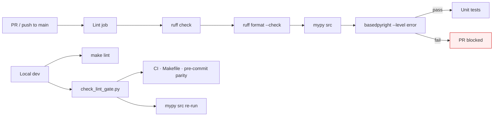

**Config alignment (`src/core/lint_gate.py`):** `check_lint_gate.py` verifies that CI (`.github/workflows/ci.yml`), `make lint`, and the pre-commit mypy hook use the same canonical commands, that the CI mypy step has no `continue-on-error`, and that no layer passes CLI `--ignore-missing-imports`.

**Type regression modules (`src/type_regression/`):** mypy analyzes typed smoke functions for compression and contextual-header APIs at lint time; unit tests call the same functions to assert runtime behavior matches the typed contracts.

Mypy reads `[tool.mypy]` from `pyproject.toml` (`strict = true`, `ignore_missing_imports` at project level). Do not pass `--ignore-missing-imports` on the CLI — that bypasses the audited T-170 configuration. basedpyright uses `[tool.basedpyright]` with `typeCheckingMode = "standard"` (T-173 progression from `basic`), `failOnWarnings = false`, and `reportMissingImports = false` for optional runtime deps. See [docs/type-safety.md](docs/type-safety.md) for the burn-down inventory, enabled rules, and mode progression plan.

**Environment variables** use `__` as the nested delimiter:
```bash
LLM__TEMPERATURE=0.0
RETRIEVAL__HYBRID_FUSION=rrf
RETRIEVAL__TOP_K_FINAL=5
RETRIEVAL__HYPE__ENABLED=false
RETRIEVAL__HYDE__ENABLED=false
RETRIEVAL__ADAPTIVE__ENABLED=false
RETRIEVAL__RSE__ENABLED=false
RETRIEVAL__RSE__MAX_SEGMENT_TOKENS=1500
RETRIEVAL__PARENT_CONTEXT__ENABLED=false
RETRIEVAL__DIVERSITY__ENABLED=false
RETRIEVAL__DIVERSITY__LAMBDA=0.7
QUALITY__RELIABLE_RAG__ENABLED=false
QUALITY__SELF_RAG__ENABLED=false
QUERY_EXPANSION__STEP_BACK__ENABLED=false
CHUNKING__STRATEGY=recursive
CHUNKING__PROPOSITION__QUALITY_THRESHOLD=7
CHUNKING__CONTEXTUAL_HEADERS__ENABLED=false
CHUNKING__AUGMENTATION__ENABLED=false
CHUNKING__HIERARCHICAL__ENABLED=false
PARSING__LAYOUT_PARSER__ENABLED=false
PARSING__TABLE_CHUNKS__ENABLED=false
PARSING__OCR__ENABLED=false
PARSING__OCR__MIN_CHARS=50
NEO4J__ENABLED=true
EMBEDDINGS__DEVICE=cpu
```

### Makefile targets

| Target | Description |
|---|---|
| `make install` | `uv sync --group dev --extra evals` |
| `make serve` | Start API server natively (Metal/MPS) |
| `make ingest SOURCE=path` | Ingest a file or directory |
| `make evals` | Generate golden QA + retrieval datasets (requires `make ingest` first; T-152) |
| `make sync-retrieval-goldens` | Rebuild retrieval goldens from QA without LLM regeneration (T-152) |
| `make benchmark` | Run E2E benchmark |
| `make benchmark-techniques` | Compare RAG techniques side-by-side (T-150) |
| `make benchmark-chunk-sizes` | Sweep chunk sizes and recommend optimal size (T-151) |
| `make benchmark-infra` | Infrastructure latency baseline (T-172) |
| `make audit-deps` | Audit dependencies for high/critical CVEs (T-161) |
| `make lint` | `ruff check` + `ruff format --check` + `mypy` + `basedpyright` |
| `make format` | `ruff format` + `ruff check --fix` |
| `make test` | Unit + integration tests with coverage |
| `make test-unit` | Unit tests only (excludes `@pytest.mark.slow`) |
| `make test-slow` | Slow scale unit tests only (T-181) |
| `make test-e2e` | End-to-end tests |
| `make docker-build` | Build `api` and `worker` images |
| `make docker-up` | Start full Docker Compose stack |
| `make docker-down` | Stop containers (volumes kept) |
| `make docker-logs` | Tail API container logs |
| `make docker-ingest SOURCE=path` | Run one-shot ingestion via Docker |
| `make docker-clean` | Stop containers **and** destroy volumes |
| `make qdrant-up` | Start Qdrant container only (legacy) |
| `make clean` | Remove `__pycache__`, `.mypy_cache`, etc. |

---

## Testing

```bash
# Unit tests (fast, no external services needed; excludes slow scale tests)
make test-unit

# Slow scale tests (100K BM25); also runs weekly in ci-slow.yml
make test-slow

# All tests including integration
make test

# Qdrant integration tests (requires running Qdrant — skipped in CI)
make qdrant-up
uv run pytest tests/integration/test_qdrant.py -v

# Benchmark suite (E2E, technique matrix, chunk size sweep, infra latency, feedback concurrency)
uv run pytest tests/benchmarks/ -v -s

# Infra latency benchmarks only (optional live run; skipped in CI by default)
RUN_INFRA_BENCHMARK=1 uv run pytest tests/benchmarks/test_infra_benchmark.py -v -s

# Lint gate + type regression (T-171)
uv run pytest tests/unit/test_lint_gate.py tests/unit/test_type_regression.py -v
```

**Test coverage:** 130+ source files · 96 test files · 2389 tests (32 skipped without models/services).

Integration tests auto-skip when models or Qdrant are absent (CI runs them but does not start Docker services).

---

## Retrieval Pipeline Details

```mermaid
flowchart TD
    Q["🔎 User Question"] --> FILT["Retrieval Filters<br/>document_ids · metadata · min_score<br/>(optional · T-134)"]
    FILT --> ADAPT["Adaptive Classification<br/>factual · analytical · opinion · contextual<br/>(optional · T-131)"]
    ADAPT --> STRAT["Adaptive Strategy<br/>top_k · n_variants · hyde · compression<br/>(optional · T-132)"]
    STRAT --> QE["Query Expander<br/>LLM variants + step-back<br/>(optional · T-133)"]
    QE --> EMB["BGE-M3 Encoder<br/>1024-dim dense + sparse"]
    QE --> HYDE["HyDE · Hypothetical Doc<br/>LLM → embed passage<br/>(optional · T-130)"]

    EMB --> DS["Dense Search<br/>Qdrant HNSW cosine<br/>payload filters · min_score"]
    HYDE --> DS2["Dense Search<br/>hypothetical passage embed<br/>payload filters · min_score"]
    EMB --> BS["BM25 Search<br/>scoped lexical ranking<br/>(no min_score)"]
    EMB --> HS["HyPE Search<br/>question→question dense<br/>payload filters · min_score<br/>(optional · T-122)"]
    EMB --> HRS["Hierarchical Search<br/>summary → detail<br/>payload filters · min_score<br/>(optional · T-125)"]
    QE --> GS["Graph Search<br/>Neo4j entity traversal<br/>scope filter post-lookup<br/>(optional)"]

    DS -->|Top 50 candidates| RRF["RRF Fusion<br/>score = Σ 1/(k+rank)"]
    DS2 -->|Top 50 candidates| RRF
    BS -->|Top 50 candidates| RRF
    HS -->|resolved source chunks| RRF
    HRS -->|detail chunks only| RRF
    GS -->|entity-matched chunks| RRF

    RRF --> FB["Feedback Boost<br/>Qdrant feedback_score<br/>(optional · T-145)"]
    FB --> RR["BGE-Reranker<br/>Cross-encoder scoring<br/>Top 10"]
    RR --> FB2["Feedback Boost<br/>re-applied post-rerank<br/>(optional · T-145)"]
    FB2 --> MMR["MMR Diversity<br/>relevance − similarity<br/>(optional · T-135)"]
    MMR --> RSE["RSE · Merge Adjacent<br/>consecutive chunk_index<br/>(optional · T-123)"]
    RSE --> PC["Parent Context<br/>child → parent text<br/>(optional · T-124)"]
    PC --> RRAG["Reliable RAG<br/>LLM relevancy grade<br/>filter by min_score<br/>(optional · T-140)"]
    RRAG --> CTX["Contextual Compression<br/>LLM extracts relevant sentences<br/>≤ 1500 tokens"]
    CTX --> GEN["🤖 Generation<br/>llama.cpp · Qwen3-30B"]
    GEN --> ANS["💬 Streamed Answer<br/>+ source chunk IDs"]

    style FILT fill:#fff8e6,stroke:#cc9900
    style RRAG fill:#fff8e6,stroke:#cc9900
    style RRF fill:#f0f0ff,stroke:#6666cc
    style CTX fill:#f0fff0,stroke:#66aa66
```

**Multi-query fusion:** the query expander produces up to `query_expansion.n_variants` variants (overridden per category when adaptive strategies are enabled), plus an optional step-back query when `query_expansion.step_back.enabled: true` (T-133); hybrid retrieval runs for each variant and results are fused with RRF before reranking. When **multi-faceted filters** (T-134) are set on the chat request, they attach to the `Query` entity at the start of the pipeline and constrain every hybrid leg before RRF — document scope and metadata on all retrievers; `min_score` on cosine-similarity legs only (dense, HyPE, HyDE, hierarchical), not BM25 or graph ranks. Set `retrieval.hybrid_fusion: weighted_linear` in `configs/retrieval.yaml` to use dense/BM25 score blending instead (controlled by `hybrid_alpha`). `top_k_final` caps how many chunks reach generation after rerank, optional feedback boost (T-145), optional MMR diversity (T-135), optional RSE, optional parent context, optional Reliable RAG relevancy grading (T-140), and compression. Hybrid candidate pool size (`top_k` per variant) also follows the active adaptive strategy when enabled; when feedback boost is enabled the fusion pool expands (up to 150 candidates) so boosted chunks can enter the reranker window. When HyPE is enabled (`retrieval.hype.enabled: true`), it participates as an additional RRF list; when HyDE is enabled globally (`retrieval.hyde.enabled: true`) or per-category via adaptive strategies (`retrieval.adaptive.strategies.*.hyde: true`), hypothetical-passage dense search participates similarly; when hierarchical indexing is enabled (`chunking.hierarchical.enabled: true`), two-stage summary→detail search participates similarly. Weighted-linear fusion is not used if HyPE, HyDE, hierarchical, or graph retrieval is active.

When **document augmentation** (T-121) is enabled, synthetic question hits from dense/BM25 search are mapped back to source chunks (via `source_chunk_id`) before fusion, so the generator always receives original passage text.

When **HyPE** (T-122) is enabled, the dedicated `HyPERetriever` searches only `hype_question` vectors, resolves hits to source chunks, and merges them into RRF alongside dense, BM25, and graph results. Standard dense search excludes HyPE points so passage and question embeddings do not compete in the same index query.

When **HyDE** (T-130) is enabled globally, `HyDERetriever` generates a hypothetical answer passage via LLM, embeds it, and runs dense search against standard chunk vectors (same exclusions as dense search). Results merge into RRF alongside dense, BM25, HyPE, hierarchical, and graph lists. When **adaptive strategies** (T-132) are enabled, the HyDE retriever is also built and invoked only for categories whose strategy sets `hyde: true` (e.g. `analytical`), even if `retrieval.hyde.enabled` is false. LLM or embedding failures return no HyDE hits and the pipeline continues with standard retrieval only. No ingest-time setup or re-ingestion is required.

When **hierarchical summaries** (T-125) are enabled, detail chunks are tagged at ingest (`type=detail`) and document summaries are indexed separately (`type=summary`). `HierarchicalRetriever` matches summaries first to select documents, then retrieves detail chunks within those documents. Summary vectors are excluded from BM25 and standard dense search; only detail chunks are returned to downstream reranking and generation.

When **adaptive classification** (T-131) is enabled, `QueryClassifier` runs before query expansion and attaches `Query.metadata["category"]` (`factual`, `analytical`, `opinion`, or `contextual`) using structured LLM output. Classification is recorded on OTel span `retrieval.adaptive.classification`. Parse or LLM failures default to `factual`. When **adaptive strategies** (T-132) are also enabled (same `retrieval.adaptive.enabled` flag), `AdaptiveStrategyRegistry` selects category-specific `top_k`, `n_variants`, `hyde`, and `compression` parameters before expansion and hybrid retrieval.

##### Adaptive Query Classification (T-131)

Adaptive classification is a **query-time** intent label applied before expansion and retrieval. The LLM classifies each question into one of four categories; the result is stored on the `Query` entity and exported to tracing.

| Category | Typical questions |
|---|---|
| `factual` | Specific facts, definitions, dates, names |
| `analytical` | Comparisons, cause-effect, trends, reasoning |
| `opinion` | Recommendations, preferences, subjective advice |
| `contextual` | Follow-ups, pronouns, conversation-dependent phrasing |

```yaml
# configs/retrieval.yaml
retrieval:
  adaptive:
    enabled: false       # set true to classify queries and apply category strategies
```

**When to use:** tuning retrieval depth and cost by query intent, debugging query routing in traces, or downstream logic that reads `Query.metadata["category"]`.

**Trade-offs:** one extra LLM call per unique query text when enabled (results are cached per query string for the lifetime of the classifier instance). Failures are logged and default to `factual`. OTel span `retrieval.adaptive.classification` records `query.category`.

```bash
RETRIEVAL__ADAPTIVE__ENABLED=true
```

##### Adaptive Retrieval Strategies (T-132)

When `retrieval.adaptive.enabled=true`, `AdaptiveStrategyRegistry` maps the classified category to retrieval parameters. Unknown or missing categories fall back to the `factual` strategy. Each parameter overrides the global default for that query only:

| Category | `top_k` | `n_variants` | `hyde` | `compression` |
|---|---:|---:|---|---|
| `factual` | 30 | 1 | false | true |
| `analytical` | 50 | 3 | true | true |
| `opinion` | 20 | 2 | false | false |
| `contextual` | 40 | 2 | false | true |

```yaml
# configs/retrieval.yaml
retrieval:
  adaptive:
    enabled: false
    strategies:
      factual:
        top_k: 30
        n_variants: 1
        hyde: false
        compression: true
      analytical:
        top_k: 50
        n_variants: 3
        hyde: true
        compression: true
        # pairs well with query_expansion.step_back.enabled (T-133)
      opinion:
        top_k: 20
        n_variants: 2
        hyde: false
        compression: false
      contextual:
        top_k: 40
        n_variants: 2
        hyde: false
        compression: true
```

**What each knob does:**

- **`top_k`** — candidate pool size per query variant in hybrid retrieval (replaces `retrieval.top_k_dense` for that query).
- **`n_variants`** — caps how many LLM-expanded query strings are fused (requires `query_expansion.enabled: true`). Step-back (T-133) adds one additional variant when enabled, independent of this cap.
- **`hyde`** — when true, runs HyDE dense search for that category (HyDE retriever is built whenever adaptive is enabled, even if `retrieval.hyde.enabled` is false).
- **`compression`** — when false, skips contextual compression for that category even if `compression.enabled` is true.

**When to use:** corpora with mixed query types where factual lookups need fewer candidates but analytical questions benefit from broader retrieval and HyDE. Enable `query_expansion.step_back` (T-133) alongside the `analytical` strategy for questions that need foundational background context.

**Trade-offs:** strategy selection adds no extra LLM calls (classification cost is T-131). Analytical queries may trigger HyDE plus more expansion variants, increasing latency. OTel span `retrieval.adaptive.strategy` records `query.category` and the resolved `retrieval.strategy.*` attributes.

```bash
RETRIEVAL__ADAPTIVE__ENABLED=true
RETRIEVAL__ADAPTIVE__STRATEGIES__ANALYTICAL__TOP_K=50
RETRIEVAL__ADAPTIVE__STRATEGIES__ANALYTICAL__HYDE=true
RETRIEVAL__ADAPTIVE__STRATEGIES__OPINION__COMPRESSION=false
```

##### HyDE — Hypothetical Document Embedding (T-130)

HyDE is a **query-time** retrieval augmentation inspired by hypothetical document embeddings. For each query, the LLM writes a short passage that would answer the question as if it appeared in the corpus; that passage is embedded and used for dense search. Hits are fused via RRF with dense, BM25, HyPE, hierarchical, and graph results.

Unlike HyPE (T-122), HyDE does not index separate vectors at ingest — it adds one LLM call per query when active. HyDE runs when `retrieval.hyde.enabled=true` **or** when adaptive strategies enable it for the query's category (`retrieval.adaptive.strategies.*.hyde: true`; requires `retrieval.adaptive.enabled=true`).

```yaml
# configs/retrieval.yaml
retrieval:
  hyde:
    enabled: false       # set true to retrieve via hypothetical document embedding
```

**When to use:** vague or underspecified questions where the raw query embedding is a poor match for passage text (short questions, conversational phrasing, missing domain terminology).

**Trade-offs:** one extra LLM call per query when enabled. Failures are logged and fall back silently to standard retrieval (HyDE contributes an empty RRF list). OTel span `retrieval.hyde` records `hypothetical_doc_length`.

```bash
RETRIEVAL__HYDE__ENABLED=true
```

##### Step-Back Query Transformation (T-133)

Step-back prompting generates a **broader background question** alongside the original query. The LLM rewrites the user's question into a more general, foundational form that retrieves underlying concepts and definitions. The step-back string is stored in `Query.metadata["step_back"]` and participates in multi-query RRF fusion as an additional retrieval variant — independent of the standard expansion variants.

Step-back can run **even when `query_expansion.enabled` is false** — only the step-back LLM call is made. When both are enabled, the original query, expansion variants, and step-back query are all deduplicated and fused. Failures are logged and fall back silently to standard retrieval.

```yaml
# configs/retrieval.yaml
query_expansion:
  enabled: true
  n_variants: 3
  step_back:
    enabled: false       # set true to add a broader background query variant
```

**When to use:** specific or jargon-heavy questions that need surrounding context — especially analytical queries that benefit from retrieving foundational material before the precise answer. Pairs well with the `analytical` adaptive strategy (T-132), which already enables broader retrieval (`top_k: 50`, `n_variants: 3`, HyDE).

**Trade-offs:** one extra LLM call per unique query text when enabled (results are cached for the lifetime of the expander instance). Step-back runs inside the existing `retrieval.expansion` OTel span alongside standard query expansion. No ingest-time setup or re-ingestion is required.

```bash
QUERY_EXPANSION__STEP_BACK__ENABLED=true

# Combine with analytical adaptive strategy
RETRIEVAL__ADAPTIVE__ENABLED=true
RETRIEVAL__ADAPTIVE__STRATEGIES__ANALYTICAL__TOP_K=50
RETRIEVAL__ADAPTIVE__STRATEGIES__ANALYTICAL__HYDE=true
```

##### Diversity Retrieval — MMR (T-135)

MMR (Maximal Marginal Relevance) is an optional **query-time** step that runs **after cross-encoder reranking** and **before** RSE, parent context, Reliable RAG grading, and compression. It reorders the reranker’s top candidates to reduce near-duplicate passages while preserving high relevance — inspired by lightweight MMR / “dartboard” patterns in advanced RAG pipelines (not full RIG optimization).

Greedy selection maximizes:

```
λ × relevance − (1 − λ) × max_similarity_to_already_selected
```

- **Relevance** is derived from reranker order (first chunk = highest).
- **Similarity** uses cosine distance between passage embeddings (chunk vectors from Qdrant/BM25 when available, otherwise on-the-fly `embed_passage()`).
- **`lambda: 1.0`** skips the diversity penalty and keeps pure reranker order.

```yaml
# configs/retrieval.yaml
retrieval:
  diversity:
    enabled: false       # set true for MMR re-ranking after cross-encoder
    lambda: 0.7          # 1.0 = pure relevance, 0.0 = max diversity
```

**When to use:** corpora where reranking often returns several overlapping chunks from the same section (policy manuals, long technical docs, duplicated boilerplate). Pairs well with RSE (T-123): MMR spreads results across distinct topics first; RSE then merges adjacent siblings within each topic.

**Trade-offs:** does not replace the cross-encoder — it reorders its output only. When chunk embeddings are unavailable and no embedder is wired, the step is skipped with a warning (reranker order preserved). API providers with separate query/document modes (Cohere, Voyage, Gemini) embed missing passages via `embed_passage()` on the document path. OTel span `retrieval.diversity` records `chunk_count` and `diversity.lambda`.

```bash
RETRIEVAL__DIVERSITY__ENABLED=true
RETRIEVAL__DIVERSITY__LAMBDA=0.7
```

##### Relevant Segment Extraction (T-123)

RSE is a **query-time** post-reranking step (not ingest-time). When enabled, adjacent retrieved chunks from the same document — those with consecutive `metadata.chunk_index` values — are merged into longer coherent segments before parent context expansion and downstream quality gates. Parent-level chunks and child chunks are merged separately (siblings sharing the same `parent_id` only). Merged segments respect `max_segment_tokens` and never combine chunks from different documents. Overlapping sibling text from recursive/parent-child chunking is deduplicated at merge boundaries.

RSE adds no extra LLM or API calls at query time. It is especially useful when reranking returns several neighboring chunks from the same passage.

```yaml
# configs/retrieval.yaml
retrieval:
  rse:
    enabled: false              # set true to merge adjacent chunks after reranking
    max_segment_tokens: 1500
```

**When to use:** corpora chunked with `recursive`, `semantic`, or `parent_child` strategies (passage slices with `chunk_index`). Not for `proposition` strategy — propositions are independent atomic facts and pass through unchanged. Runs after optional [MMR diversity (T-135)](#diversity-retrieval--mmr-t-135). Complements parent-child chunking: RSE stitches adjacent sibling children into segments; for expanding a single child hit to its full parent passage, enable [Parent Context (T-124)](#parent-context-on-retrieve-t-124).

**Behavior:** merged segments keep the lowest-index chunk's ID as anchor; `metadata.merged_chunk_ids` lists all contributing chunk IDs (also expanded in `Answer.sources` via `chunk_source_ids`). Chunks without `chunk_index` pass through unchanged. Contextual headers (T-120): merged `raw_text` includes all source bodies. OTel span `retrieval.rse` records `merge_count`.

```bash
RETRIEVAL__RSE__ENABLED=true
RETRIEVAL__RSE__MAX_SEGMENT_TOKENS=1500
```

##### Parent Context on Retrieve (T-124)

Parent context is a **query-time** step for the **parent-child chunking strategy**. Small child chunks are retrieved (precise embedding match), then each child's parent chunk is looked up from the BM25 index and its text is substituted into the LLM context. `Answer.sources` still references the original child chunk IDs — citations point at the precise match, while the generator sees the broader parent passage.

Activation requires **both** flags:

```yaml
# configs/retrieval.yaml
chunking:
  strategy: parent_child

retrieval:
  parent_context:
    enabled: false              # set true to expand child hits to parent text
```

When a parent chunk cannot be found (e.g. index rebuilt without parents), the pipeline falls back to the child text and continues. Parent context adds no extra LLM or API calls — only BM25 lookups by `metadata.parent_id`.

**When to use:** corpora indexed with `chunking.strategy: parent_child`, where child chunks improve retrieval precision but parent passages provide better generation context. Complements RSE (T-123): RSE merges adjacent sibling children; parent context expands a single child hit to its parent window.

**Behavior:** parent text is stored in `metadata.parent_context_text` and takes priority in `chunk_context_text()` for LLM prompts. Contextual headers (T-120) on the parent are respected (uses `raw_text` when present). When [Reliable RAG relevancy grading (T-140)](#reliable-rag--document-relevancy-grading-t-140) is enabled, grading runs **after** parent expansion and scores the parent passage (not the child slice). OTel span `retrieval.parent_context` records `resolved_count` (children expanded) and `chunk_count`.

```bash
CHUNKING__STRATEGY=parent_child
RETRIEVAL__PARENT_CONTEXT__ENABLED=true
```

##### Reliable RAG — Document Relevancy Grading (T-140)

Reliable RAG is an optional **query-time quality gate** inspired by [Reliable RAG](https://github.com/NirDiamant/RAG_Techniques) patterns. After cross-encoder reranking and optional enrichment (MMR diversity, RSE, parent context), an LLM grades each surviving passage for relevancy to the query. Chunks below `min_score` are excluded before contextual compression and generation.

**Pipeline position:** runs **after** RSE (T-123) and parent context (T-124), **before** contextual compression — so grading evaluates the same text the generator will see (`chunk_context_text()`), including expanded parent bodies, RSE-merged segments, and CCH `raw_text` (not header-prefixed embed text). Sibling children sharing the same parent context are graded once as a group via `group_chunks_by_passage()` (same grouping used by explainable retrieval T-143, source highlighting T-144, and `join_chunk_context`).

```yaml
# configs/retrieval.yaml
quality:
  reliable_rag:
    enabled: false       # set true for LLM relevancy grading before compression
    min_score: 0.5       # passages below this score are dropped (0.0–1.0)
  self_rag:
    enabled: false       # Self-RAG agent gates on /chat/agent* (see Agentic RAG)
  crag:
    enabled: false       # Corrective RAG web fallback on /chat* (see T-142)
    lower_threshold: 0.3 # below → discard retrieval, web search only
    upper_threshold: 0.7 # above → use retrieved context as-is
  feedback_loop:
    enabled: false       # user relevance feedback + retrieval boost (T-145)
    boost_multiplier: 0.05
```

```yaml
# configs/web_search.yaml  (required when quality.crag.enabled=true)
web_search:
  provider: none         # none | duckduckgo | tavily
  max_results: 5
  tavily:
    api_key: ""          # or WEB_SEARCH__TAVILY__API_KEY
```

**Structured LLM output** (per passage group):

| Field | Type | Meaning |
|---|---|---|
| `chunk_id` | string | Representative chunk ID (citation anchor preserved) |
| `relevance_score` | float | 0.0 (irrelevant) – 1.0 (highly relevant) |
| `supporting` | bool | Whether the passage directly supports answering the query |

Passed chunks receive `metadata.relevance_score` and `metadata.relevance_supporting` for tracing and downstream use (Self-RAG agent loop T-141, T-143 explainable retrieval, T-144 source highlighting).

**When to use:** production deployments where weak retrieval should not reach the generator; corpora with noisy hybrid recall; parent-child indexes where a precise child hit might expand to a broader parent passage that is only partially relevant.

**Trade-offs:** one extra LLM call per query when enabled (batched over all passage groups in a single prompt). LLM or parse failures degrade gracefully — all input chunks are kept and a warning is logged. When every passage is filtered, `join_chunk_context` returns empty text and `GenerationService` responds with exactly *"I don't have information about this."* (no hallucination). OTel span `retrieval.relevance_grading` records `relevance.pass_count`, `relevance.fail_count`, `relevance.min_score`, and `chunk_count`.

```bash
QUALITY__RELIABLE_RAG__ENABLED=true
QUALITY__RELIABLE_RAG__MIN_SCORE=0.5
```

##### Corrective RAG — Web Search Fallback (T-142)

Corrective RAG (CRAG) is an optional **post-retrieval quality gate** in `ChatPipeline` inspired by [Corrective RAG](https://github.com/NirDiamant/RAG_Techniques) patterns. It runs **after** the full retrieval pipeline (including Reliable RAG T-140 and compression) and **before** generation on `/chat`, `/chat/full`, and the E2E benchmark — not on agent endpoints.

**Pipeline position:** retrieval returns compressed context + chunks → CRAG scores aggregate quality → optional web search + LLM knowledge refinement → generation.

**Prerequisite:** CRAG reads mean `metadata.relevance_score` from Reliable RAG (T-140). When chunks lack those grades, correction is **skipped** (`crag.skipped=true` in traces) and retrieval context passes through unchanged. Enable both flags for the full corrective flow:

```bash
QUALITY__RELIABLE_RAG__ENABLED=true
QUALITY__CRAG__ENABLED=true
WEB_SEARCH__PROVIDER=duckduckgo   # or tavily
```

```mermaid
flowchart TD
    RT["Retrieval complete<br/>context + chunks"] --> SC["Score retrieval quality<br/>mean relevance_score"]
    SC --> G{graded?}
    G -->|no| SKIP["Skip CRAG<br/>use retrieval context"]
    G -->|yes| ACT{mean score vs thresholds}
    ACT -->|"> upper"| USE["USE_RETRIEVAL<br/>keep context + sources"]
    ACT -->|"< lower"| WO["WEB_ONLY<br/>discard retrieval for refine"]
    ACT -->|between| CB["COMBINE_AND_REFINE<br/>retrieval + web"]
    WO --> WS{"Web search<br/>available?"}
    CB --> WS
    WS -->|no| FB["Fallback<br/>COMBINE → retrieval<br/>WEB_ONLY → no info"]
    WS -->|yes| SR["Search web<br/>duckduckgo or tavily"]
    SR --> NR{results?}
    NR -->|no| FB
    NR -->|yes| RF["Knowledge refinement<br/>crag_knowledge_refinement.txt"]
    RF --> OK{refined context?}
    OK -->|yes| GEN["Generate answer"]
    OK -->|no| FB
    USE --> GEN
    SKIP --> GEN
    FB --> GEN

    style SC fill:#fff8e6,stroke:#cc9900
    style RF fill:#fff8e6,stroke:#cc9900
    style FB fill:#ffeeee,stroke:#cc0000
```

**Branch behavior:**

| Action | Trigger | Web search input | Sources in answer | On failure |
|---|---|---|---|---|
| `use_retrieval` | Score > `upper_threshold` | Skipped | Retrieved chunk IDs | — |
| `combine_and_refine` | `lower` ≤ score ≤ `upper` | Retrieval + web snippets | Retrieved chunk IDs | Falls back to retrieval context if web/refine unavailable |
| `web_only` | Score < `lower_threshold` | Web snippets only | Empty (`[]`) | Returns *"I don't have information about this."* |

**Web search providers** (`configs/web_search.yaml`):

| Provider | API key | Notes |
|---|---|---|
| `none` | — | CRAG enabled but no corrective search; `COMBINE` falls back to retrieval, `WEB_ONLY` returns no-info |
| `duckduckgo` | None | DuckDuckGo Lite HTML scrape — good for local dev |
| `tavily` | `WEB_SEARCH__TAVILY__API_KEY` | REST API — higher quality for production |

**Knowledge refinement:** when web search runs, an LLM call (`src/prompts/quality/crag_knowledge_refinement.txt`) merges retrieval passages (if any) and web snippets into a single factual context block. Output `INSUFFICIENT_INFORMATION` or LLM failure triggers the fallback row above.

**Benchmark alignment:** `ChatPipeline.benchmark()` returns eval passages that mirror generation context — chunk texts for unrefined retrieval, `[refined_context]` after successful CRAG refinement, or `[]` when CRAG clears context. Faithfulness and context precision therefore score against what the model actually saw, not discarded retrieval passages.

**When to use:** corpora with frequent weak retrieval where external web evidence can rescue answers; production chat where low-confidence retrieval should not reach the generator unchanged.

**Trade-offs:** requires Reliable RAG (extra LLM call in retrieval) plus up to one web request and one refinement LLM call per query on corrective branches. DuckDuckGo scraping may be rate-limited; Tavily adds cost. `WEB_ONLY` clears citation sources even when retrieval found related chunks.

```bash
QUALITY__CRAG__ENABLED=true
QUALITY__CRAG__LOWER_THRESHOLD=0.3
QUALITY__CRAG__UPPER_THRESHOLD=0.7
WEB_SEARCH__PROVIDER=duckduckgo
WEB_SEARCH__MAX_RESULTS=5
WEB_SEARCH__TAVILY__API_KEY=tvly-...   # when provider=tavily
```

##### Explainable Retrieval (T-143)

Explainable retrieval is an optional **post-generation** step on `POST /chat/full` only. When `explain=true`, after the answer and `sources` are produced, the pipeline attaches human-readable reasons for each cited passage.

**Pipeline position:** retrieval → optional CRAG → generation → optional explain and/or highlights (does not affect the answer text).

**LLM routing:**

| Request | Primary call | Fallback |
|---|---|---|
| `explain=true` only | `explain_chunks()` · `explain_retrieval.txt` | — |
| `explain=true` + highlighting requested | `explain_and_highlight()` · `explain_and_highlight.txt` | `explain_chunks()` if explanations still empty |
| highlighting only | — | — |

Highlighting requested means `?highlights=true` **or** `quality.source_highlighting.enabled=true` (so `?explain=true` with global highlighting enabled uses the combined path).

```mermaid
flowchart TD
    RT["Retrieval complete<br/>context + chunks"] --> CRAG{"CRAG enabled?<br/>(optional · T-142)"}
    CRAG -->|no| GEN["Generate answer<br/>+ source chunk IDs"]
    CRAG -->|yes| CR2["Resolve context<br/>use_retrieval · combine · web_only"]
    CR2 --> GEN
    GEN --> PG{"explain and/or<br/>highlights requested?"}
    PG -->|no| OUT["Return answer<br/>explanations & highlights omitted"]
    PG -->|yes| CHK{chunks explainable?<br/>CRAG refined non-fallback}
    CHK -->|no| OUT
    CHK -->|yes| RES["resolve_chunks_for_sources<br/>map citation IDs → chunks"]
    RES --> BOTH{both explain<br/>AND highlighting?}
    BOTH -->|yes| COMB["explain_and_highlight<br/>combined LLM call"]
    COMB --> FBE{explain requested<br/>but still empty?}
    FBE -->|yes| EXP["explain_chunks<br/>fallback LLM call"]
    FBE -->|no| FBH
    EXP --> FBH{highlighting requested<br/>but still empty?}
    FBH -->|yes| HL["extract_highlights<br/>fallback LLM call"]
    FBH -->|no| OUT2
    HL --> OUT2["Return answer<br/>+ explanations and/or highlights"]
    BOTH -->|explain only| EXP2["explain_chunks"]
    BOTH -->|highlight only| HL2["extract_highlights"]
    EXP2 --> OUT2
    HL2 --> OUT2
    OUT --> DONE["Response"]
    OUT2 --> DONE

    style COMB fill:#fff8e6,stroke:#cc9900
    style EXP fill:#fff8e6,stroke:#cc9900
    style EXP2 fill:#fff8e6,stroke:#cc9900
    style HL fill:#e6f3ff,stroke:#0066cc
    style HL2 fill:#e6f3ff,stroke:#0066cc
```

**Structured LLM output** (batched over passage groups via `format_passages_for_llm()`):

| Field | Type | Meaning |
|---|---|---|
| `chunk_id` | string | Citation chunk ID (must match `sources`) |
| `reason` | string | One or two sentences on why the passage was retrieved |

Passage groups mirror Reliable RAG (T-140) and `join_chunk_context` deduplication: `group_chunks_by_passage()` collapses sibling children with the same parent context into one explain prompt entry, then fans the reason out to every chunk ID in the group. Explain prompts normalize newlines for readability; highlight prompts preserve passage formatting for verbatim span validation.

**CRAG interaction:** `explainable_chunks_for_resolution()` returns `None` when CRAG successfully refines retrieval into a web-only passage (`refined=true` and not `fallback_to_retrieval`). Explaining individual retrieved chunks would misrepresent what the generator actually read. When CRAG falls back to raw retrieval context, explanations proceed normally.

**When to use:** audit trails, support UI tooltips, debugging retrieval quality in production chat, or compliance workflows that require rationale alongside citations.

**Trade-offs:** one extra LLM call per enabled side on `/chat/full` (included in `latency_ms`); both sides share one call when the combined path succeeds. No YAML config flag for explain — opt in per request via `?explain=true`. Failures are logged and omitted from the response; the answer is never blocked. Not available on streaming `/chat` or agent endpoints.

```bash
curl -X POST "http://localhost:8000/chat/full?explain=true" \
  -H "Content-Type: application/json" \
  -d '{"question": "What was Q3 revenue?"}'
```

##### Source Highlighting (T-144)

Source highlighting is an optional **post-generation** step on `POST /chat/full`. When `highlights=true` or `quality.source_highlighting.enabled` is set, the pipeline returns verbatim supporting spans keyed by citation chunk ID.

**LLM routing:**

| Request | Primary call | Fallback |
|---|---|---|
| `highlights=true` or config enabled, explain not requested | `extract_highlights()` · `source_highlighting.txt` | — |
| highlighting + `explain=true` | `explain_and_highlight()` · `explain_and_highlight.txt` | `extract_highlights()` if highlights still empty |

`explain_and_highlight()` (`src/rag/quality/post_generation.py`) parses explanations and highlights independently — one field can succeed while the other is malformed or empty, triggering the dedicated fallback for the missing side.

**Structured LLM output:**

| Field | Type | Meaning |
|---|---|---|
| `chunk_id` | string | Passage representative ID from the prompt |
| `spans` | string[] | Verbatim substrings of `chunk_context_text` supporting the answer |

**Passage text contract:** spans must be findable in `chunk_context_text()`, not necessarily in `Chunk.text`. Parent-context siblings receive the same spans under each child citation ID because generation saw the shared parent body.

**CRAG interaction:** same gate as T-143 — omitted when CRAG refines to a web-only passage.

**Trade-offs:** one extra LLM call when enabled (included in `latency_ms`); shares the combined call when explain is also requested. Configure globally via `quality.source_highlighting.enabled` in `configs/retrieval.yaml`. Failures are logged and omitted; the answer is never blocked. Not available on streaming `/chat` or agent endpoints.

```bash
# Per-request
curl -X POST "http://localhost:8000/chat/full?highlights=true" \
  -H "Content-Type: application/json" \
  -d '{"question": "What was Q3 revenue?"}'

# Both post-generation enrichments in one request
curl -X POST "http://localhost:8000/chat/full?explain=true&highlights=true" \
  -H "Content-Type: application/json" \
  -d '{"question": "What was Q3 revenue?"}'
```

##### Retrieval Feedback Loop (T-145)

The retrieval feedback loop is an optional **closed-loop retrieval quality** feature inspired by [retrieval with feedback loop](https://github.com/NirDiamant/RAG_Techniques) patterns. Clients submit relevance votes on retrieved chunks; scores accumulate in Qdrant and optionally boost future hybrid retrieval for positively rated chunks.

**Pipeline position:** feedback is **not** part of the chat generation path — it is a separate write API (`POST /feedback`) plus an optional read-side boost during retrieval. When `quality.feedback_loop.enabled=true`, `apply_feedback_boost()` runs after RRF fusion in `HybridRetriever` and again after cross-encoder scoring in `CrossEncoder` so user signal survives reranking.

**Storage model:**

| Field / key | Location | Meaning |
|---|---|---|
| `feedback_score` | Backend-specific (see below) | Accumulated signed score (`+1.0` per positive vote, `-1.0` per negative) |
| `feedback_revision` | Qdrant chunk payload only | Monotonic counter for compare-and-set updates (`backend=qdrant`) |

**Backends** (`quality.feedback_loop.backend` — **T-146**):

| Backend | Write path | Read path at boost time |
|---|---|---|
| `qdrant` (default) | `accumulate_feedback_score()` with CAS retries on chunk payload | `get_feedback_scores()` via Qdrant |
| `redis` | `HINCRBYFLOAT` on hash `rag:feedback:scores` | Same hash via `RedisFeedbackStore` |
| `postgres` | SQL `UPSERT … score += delta` (SQLite file for local dev) | Same store; not suitable for multi-pod SQLite |

BM25 is **never** updated on the feedback path. Shutdown persistence skips the BM25 JSON rewrite when the in-memory index is unchanged (`BM25Index._dirty`). Boost reads live scores via `vector_store.get_feedback_scores()` at retrieval time (not stale in-memory BM25 metadata). Re-ingest upserts preserve existing Qdrant feedback under CAS-protected updates when using the default backend.

**API contract:**

```json
POST /feedback
{
  "query_id": "<from /chat/full Answer.query_id — used for audit logging>",
  "chunk_id": "<source chunk ID from Answer.sources>",
  "relevant": true
}
```

| Response | Meaning |
|---|---|
| `204` | Feedback recorded |
| `404` | Chunk ID not found in vector store (`chunk_exists` check) |
| `429` | Rate limit exceeded when `api.rate_limit.enabled=true` (**T-160**) |
| `502` | Vector store / feedback backend error |

Requires `X-API-Key` when `API__API_KEY` is set (same as `/ingest` and `/chat`).

**Boost formula:** for each candidate with `feedback_score > 0`, fused or reranker score increases by `boost_multiplier × feedback_score`, then results are re-sorted. Only positive accumulated scores boost ranking; negative totals reduce the score but do not apply an additional penalty beyond the accumulated value.

```yaml
# configs/retrieval.yaml
quality:
  feedback_loop:
    enabled: false         # set true to apply boost during retrieval
    boost_multiplier: 0.05 # tune per deployment — higher = stronger feedback influence
    backend: qdrant        # qdrant | redis | postgres (T-146)
    postgres_url: ""       # path to SQLite file when backend=postgres
```

**When to use:** human-in-the-loop QA UIs, internal knowledge bases where users can thumbs-up/down sources, or gradual corpus-specific ranking tuning without re-ingestion.

**Trade-offs:** feedback affects ranking globally for a chunk across all future queries (not scoped per user or session). Under extreme concurrent votes on the same chunk with `backend=qdrant`, CAS retries may eventually fail — switch to `backend=redis` for atomic increments. For public APIs with HPA ≥ 2, enable rate limiting (**T-160**) and follow [docs/operations/feedback-multi-replica.md](docs/operations/feedback-multi-replica.md). Disabled boost (`enabled: false`) still accepts and persists feedback for later enablement.

```bash
QUALITY__FEEDBACK_LOOP__ENABLED=true
QUALITY__FEEDBACK_LOOP__BOOST_MULTIPLIER=0.05
QUALITY__FEEDBACK_LOOP__BACKEND=redis
API__RATE_LIMIT__ENABLED=true

curl -X POST http://localhost:8000/feedback \
  -H "Content-Type: application/json" \
  -H "X-API-Key: $API_KEY" \
  -d '{"query_id": "abc-123", "chunk_id": "chunk-xyz", "relevant": true}'
```

##### Self-RAG and Reliable RAG together (T-141 + T-140)

Self-RAG runs on **agent endpoints only** (`/chat/agent`, `/chat/agent/full`) and is configured separately from the standard chat pipeline. When both `quality.self_rag.enabled` and `quality.reliable_rag.enabled` are true, Reliable RAG filters passages inside each Self-RAG retrieval step before the agent drafts an answer. Full flow diagram, API response fields, and Python examples: [Self-RAG decision loop (T-141)](#self-rag-decision-loop-t-141).

```bash
QUALITY__SELF_RAG__ENABLED=true
```

##### Multi-Faceted Retrieval Filtering (T-134)

Per-request retrieval constraints for scoped Q&A — inspired by multi-faceted filtering patterns in advanced RAG pipelines. Filters travel on the `Query` entity (`Query.filters: RetrievalFilter | None`) and are built from API fields via `filters_from_request()`.

**Filter types:**

| Filter | Applied at | Notes |
|---|---|---|
| `document_ids` | Qdrant payload + BM25 ranking + graph post-filter | Intersects with hierarchical stage-2 scope when both are set |
| `metadata` (exact match) | Qdrant `metadata.{key}` + BM25 + graph post-filter | Values must match `Chunk.metadata` strings exactly |
| `min_score` | Dense, HyPE, HyDE, hierarchical only | Cosine similarity in `[0, 1]`; applied after search, before RRF fusion |

```yaml
# No config required — filters are per-request on POST /chat and POST /chat/full
# Example request body:
# {
#   "question": "...",
#   "document_ids": ["doc-a"],
#   "metadata_filters": {"source": "policy.pdf"},
#   "min_score": 0.65
# }
```

**Implementation (`src/rag/retrieval/filters.py`):**

- `build_qdrant_filter()` — translates `RetrievalFilter` into Qdrant `Filter` conditions for dense search
- `chunk_matches_filter()` / `apply_chunk_filters()` — document scope and metadata checks on in-memory result lists (BM25, graph, post–synthetic-question resolution)
- `apply_min_score()` — cosine threshold for Qdrant-backed retrievers only

**Hybrid retriever behavior:** `HybridRetriever` passes `query.filters` into BM25 and graph search, applies chunk filters on every RRF input list, and applies `min_score` only where scores are cosine similarities. This prevents out-of-scope BM25 or graph hits from entering fusion when the chat API scopes a query.

**When to use:** multi-tenant deployments, folder-level isolation, compliance boundaries (search only approved documents), or quality gates that discard weak dense matches.

**Trade-offs:** stricter filters reduce recall — combine with query expansion (T-133) or HyDE (T-130) when scoped corpora are small. Metadata filters require the keys to exist on indexed chunks (set at ingest via loaders or chunking). Re-ingest does not change filter behavior; filters are purely query-time.

**Why Hybrid Search?** BM25 finds exact keyword matches (error codes, proper nouns) that dense embeddings miss. RRF fusion consistently outperforms either method alone.

---

## Evaluation Framework

The platform ships four evaluation layers: synthetic dataset generation (T-040), retrieval metrics (T-041), generation metrics (T-042), end-to-end benchmarking (T-043/T-044), optional **technique comparison** (T-150) for side-by-side RAG configuration tuning, **chunk size optimization** (T-151) for corpus-specific chunking tuning, **infrastructure performance baselines** (T-172) for Phase 16 latency regression checks, and **golden dataset hardening** (T-152) for placeholder filtering, QA/retrieval sync, and CI regression gates.

```mermaid
flowchart LR
    subgraph GEN["🏭 Dataset Generation (T-040)"]
        IC[Ingested Chunks] --> LLM2["LLM<br/>Generates N Q&A pairs"]
        LLM2 --> DED["Cosine Dedup<br/>threshold 0.95"]
        DED --> QA[("datasets/synthetic<br/>generated_qa.json")]
    end

    subgraph RET["📏 Retrieval Evals (T-041)"]
        QA2[("datasets/goldens<br/>retrieval_dataset.json")] --> R1["Recall@K"]
        QA2 --> R2["Precision@K"]
        QA2 --> R3["NDCG@K"]
        QA2 --> R4["MRR"]
        R1 & R2 & R3 & R4 --> RT[Summary Table]
    end

    subgraph GEN2["🧪 Generation Evals (T-042)"]
        QA3[("QA Dataset")] --> F["Faithfulness<br/>Ragas"]
        QA3 --> RV["Relevance<br/>Ragas"]
        QA3 --> CP["Context Precision<br/>Ragas"]
        QA3 --> H["Hallucination<br/>DeepEval"]
        F & RV & CP & H --> GR["Pass / Fail<br/>per threshold"]
    end

    subgraph E2E["🏁 E2E Benchmark (T-043 / T-044)"]
        QA4[("QA Dataset")] --> PIPE["Full RAG Pipeline<br/>Retrieval + CRAG + Generation"]
        PIPE --> MET["Recall@5 · Faithfulness<br/>Relevance · Context Precision"]
        MET --> RPT[("data/exports<br/>benchmark_{ts}.json")]
        RPT --> EXIT{All ≥ threshold?}
        EXIT -->|yes| PASS["exit 0 ✅<br/>POST /evals/run → 200"]
        EXIT -->|no| FAIL["exit 1 ❌<br/>POST /evals/run → 200 failed"]
    end

    subgraph TECH["📊 Technique Benchmark (T-150)"]
        QA5[("QA Dataset<br/>filter placeholders")] --> CFG["Config permutations<br/>env overrides per technique"]
        CFG --> RUN["ChatPipeline / AgentPipeline<br/>isolated settings reload"]
        RUN --> MET2["Recall@5 · Faithfulness<br/>Relevance · latency"]
        MET2 --> TB[("data/exports<br/>technique_benchmark_{ts}.json")]
        RUN --> FBAB["Feedback A/B<br/>temporary_feedback_seed<br/>boost off vs on"]
    end

    subgraph SWEEP["📐 Chunk Size Sweep (T-151)"]
        SRC["--ingest-source<br/>or data/chunks/{size}/ cache"] --> CHK["Chunk at size<br/>save chunks.json"]
        CHK --> IDX["Embed + recreate_collection<br/>rag_documents_cs{size}"]
        IDX --> BM25S[("data/chunks/{size}/<br/>bm25_index.json")]
        IDX --> QCS[("Qdrant<br/>per-size collection")]
        QA6[("QA Dataset<br/>filter placeholders")] --> EVAL["ChatPipeline per size<br/>remap relevant_chunks"]
        QCS --> EVAL
        BM25S --> EVAL
        EVAL --> MET3["Recall@5 · Faithfulness<br/>Relevance · latency"]
        MET3 --> WGT["Weighted score<br/>configs/evals.yaml weights"]
        WGT --> CS[("data/exports<br/>chunk_size_sweep_{ts}.json")]
        WGT --> REC["★ recommended chunk_size"]
    end

    subgraph GOLDEN["🔒 Golden Dataset & CI Gate (T-152)"]
        IC2[Ingested Chunks] --> EXPAND["generate_until_min_pairs<br/>filter placeholders"]
        EXPAND --> QA7[("qa_dataset.json")]
        EXPAND --> RET2[("retrieval_dataset.json")]
        QA7 --> MATCH{retrieval_rows_match_qa?}
        RET2 --> MATCH
        MATCH -->|no| SYNC2["make sync-retrieval-goldens"]
        SYNC2 --> RET2
        MATCH -->|yes| GATE2["regression_gate<br/>min_samples · oracle Recall@5"]
        BASE2[("retrieval_baseline.json")] --> GATE2
        GATE2 --> CI2["check_regression_gate.py<br/>CI job 4"]
    end

    subgraph INFRA["⚡ Infra Benchmark (T-172)"]
        ORCH2["InfraBenchmark scenarios<br/>streaming · concurrent · BM25 · graph"] --> MET4["p50/p95 · failures · memory"]
        MET4 --> IB[("data/exports<br/>infra_benchmark_{ts}.json")]
        IB --> CMP2{"--compare?"}
        BASE3[("infra_baseline.json")] --> CMP2
        CMP2 -->|regression| WARN["exit 2 ⚠"]
        CMP2 -->|ok| OK["exit 0 ✅"]
    end

    GEN --> RET
    GEN --> GEN2
    GEN --> E2E
    GEN --> GOLDEN
    E2E --> TECH
    E2E --> SWEEP
    E2E --> INFRA
```

---

## Observability

### OTel Span Hierarchy

```mermaid
gantt
    title Request Trace (example · 2.4 s total)
    dateFormat  x
    axisFormat  %L ms

    section retrieval
    retrieval.adaptive.classification :0, 120
    retrieval.adaptive.strategy :120, 140
    retrieval.expansion    :140, 320
    retrieval.hyde         :320, 420
    retrieval.embedding    :420, 620
    retrieval.hybrid       :620, 1020
    retrieval.reranking    :1020, 1320
    retrieval.diversity    :1320, 1360
    retrieval.rse          :1360, 1410
    retrieval.parent_context :1410, 1440
    retrieval.relevance_grading :1440, 1520
    retrieval.compression  :1520, 1670

    section generation
    chat.crag              :1670, 1870
    generation.llm         :1870, 2820
```

When Corrective RAG is enabled (`quality.crag.enabled=true`), span `chat.crag` appears between retrieval completion and `generation.llm`, with attributes `crag.quality_score`, `crag.action` (`use_retrieval` | `combine_and_refine` | `web_only`), `crag.quality_graded`, `crag.web_search_used`, `crag.web_result_count`, `crag.refined`, `crag.fallback_to_retrieval`, and `crag.skipped`.

Configure the collector endpoint:
```bash
LOGGING__OTEL_ENDPOINT=http://localhost:4317
```

When MMR diversity is enabled (`retrieval.diversity.enabled=true`), span `retrieval.diversity` appears between `retrieval.reranking` and `retrieval.rse` (or `retrieval.parent_context` / `retrieval.relevance_grading` / `retrieval.compression` when downstream steps are off), with attributes `chunk_count` and `diversity.lambda`.

When RSE is enabled, span `retrieval.rse` appears after `retrieval.diversity` (or `retrieval.reranking` when diversity is off) and before `retrieval.parent_context` (or `retrieval.relevance_grading` / `retrieval.compression` when parent context is off), with attributes `merge_count` (chunk boundaries eliminated) and `chunk_count` (segments after merging).

When adaptive classification is enabled (`retrieval.adaptive.enabled=true`), span `retrieval.adaptive.classification` appears before `retrieval.expansion`, with attribute `query.category` (`factual`, `analytical`, `opinion`, or `contextual`). Span `retrieval.adaptive.strategy` follows immediately with resolved parameters: `retrieval.strategy.top_k`, `retrieval.strategy.n_variants`, `retrieval.strategy.hyde`, and `retrieval.strategy.compression`.

When step-back is enabled (`query_expansion.step_back.enabled=true`), the step-back LLM call runs inside the existing `retrieval.expansion` span alongside standard query expansion — no separate span is emitted.

When HyDE is enabled globally (`retrieval.hyde.enabled=true`) or per-category via adaptive strategies, span `retrieval.hyde` appears during hybrid retrieval (inside the per-variant search path), with attribute `hypothetical_doc_length` (characters in the LLM-generated passage). On failure the span still records `hypothetical_doc_length=0`.

When parent context is enabled (`chunking.strategy=parent_child` and `retrieval.parent_context.enabled=true`), span `retrieval.parent_context` appears between `retrieval.rse` (or `retrieval.reranking` when RSE is off) and `retrieval.relevance_grading` (or `retrieval.compression` when Reliable RAG is off), with attributes `resolved_count` (child chunks expanded to parent text) and `chunk_count`.

When Reliable RAG relevancy grading is enabled (`quality.reliable_rag.enabled=true`), span `retrieval.relevance_grading` appears between `retrieval.parent_context` (or `retrieval.rse` / `retrieval.reranking` when upstream enrichment is off) and `retrieval.compression`, with attributes `relevance.pass_count`, `relevance.fail_count`, `relevance.min_score`, and `chunk_count`.

On `POST /chat/full`, optional post-generation spans appear after `generation.llm`:

| Span | When | Key attributes |
|---|---|---|
| `quality.explain_and_highlight` | both explain and highlighting requested | `quality.explanations_success`, `quality.highlights_success`, `quality.explanation_count`, `quality.highlight_chunk_count` |
| `quality.explain_retrieval` | explain fallback or explain-only | `quality.explanation_count` |
| `quality.source_highlighting` | highlight fallback or highlight-only | `quality.highlight_chunk_count` |

### Prometheus Metrics

| Metric | Type | Labels |
|---|---|---|
| `rag_request_latency_seconds` | Histogram | `stage` |
| `rag_requests_total` | Counter | `status` |
| `rag_retrieval_chunk_count` | Histogram | — |
| `rag_llm_tokens_total` | Counter | — |
| `rag_embedding_cache_hits_total` | Counter | — |
| `rag_embedding_cache_misses_total` | Counter | — |
| `rag_rate_limit_rejected_total` | Counter | `path` (T-160) |

**Grafana scrape config:**
```yaml
scrape_configs:
  - job_name: rag-platform
    static_configs:
      - targets: ['localhost:8000']
    metrics_path: /metrics
```

---

## CI/CD

```mermaid
flowchart LR
    PR["Pull Request<br/>or push to main"] --> CH["Detect Changes<br/>paths-filter"]
    CH --> Q["Quality<br/>parallel with unit"]
    CH --> U["Unit Tests<br/>-m 'not slow' · xdist · cov"]
    Q -->|audit + lint fail| BLOCK["PR blocked"]
    U -->|fail| BLOCK
    U --> E["Extended Tests<br/>integration + retrieval gate"]
    E -->|regression| BLOCK
    E -->|pass| MERGE["Ready to merge"]

    style BLOCK fill:#ffeeee,stroke:#cc0000
    style MERGE fill:#eeffee,stroke:#00aa00
```

Three jobs share [`.github/actions/setup-python-env`](.github/actions/setup-python-env/action.yml) (uv cache + `.venv` cache + `uv sync --frozen --group dev`):

| Job | What it runs | When skipped |
|---|---|---|
| **Quality** | `check_dependencies.sh` + same four commands as `make lint` (T-171) | No matching paths in `changes` filter |
| **Unit Tests** | `pytest tests/unit -m "not slow" -n auto --cov=src --cov-report=xml` | No matching paths in `changes` filter |
| **Extended Tests** | `pytest tests/integration` + retrieval benchmark + `check_regression_gate.py` | After unit tests; skipped when diff is unit-test-only |

**Path filters:** edits under `specs/**`, `docs/**`, or `data/exports/**` alone do not trigger CI (`paths-ignore`). Narrow unit-test-only diffs skip Extended Tests.

**Slow tests:** 100K-chunk BM25 scale tests are marked `@pytest.mark.slow`. Run locally with `make test-slow`. Weekly coverage via [`.github/workflows/ci-slow.yml`](.github/workflows/ci-slow.yml). Manual full suite: Actions → CI → Run workflow → enable **Include slow unit tests**.

**Branch protection migration (T-180):** after the first green run, update required checks from `Dependency Scan` + `Lint` + `Integration Tests` + `Retrieval Eval Regression` to **Quality**, **Unit Tests**, **Extended Tests**. Use `./scripts/migrate_ci_checks.sh` to inspect current contexts and print a `gh api` patch template.

Run `uv run python scripts/check_lint_gate.py` locally to verify CI/Makefile/pre-commit parity before opening a PR (T-171). Operators can monitor upstream `diskcache` fixes locally with `./scripts/check_diskcache_cve.sh` (T-162); Dependabot opens weekly PRs for `llama-cpp-python` updates.

---

## License

MIT
