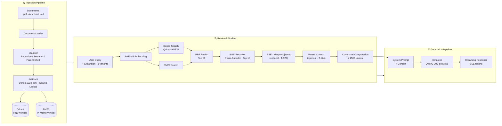
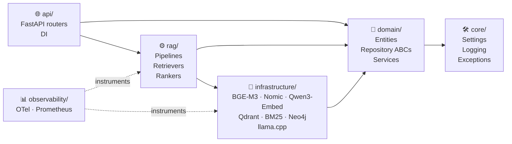
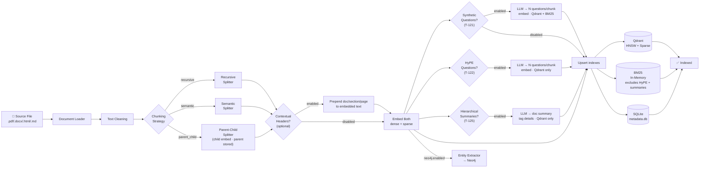
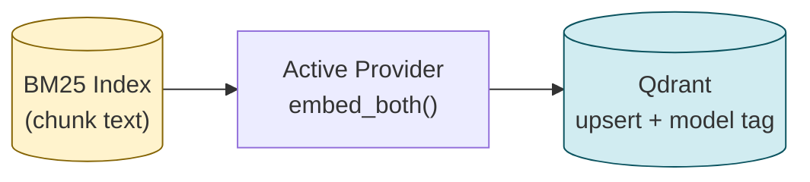
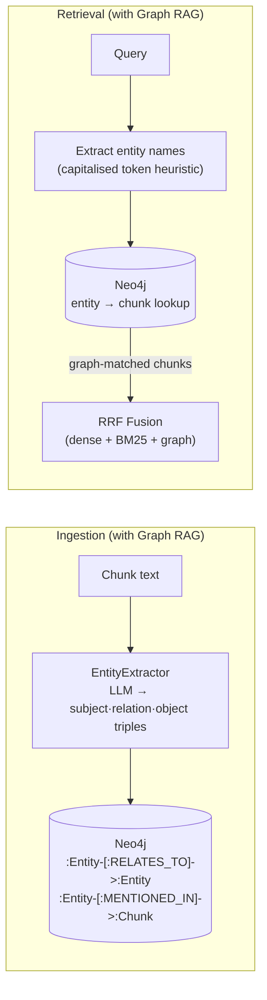
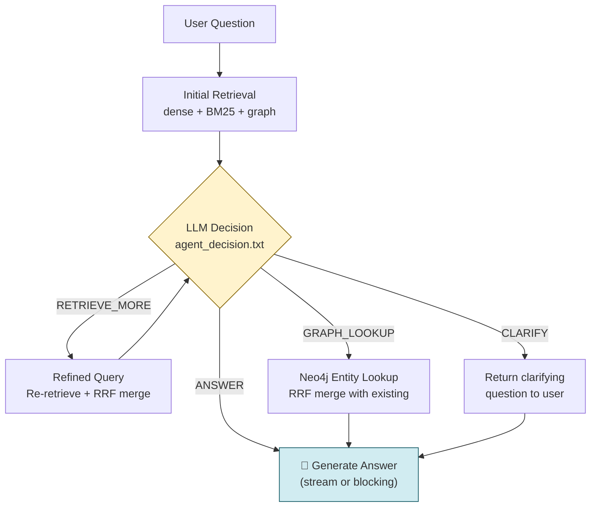
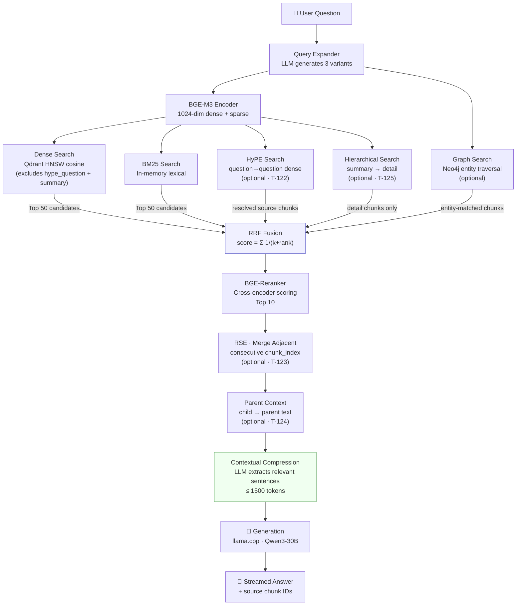
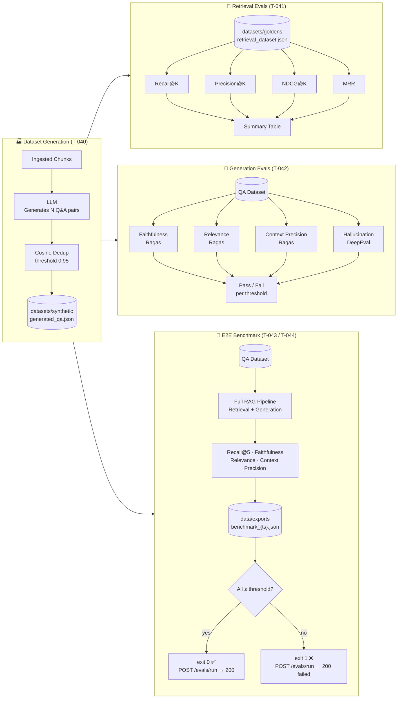
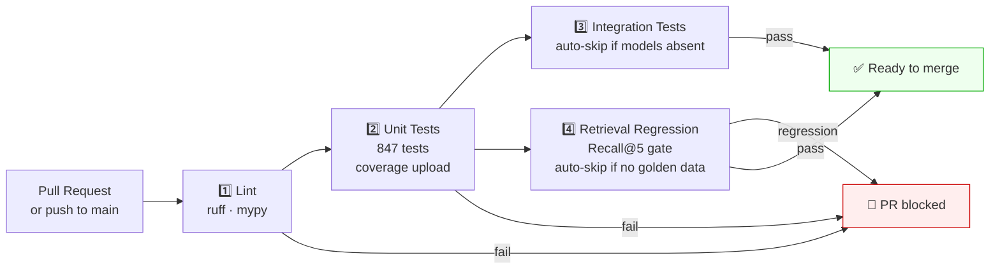

# RAG Platform

A production-grade Retrieval-Augmented Generation platform built with Clean Architecture and Domain-Driven Design. Runs fully self-hosted on Apple Silicon (M-series) by default; API-based embedding providers (OpenAI, Voyage AI, Cohere, Gemini) can be enabled with a single config change.

---

## Table of Contents

- [Architecture Overview](#architecture-overview)
- [Tech Stack](#tech-stack)
- [Prerequisites](#prerequisites)
- [Installation](#installation)
- [Model Setup](#model-setup)
- [Configuration](#configuration)
- [Usage](#usage)
  - [Ingest Documents](#ingest-documents)
    - [Optional Chunk Enrichment](#optional-chunk-enrichment)
  - [Start the API Server](#start-the-api-server)
  - [Chat](#chat)
  - [Run Evaluations](#run-evaluations)
  - [Benchmark](#benchmark)
  - [Compare Embedding Providers](#compare-embedding-providers)
- [Docker Compose](#docker-compose)
  - [Full Stack](#full-stack)
  - [Development Hot-Reload](#development-hot-reload)
  - [Ingestion via Docker](#ingestion-via-docker)
- [Kubernetes & Production](#kubernetes--production)
  - [Helm Chart](#helm-chart)
  - [EKS Setup](#eks-setup)
- [Knowledge Graph (Graph RAG)](#knowledge-graph-graph-rag)
- [Agentic RAG](#agentic-rag)
- [Embedding Providers](#embedding-providers)
- [API Reference](#api-reference)
- [Project Structure](#project-structure)
- [Development](#development)
- [Testing](#testing)
- [Observability](#observability)
- [CI/CD](#cicd)

---

## Architecture Overview



### Layer Separation (Clean Architecture)



> **Rule:** arrows point inward — `domain/` never imports from `infrastructure/` or `rag/`.

---

## Tech Stack

| Component | Technology |
|---|---|
| LLM (inference) | [llama.cpp](https://github.com/ggerganov/llama.cpp) via `llama-cpp-python` |
| Default model | Qwen3-30B (GGUF) |
| Embeddings (self-hosted) | [BGE-M3](https://huggingface.co/BAAI/bge-m3) · [Nomic-Embed-Text v1.5](https://huggingface.co/nomic-ai/nomic-embed-text-v1.5) · [Qwen3-Embedding](https://huggingface.co/Qwen/Qwen3-Embedding-0.6B) |
| Embeddings (API, optional) | OpenAI · Voyage AI · Cohere · Gemini (`uv sync --extra api-embeddings`) |
| Embedding cache | Redis (transparent decorator, configurable TTL) |
| Reranker | [BGE-Reranker-v2-M3](https://huggingface.co/BAAI/bge-reranker-v2-m3) |
| Vector DB | [Qdrant](https://qdrant.tech) (self-hosted, with embedding model versioning) |
| Sparse search | BM25 via `rank-bm25` |
| Knowledge graph | [Neo4j](https://neo4j.com) (optional, `uv sync --extra graph`) |
| API framework | [FastAPI](https://fastapi.tiangolo.com) |
| Package manager | [uv](https://docs.astral.sh/uv/) |
| Linting | [Ruff](https://docs.astral.sh/ruff/) + [mypy](https://mypy-lang.org/) |
| Tracing | [OpenTelemetry](https://opentelemetry.io/) |
| Metrics | [Prometheus](https://prometheus.io/) |
| Evaluation | [Ragas](https://docs.ragas.io/) + [DeepEval](https://docs.confident-ai.com/) |

---

## Prerequisites

- **macOS** with Apple Silicon (M1/M2/M3/M4) — MPS acceleration
- **Python 3.12+** (managed by uv)
- **[uv](https://docs.astral.sh/uv/)** — `brew install uv`
- **[Docker Desktop](https://www.docker.com/)** — for Qdrant (native) or the full stack (Compose)
- **~64 GB RAM** recommended for Qwen3-30B; smaller models work on less

---

## Installation

### Option A — Native (recommended for active development on Apple Silicon)

```bash
# 1. Clone the repository
git clone <repo-url>
cd rag_implementation

# 2. Install all dependencies (including dev tools)
make install

# 3. Copy and edit the environment file
cp .env.example .env

# 4. Start Qdrant only
make qdrant-up

# 5. Start the API server (Metal/MPS acceleration)
make serve
```

### Option B — Docker Compose (full stack, no local Python setup required)

```bash
cp .env.example .env   # adjust LLM__MODEL_PATH etc.
make docker-up         # starts api, qdrant, ollama, redis, prometheus, otel-collector
```

See [Docker Compose](#docker-compose) for details.

---

## Model Setup

Download models into the `models/` directory:

```bash
# BGE-M3 embeddings (~570 MB)
huggingface-cli download BAAI/bge-m3 --local-dir models/embeddings/bge-m3

# BGE-Reranker-v2-M3 (~570 MB)
huggingface-cli download BAAI/bge-reranker-v2-m3 --local-dir models/rerankers/bge-reranker-v2-m3

# Qwen3-30B-Instruct GGUF (~16 GB at Q4_K_M)
# Download from Hugging Face and place in models/llm/
# e.g. qwen3-30b-instruct-q4_k_m.gguf
```

Update `configs/llm.yaml` with your model filename:
```yaml
llm:
  model_path: models/llm/qwen3-30b-instruct-q4_k_m.gguf
```

---

## Configuration

All configuration lives in `configs/*.yaml` with environment variable overrides. Copy `.env.example` to `.env` and adjust:

```bash
# Key settings (use __ as nested delimiter)
LLM__MODEL_PATH=models/llm/your-model.gguf
LLM__N_GPU_LAYERS=-1                       # -1 = all layers on Metal
EMBEDDINGS__PROVIDER=bge_m3                # bge_m3 | nomic | qwen_embedding | openai | voyage | cohere | gemini
EMBEDDINGS__DEVICE=mps                     # mps | cuda | cpu
QDRANT__URL=http://localhost:6333
QDRANT__COLLECTION=rag_documents

# API embedding providers (only required when EMBEDDINGS__PROVIDER matches)
EMBEDDINGS__OPENAI__API_KEY=
EMBEDDINGS__VOYAGE__API_KEY=
EMBEDDINGS__COHERE__API_KEY=
EMBEDDINGS__GEMINI__API_KEY=

# Embedding cache (disabled by default — set true to enable Redis caching)
EMBEDDINGS__CACHE__ENABLED=false
REDIS__URL=redis://localhost:6379

# Retrieval fusion (multi-query variants fused via RRF by default)
RETRIEVAL__TOP_K_FINAL=5
RETRIEVAL__HYBRID_FUSION=rrf              # rrf | weighted_linear
RETRIEVAL__HYBRID_ALPHA=0.7               # weighted_linear only
RETRIEVAL__HYPE__ENABLED=false            # HyPE question-question matching (T-122)
RETRIEVAL__HYPE__N_QUESTIONS=3
RETRIEVAL__RSE__ENABLED=false             # merge adjacent retrieved chunks (T-123)
RETRIEVAL__RSE__MAX_SEGMENT_TOKENS=1500
RETRIEVAL__PARENT_CONTEXT__ENABLED=false  # expand child chunks to parent text (T-124; requires parent_child)

# Chunk enrichment (disabled by default — see Optional Chunk Enrichment)
CHUNKING__STRATEGY=recursive              # recursive | semantic | parent_child
CHUNKING__CONTEXTUAL_HEADERS__ENABLED=false
CHUNKING__CONTEXTUAL_HEADERS__EXCLUDE_FROM_LLM_CONTEXT=true
CHUNKING__AUGMENTATION__ENABLED=false
CHUNKING__AUGMENTATION__N_QUESTIONS=3
CHUNKING__HIERARCHICAL__ENABLED=false      # document summary + detail two-tier index (T-125)
CHUNKING__HIERARCHICAL__SUMMARY_TOP_K=3

# Neo4j Graph RAG (disabled by default)
NEO4J__ENABLED=false
NEO4J__URI=bolt://localhost:7687
NEO4J__USER=neo4j
NEO4J__PASSWORD=
NEO4J__EXTRACT_ENTITIES_ON_INGEST=true

# SQLite metadata store (ingestion history + content-hash dedup)
METADATA__ENABLED=true
METADATA__DB_PATH=data/processed/metadata.db

# API security (optional — local dev leaves API key empty)
API__API_KEY=                          # when set, require X-API-Key on /ingest, /chat, /evals
API__MAX_UPLOAD_BYTES=10485760           # POST /ingest/upload size cap (10 MiB)
# API__INGEST_ALLOWED_ROOTS='["data/raw"]'  # JSON list; /ingest/path restricted to these dirs
```

| File | Purpose |
|---|---|
| `configs/llm/qwen3-30b.yaml` | Default LLM profile (llama.cpp + Qwen3-30B) |
| `configs/llm/qwen3-14b.yaml` | Lighter LLM profile (llama.cpp + Qwen3-14B) |
| `configs/llm/ollama-*.yaml` | Ollama-backed profiles (GLM-5.2, Gemma3-27B, Llama3.3-70B) |
| `configs/embeddings.yaml` | Embedding provider, dimensions, API credentials, cache TTL |
| `configs/retrieval.yaml` | Chunking, contextual headers, synthetic-question augmentation, hierarchical summaries, HyPE, RSE, parent context, hybrid fusion, reranker |
| `configs/neo4j.yaml` | Neo4j connection, graph enable flag, entity extraction on ingest |
| `configs/evals.yaml` | Evaluation thresholds and dataset paths |
| `configs/logging.yaml` | Log level, format (json/text), OTel endpoint |

---

## Usage

### Ingest Documents

```bash
# Ingest a single file
make ingest SOURCE=data/raw/manual.pdf

# Ingest a directory
make ingest SOURCE=data/raw/

# List ingested documents (SQLite metadata store)
uv run python scripts/ingest.py --list

# Supported formats: .pdf, .docx, .html, .htm, .md, .markdown
```

Re-ingesting the same file is **idempotent**: unchanged content is skipped (`IngestionResult.skipped=True`); modified content removes old chunks and upserts new ones. Deduplication uses a content hash stored in the SQLite metadata store (`data/processed/metadata.db` by default).

With `chunking.strategy: parent_child`, both parent and child chunks are indexed in Qdrant and BM25. At query time, retrieval matches on child embeddings; enable `retrieval.parent_context` to substitute parent text into the LLM context (see [Parent Context on Retrieve (T-124)](#parent-context-on-retrieve-t-124)).

**Security notes:**
- `POST /ingest/path` only reads files under `api.ingest_allowed_roots` (default: `data/raw`). It cannot ingest arbitrary server paths such as `/etc/passwd`.
- `POST /ingest/upload` reads uploads in bounded chunks (`api.max_upload_bytes`, default 10 MiB) and accepts only supported extensions.
- Set `API__API_KEY` to require an `X-API-Key` header on `/ingest`, `/chat`, and `/evals/run`. `/health` and `/metrics` stay public.

#### Ingestion Flow



#### Optional Chunk Enrichment

Several optional index-time techniques are configured in `configs/retrieval.yaml`. All are **off by default** — enabling any flag leaves behavior unchanged when it stays `false`.

| Technique | Config path | Indexed in | Retrieved via |
|---|---|---|---|
| Contextual headers (T-120) | `chunking.contextual_headers` | Same chunk text (header prepended before embed) | Standard dense/BM25 |
| Document augmentation (T-121) | `chunking.augmentation` | Qdrant + BM25 (`type=synthetic_question`) | Standard dense/BM25 → resolve to source |
| HyPE (T-122) | `retrieval.hype` | Qdrant only (`type=hype_question`) | Dedicated question→question dense search → RRF source |
| Hierarchical summaries (T-125) | `chunking.hierarchical` | Qdrant only (`type=summary` + `type=detail`) | Two-stage summary→detail dense search → RRF source |

##### Contextual Chunk Headers (T-120)

Prepends document title, section, and page metadata to each chunk **before embedding**, improving recall without changing the text shown to the generator (by default).

```yaml
# configs/retrieval.yaml
chunking:
  contextual_headers:
    enabled: false                    # set true to prepend headers at ingest
    exclude_from_llm_context: true      # true → generation uses raw chunk body
```

Example embedded text:

```
[Document: Annual Report 2023 | Section: Revenue | Page: 42]
Revenue grew 12% year over year.
```

Headers are derived from loader metadata (`filename`, `section`, `page`). The original body is preserved in `Chunk.metadata["raw_text"]` for retrieval context and compression.

##### Document Augmentation — Synthetic Questions (T-121)

At ingest time, the LLM generates up to **N questions per chunk**. Each question is embedded and indexed in Qdrant + BM25 as a separate point (`metadata.type = synthetic_question`, `metadata.source_chunk_id` links back to the source chunk). At retrieval, question hits are resolved to their source chunks before RRF fusion.

```yaml
# configs/retrieval.yaml
chunking:
  augmentation:
    enabled: false       # set true to generate questions during ingest
    n_questions: 3
```

**Trade-offs:** augmentation adds one LLM call per chunk at ingest (failures on individual chunks are logged and skipped). Re-ingest after toggling these flags — existing indexes are not updated retroactively.

##### HyPE — Hypothetical Prompt Embeddings (T-122)

HyPE precomputes hypothetical questions per chunk at **ingest** time and embeds them as separate Qdrant points (`metadata.type = hype_question`). At **query** time, the user question is embedded and matched against those HyPE vectors (question→question similarity), then hits are resolved to source chunks and fused as a **fourth RRF source** alongside dense, BM25, and graph retrieval.

HyPE vectors are stored in Qdrant only — they are excluded from BM25 and from the standard dense search path (so they do not compete with passage embeddings).

```yaml
# configs/retrieval.yaml
retrieval:
  hype:
    enabled: false       # set true to index + retrieve via HyPE
    n_questions: 3
```

**When to use:** FAQ-style corpora and question-like queries where matching the user's phrasing to pre-generated questions improves recall. Can be combined with document augmentation (T-121), but both add LLM calls per chunk at ingest — enable deliberately.

**Trade-offs:** one LLM call per chunk at ingest (same generator as T-121; failures are logged and skipped). Re-ingest after enabling — existing indexes are not updated retroactively. `rebuild_embeddings.py` re-embeds passage chunks from BM25; re-run ingestion to rebuild HyPE question vectors.

```bash
# HyPE only
RETRIEVAL__HYPE__ENABLED=true
RETRIEVAL__HYPE__N_QUESTIONS=3

# Or combine with other enrichment flags
CHUNKING__CONTEXTUAL_HEADERS__ENABLED=true
CHUNKING__AUGMENTATION__ENABLED=true
CHUNKING__AUGMENTATION__N_QUESTIONS=3
RETRIEVAL__HYPE__ENABLED=true
```

##### Hierarchical Index Summaries (T-125)

Hierarchical indexing builds a **two-tier index** at ingest time: one document-level summary vector plus detail chunk vectors tagged by document. At query time, the retriever first matches summaries to select the most relevant documents, then searches detail chunks scoped to those documents. Only **detail** chunks reach the LLM — summary text is used for routing, not generation.

At ingest, detail chunks receive `metadata.type = detail`. The LLM generates a concise document summary from the full source text; that summary is embedded and stored as `metadata.type = summary` with the same `document_id`. Summary vectors are stored in Qdrant only (excluded from BM25 and standard dense search, like HyPE).

At retrieval, `HierarchicalRetriever` runs a two-stage dense search: top `summary_top_k` documents from summary vectors, then detail search filtered to those document IDs. Results are fused into RRF alongside dense, BM25, HyPE, and graph retrieval.

```yaml
# configs/retrieval.yaml
chunking:
  hierarchical:
    enabled: false       # set true to index document summaries + detail tags
    summary_top_k: 3     # documents selected in stage 1 before detail search
```

**When to use:** large multi-document corpora where coarse document-level matching improves recall before drilling into passages — especially when individual chunks lack enough context to rank well on their own.

**Trade-offs:** one LLM call per document at ingest (failures are logged; detail chunks are still tagged and indexed). Re-ingest after enabling — existing indexes are not updated retroactively. `rebuild_embeddings.py` re-embeds passage chunks from BM25; re-run ingestion to rebuild summary vectors and detail type tags.

```bash
CHUNKING__HIERARCHICAL__ENABLED=true
CHUNKING__HIERARCHICAL__SUMMARY_TOP_K=3
```

### Start the API Server

```bash
make serve
# Server starts at http://localhost:8000
# Interactive docs: http://localhost:8000/docs
```

### Chat

**Streaming (SSE):**
```bash
curl -X POST http://localhost:8000/chat \
  -H "Content-Type: application/json" \
  -d '{"question": "How do IAM roles work in EKS?"}' \
  --no-buffer
```

**Non-streaming:**
```bash
curl -X POST http://localhost:8000/chat/full \
  -H "Content-Type: application/json" \
  -d '{"question": "How do IAM roles work in EKS?"}'
```

**Python client:**
```python
import httpx, json

with httpx.Client() as client:
    with client.stream("POST", "http://localhost:8000/chat",
                       json={"question": "What is EKS?"}) as r:
        for line in r.iter_lines():
            if line.startswith("data: ") and line != "data: [DONE]":
                token = json.loads(line[6:])["token"]
                print(token, end="", flush=True)
```

**Agentic RAG (multistep retrieval — streaming):**
```bash
curl -X POST http://localhost:8000/chat/agent \
  -H "Content-Type: application/json" \
  -d '{"question": "How do IAM roles work in EKS?", "max_iterations": 3}' \
  --no-buffer
```

**Agentic RAG (full response with iteration metadata):**
```bash
curl -X POST http://localhost:8000/chat/agent/full \
  -H "Content-Type: application/json" \
  -d '{"question": "How do IAM roles work in EKS?", "max_iterations": 3}'
```

Example response from `/chat/agent/full`:
```json
{
  "answer": "...",
  "sources": ["chunk-id-1", "chunk-id-2"],
  "latency_ms": 4200.5,
  "token_count": 312,
  "iterations": 2,
  "actions": ["RETRIEVE_MORE", "ANSWER"]
}
```

See [Agentic RAG](#agentic-rag) for action types and when to use the agent endpoints vs standard chat.

### Run Evaluations

```bash
# Generate synthetic QA pairs from ingested documents
make evals

# With options
uv run python scripts/run_evals.py \
  --n-pairs 5 \
  --max-chunks 100 \
  --output datasets/synthetic/my_dataset.json
```

### Rebuild Embeddings

Use this when you switch to a different embedding model or need to recover a corrupted Qdrant collection. The BM25 index (which persists chunk text) is used as the source of truth. Works with any provider — self-hosted or API-based.

```bash
# Preview: count chunks without writing anything
uv run python scripts/rebuild_embeddings.py --dry-run

# Full rebuild using current embedding model from configs/embeddings.yaml
uv run python scripts/rebuild_embeddings.py

# Start fresh: drop Qdrant collection, re-embed everything
uv run python scripts/rebuild_embeddings.py --recreate-collection

# Custom batch size (default: 32; API providers default to 32 with rate-limit pacing)
uv run python scripts/rebuild_embeddings.py --batch-size 16
```

> **Model mismatch guard:** Before writing, the script checks the collection's tracked `embedding_model_name` (collection metadata, or the first tagged point on legacy collections). If it differs from the current config — including API model or dimension changes — the script aborts with a clear error. Use `--recreate-collection` to re-index from scratch.



### Run Evaluations via API

Once documents are ingested and `make evals` has generated the golden QA dataset, the live endpoint runs the full benchmark:

```bash
curl -X POST http://localhost:8000/evals/run
```

**Response when QA dataset is empty** (`204 No Content`):
```
QA dataset is empty — generate samples with `make evals` first.
```

**Response when QA pairs are present** (`200 OK`):
```json
{
  "status": "passed",
  "timestamp": "20250623T143012",
  "total_samples": 42,
  "mean_recall_at_5": 0.81,
  "mean_faithfulness": 0.88,
  "mean_relevance": 0.84,
  "passed": true,
  "report_path": "data/exports/benchmark_20250623T143012.json",
  "message": "All metrics above threshold ✓"
}
```

The report is also saved to `data/exports/` for offline analysis.

### Benchmark

```bash
# End-to-end RAG benchmark (exits 0 if all metrics above threshold)
make benchmark

# With a specific LLM profile
uv run python scripts/benchmark.py \
  --llm-config configs/llm/qwen3-14b.yaml

# With custom thresholds
uv run python scripts/benchmark.py \
  --recall-threshold 0.5 \
  --faith-threshold 0.8 \
  --relev-threshold 0.75
```

### Compare Models

Run the same benchmark against multiple LLM profiles and see a side-by-side results table:

```bash
uv run python scripts/compare_models.py \
  --configs configs/llm/qwen3-30b.yaml \
           configs/llm/qwen3-14b.yaml \
           configs/llm/ollama-glm52.yaml \
  --max-samples 50
```

**Output:**

```
┌─────────────────────────────────────────────────────────────────────┐
│                        Model Comparison                             │
├──────────────────────┬──────────┬─────────────┬──────────┬─────────┤
│ Model                │ Recall@5 │ Faithfulness │ Relevance│ Status  │
├──────────────────────┼──────────┼─────────────┼──────────┼─────────┤
│ models/llm/qwen3-30b │  0.821   │    0.883     │  0.847   │ PASS ✓  │
│ models/llm/qwen3-14b │  0.798   │    0.861     │  0.822   │ PASS ✓  │
│ glm4:latest          │  0.774   │    0.840     │  0.801   │ PASS ✓  │
└──────────────────────┴──────────┴─────────────┴──────────┴─────────┘
```

The winning model is determined by real evaluation data — Faithfulness + Relevance + Recall@5 + Context Precision on **your** documents, not generic benchmarks.

---

### Compare Embedding Providers

Benchmark multiple embedding providers against the same golden QA dataset and get a side-by-side quality, latency, and estimated cost table:

```bash
# Self-hosted only (no API key required)
uv run python scripts/compare_embedding_providers.py --providers bge_m3

# Compare local vs API providers
uv run python scripts/compare_embedding_providers.py \
  --providers bge_m3 openai voyage \
  --max-samples 50

# Save results to a custom path
uv run python scripts/compare_embedding_providers.py \
  --providers bge_m3 openai voyage cohere \
  --output data/exports/embedding_comparison.json
```

**Output:**

```
┌───────────────────┬──────────┬──────────┬──────────┬─────────────┬───────────┐
│ Provider          │ Recall@5 │ NDCG@5   │ Latency  │ Cost/1K tok │ Status    │
├───────────────────┼──────────┼──────────┼──────────┼─────────────┼───────────┤
│ bge_m3 (local)    │  0.843   │  0.871   │  18 ms   │  $0.000     │ OK ✓      │
│ openai            │  0.861   │  0.889   │  210 ms  │  $0.130     │ OK ✓      │
│ voyage            │  0.878   │  0.902   │  185 ms  │  $0.120     │ OK ✓      │
└───────────────────┴──────────┴──────────┴──────────┴─────────────┴───────────┘
```

API providers that are not configured (no key set) are skipped with a warning rather than aborting the run. Results are saved to `data/exports/embedding_comparison_{timestamp}.json`.

---

## Docker Compose

The full local stack is defined in `docker-compose.yml`. All services start with a single command; the API server, Qdrant, Ollama, Redis, Prometheus, and the OTel collector are all included.

### Full Stack

```bash
# First run — build images from source
make docker-build

# Start all services in the background
make docker-up

# Verify the API is healthy
curl http://localhost:8000/health

# Tail API logs
make docker-logs

# Stop (containers removed, volumes kept)
make docker-down
```

**Services and ports:**

| Service | Port | Notes |
|---|---|---|
| `api` | 8000 | FastAPI — built from `docker/Dockerfile.api` |
| `qdrant` | 6333 / 6334 | Vector DB |
| `ollama` | 11434 | LLM server (replaces llama.cpp in Docker) |
| `redis` | 6379 | Cache |
| `prometheus` | 9090 | Scrapes `api:8000/metrics` |
| `otel-collector` | 4317 / 4318 | OTLP gRPC / HTTP |

> **Metal / MPS note:** Docker on macOS runs inside a Linux VM and cannot access the Metal GPU. The Compose file sets `EMBEDDINGS__DEVICE=cpu` and routes LLM inference through Ollama instead of llama.cpp. For full Metal performance run the API natively with `make serve` and start only infrastructure via `docker compose up qdrant redis otel-collector prometheus`.

### Development Hot-Reload

`docker-compose.override.yml` is picked up automatically by Compose. It live-mounts `src/` and `configs/` into the container and enables `uvicorn --reload`, so code changes are reflected without rebuilding the image.

```bash
# Pull the lighter dev model once
docker compose exec ollama ollama pull qwen3:14b

# Start stack — override applied automatically
make docker-up

# Edit any file under src/ → server reloads within ~1 s
make docker-logs
```

### Ingestion via Docker

```bash
# Ingest everything in data/raw/ (default)
make docker-ingest

# Ingest a specific file
make docker-ingest SOURCE=/app/data/raw/manual.pdf
```

---

## Kubernetes & Production

### Helm Chart

The chart lives in `helm/rag-platform/`. All tunables are in `values.yaml`; templates reference them — nothing is hardcoded.

```bash
# Install locally (dry-run against a k3d or kind cluster)
helm install rag-platform helm/rag-platform \
  --namespace rag-platform \
  --create-namespace \
  --dry-run

# Production deploy on EKS
helm install rag-platform helm/rag-platform \
  --namespace rag-platform \
  --create-namespace \
  --set image.api.repository=<ECR_URI>/rag-platform-api \
  --set image.worker.repository=<ECR_URI>/rag-platform-worker \
  --set ingress.enabled=true \
  --set ingress.host=api.yourdomain.com \
  --set ingress.certificateArn=<ACM_ARN> \
  --set persistence.models.storageClass=efs-sc

# Upgrade (e.g. new image tag)
helm upgrade rag-platform helm/rag-platform \
  --namespace rag-platform \
  --reuse-values \
  --set image.api.tag=<new-tag>
```

**Chart contents:**

| Template | Purpose |
|---|---|
| `deployment-api.yaml` | API Deployment — liveness/readiness probes on `GET /health` |
| `deployment-worker.yaml` | Worker Deployment — 1 replica, no autoscale |
| `service-api.yaml` | ClusterIP Service on port 8000 |
| `hpa-api.yaml` | HPA — scales api on CPU ≥ 70% (min 2, max 10 replicas) |
| `ingress.yaml` | AWS ALB Ingress — toggle via `ingress.enabled` |
| `configmap.yaml` | Non-sensitive env vars → injected via `envFrom` |
| `secret.yaml` | Sensitive values (Qdrant API key) → K8s Secret |
| `pvc-qdrant.yaml` | 50 Gi `ReadWriteOnce` volume for Qdrant data |
| `pvc-models.yaml` | 30 Gi `ReadOnlyMany` volume for model files (EFS on EKS) |

**Key `values.yaml` overrides:**

```yaml
# Pin api pods to GPU node group (llama.cpp / CUDA)
scheduling:
  api:
    nodeSelector: { eks.amazonaws.com/nodegroup: gpu }
    tolerations:
      - key: nvidia.com/gpu
        operator: Exists
        effect: NoSchedule

# Switch embedding device to CUDA on GPU nodes
env:
  embeddingsDevice: cuda
  
# Add nvidia.com/gpu to resource limits
resources:
  api:
    limits:
      cpu: "2"
      memory: "8Gi"
      nvidia.com/gpu: "1"
```

### EKS Setup

See **[infra/eks/README.md](infra/eks/README.md)** for the complete end-to-end guide covering:

- EKS cluster provisioning with `eksctl`
- Required add-ons: EBS CSI driver, EFS CSI driver, AWS Load Balancer Controller, metrics-server
- ECR image push
- Helm deploy with all production flags
- Lens Desktop connection (kubeconfig import, key views, port-forward)
- Common operations (scale, exec, log tailing, one-shot ingestion job)
- Teardown

---

## Knowledge Graph (Graph RAG)

Graph RAG augments the retrieval pipeline with a Neo4j knowledge graph that stores entity relationships extracted from ingested documents. Chunks that mention query-relevant entities are surfaced alongside dense and BM25 results.

### How it works



### Setup

```bash
# 1. Install optional Neo4j driver
uv sync --extra graph

# 2. Start Neo4j (Docker)
docker run -d --name neo4j \
  -p 7474:7474 -p 7687:7687 \
  -e NEO4J_AUTH=neo4j/yourpassword \
  neo4j:5

# 3. Enable in .env (or configs/neo4j.yaml)
NEO4J__ENABLED=true
NEO4J__URI=bolt://localhost:7687
NEO4J__USER=neo4j
NEO4J__PASSWORD=yourpassword
NEO4J__EXTRACT_ENTITIES_ON_INGEST=true   # populate graph during ingestion
```

### Enabling Graph RAG in the pipeline

Graph RAG is wired automatically when `neo4j.enabled=true`:

- **Retrieval:** `RetrievalPipeline.from_settings()` attaches `GraphRetriever` to `HybridRetriever`; graph-matched chunks participate in RRF fusion alongside dense + BM25 results.
- **Ingestion:** when `extract_entities_on_ingest=true`, the ingestion pipeline extracts entity triples per document and upserts them to Neo4j via `GraphIndexer`.
- **Degradation:** if Neo4j is disabled or unreachable, the pipeline logs a warning and continues with dense + BM25 only.

No manual wiring is required for the default API server (`make serve`) or CLI ingestion (`scripts/ingest.py`).

<details>
<summary>Advanced: manual GraphRetriever wiring</summary>

```python
from src.rag.retrieval.graph_retriever import GraphRetriever
from src.rag.retrieval.bm25_retriever import BM25Retriever
from src.infrastructure.llm.llama_cpp_provider import LlamaCppProvider

llm = LlamaCppProvider.from_settings()
bm25 = BM25Retriever.from_disk()
graph_retriever = GraphRetriever.from_settings(llm=llm, bm25=bm25)

from src.rag.retrieval.hybrid_retriever import HybridRetriever
hybrid = HybridRetriever(dense=dense, bm25=bm25, graph_retriever=graph_retriever)
```

</details>

---

## Agentic RAG

`AgentPipeline` adds an iterative reasoning loop on top of the existing retrieval + generation stack. After each retrieval, the LLM decides whether the context is sufficient or whether to take a follow-up action before answering.

### Agent loop



> The loop is capped at `max_iterations` (default: 3) to prevent runaway LLM calls. Any decision parsing failure falls back to `ANSWER` immediately.

### Usage

**HTTP (recommended when the API server is running):**

```bash
# Streaming — same SSE format as POST /chat
curl -X POST http://localhost:8000/chat/agent \
  -H "Content-Type: application/json" \
  -d '{"question": "How do IAM roles work in EKS?", "max_iterations": 3}' \
  --no-buffer

# Full response — includes iterations and actions taken
curl -X POST http://localhost:8000/chat/agent/full \
  -H "Content-Type: application/json" \
  -d '{"question": "How do IAM roles work in EKS?", "max_iterations": 3}'
```

**Python (in-process):**

```python
from src.rag.pipelines.agent_pipeline import AgentPipeline

# Build from settings (creates ChatPipeline internally)
agent = AgentPipeline.from_settings(max_iterations=3)

# Streaming
async for token in await agent.chat("How do IAM roles work in EKS?"):
    print(token, end="", flush=True)

# Blocking
result = await agent.chat_full("How do IAM roles work in EKS?")
print(result.answer.text)
print("Sources:", result.answer.sources)
print("Actions:", [a.value for a in result.actions])
```

### Agent actions

| Action | When triggered | What happens |
|---|---|---|
| `ANSWER` | Context is sufficient | Proceeds to LLM generation |
| `RETRIEVE_MORE` | Context is incomplete | Re-retrieves with `refined_query`, merges via RRF |
| `GRAPH_LOOKUP` | Entity relationships needed | Queries Neo4j, merges entity-linked chunks |
| `CLARIFY` | Question is ambiguous | Returns clarifying question; falls back to no-info reply |

### Relationship to Graph RAG

`GRAPH_LOOKUP` is active when `NEO4J__ENABLED=true` — `RetrievalPipeline.from_settings()` wires `GraphRetriever` automatically. Without Neo4j, the agent still works; it skips graph lookups and relies on dense + BM25 (+ multi-query RRF fusion).

---

## Embedding Providers

Seven providers are available across two tiers. Switch via `EMBEDDINGS__PROVIDER` (env var or `configs/embeddings.yaml`). After switching, update `EMBEDDINGS__DENSE_DIM` to match the new model and run `python scripts/rebuild_embeddings.py --recreate-collection`.

### Self-hosted (no API key, run locally)

| Provider | `EMBEDDINGS__PROVIDER` | Dim | Sparse | Source |
|---|---|---|---|---|
| BGE-M3 **(default)** | `bge_m3` | 1024 | ✓ native | `models/embeddings/bge-m3` |
| Nomic-Embed-Text v1.5 | `nomic` | 768 | ✗ (BM25) | `nomic-ai/nomic-embed-text-v1.5` |
| Qwen3-Embedding-0.6B | `qwen_embedding` | 1024 | ✗ (BM25) | `Qwen/Qwen3-Embedding-0.6B` |

### API-based (requires key + `uv sync --extra api-embeddings`)

| Provider | `EMBEDDINGS__PROVIDER` | Dim | Default model | Key env var |
|---|---|---|---|---|
| OpenAI | `openai` | 3072 | `text-embedding-3-large` | `EMBEDDINGS__OPENAI__API_KEY` |
| Voyage AI | `voyage` | 1536 | `voyage-large-2` | `EMBEDDINGS__VOYAGE__API_KEY` |
| Cohere | `cohere` | 1024 | `embed-english-v3.0` | `EMBEDDINGS__COHERE__API_KEY` |
| Gemini | `gemini` | 768 | `text-embedding-004` | `EMBEDDINGS__GEMINI__API_KEY` |

All API providers are dense-only — BM25 continues to provide sparse retrieval. OpenAI's `text-embedding-3` family supports dimension truncation via `EMBEDDINGS__OPENAI__DIMENSIONS`; changing dimensions after indexing requires `--recreate-collection`.

```bash
# Switch to Voyage AI
EMBEDDINGS__PROVIDER=voyage
EMBEDDINGS__VOYAGE__API_KEY=your-key
EMBEDDINGS__DENSE_DIM=1536

uv run python scripts/rebuild_embeddings.py --recreate-collection

# Switch back to self-hosted BGE-M3
EMBEDDINGS__PROVIDER=bge_m3
EMBEDDINGS__DENSE_DIM=1024

uv run python scripts/rebuild_embeddings.py --recreate-collection
```

### Embedding cache

When `EMBEDDINGS__CACHE__ENABLED=true`, dense vectors are cached in Redis using a SHA-256 key of `text + model_identifier`. This eliminates redundant API calls during re-ingestion or repeated queries. Caching is disabled by default — set `EMBEDDINGS__CACHE__ENABLED=true` to activate it.

```bash
EMBEDDINGS__CACHE__ENABLED=true
EMBEDDINGS__CACHE__TTL_SECONDS=604800   # 7 days
REDIS__URL=redis://localhost:6379
```

Cache metrics are exposed on `/metrics`: `rag_embedding_cache_hits_total` and `rag_embedding_cache_misses_total`. If Redis is unavailable the provider falls through transparently — no error, no data loss.

### Embedding model versioning

Each upserted point carries an `embedding_model_name` payload field. New collections also store the same value in **Qdrant collection metadata** for O(1) validation. On startup (and in `rebuild_embeddings.py` preflight), `QdrantVectorStore` compares that tracked name to the current config and aborts on mismatch — preventing silent vector corruption when switching providers, models, or dimensions.

Identifiers follow `provider:model` for self-hosted providers and `provider:model@dim` for API providers (the `@dim` suffix captures OpenAI `text-embedding-3` truncation via `EMBEDDINGS__OPENAI__DIMENSIONS`):

```
VectorStoreError: Embedding model mismatch: collection 'rag_documents' was built with
'bge_m3:models/embeddings/bge-m3' but current config is 'openai:text-embedding-3-large@512'.
Run: python scripts/rebuild_embeddings.py --recreate-collection
```

Legacy collections without metadata fall back to the first tagged point payload; a successful match backfills collection metadata automatically.

> **Sparse vectors:** BGE-M3 produces both dense and sparse vectors in a single forward pass, enabling Qdrant native sparse search. All other providers are dense-only — BM25 (maintained independently of the embedding model) continues to provide lexical retrieval.

---

## API Reference

| Method | Endpoint | Description |
|---|---|---|
| `GET` | `/health` | Server status and model load state |
| `POST` | `/chat` | Stream answer as Server-Sent Events |
| `POST` | `/chat/full` | Non-streaming chat, returns complete answer |
| `POST` | `/chat/agent` | Agentic RAG — multistep retrieval, streaming answer (`max_iterations` 1–5) |
| `POST` | `/chat/agent/full` | Agentic RAG — complete answer plus `iterations` and `actions` metadata |
| `POST` | `/ingest/path` | Ingest a local file or directory |
| `POST` | `/ingest/upload` | Ingest an uploaded file (multipart) |
| `POST` | `/evals/run` | Run E2E benchmark — returns `204` until QA dataset is populated, `200` with Recall@5 / Faithfulness / Relevance / Context Precision report |
| `GET` | `/metrics` | Prometheus metrics (text format) |
| `GET` | `/docs` | Interactive OpenAPI documentation |

---

## Project Structure

```
rag_implementation/
├── configs/                    # YAML configuration
│   ├── llm/                    # Per-model LLM profiles (switch with --llm-config)
│   │   ├── qwen3-30b.yaml      # llama.cpp · Qwen3-30B (default baseline)
│   │   ├── qwen3-14b.yaml      # llama.cpp · Qwen3-14B
│   │   ├── ollama-glm52.yaml   # Ollama · GLM-5.2
│   │   ├── ollama-gemma3-27b.yaml
│   │   └── ollama-llama33-70b.yaml
│   ├── embeddings.yaml
│   ├── retrieval.yaml
│   ├── neo4j.yaml              # Graph RAG + SQLite metadata store settings
│   ├── evals.yaml
│   ├── logging.yaml
│   ├── prometheus.yml          # Prometheus scrape config (scrapes api:8000/metrics)
│   └── otel-collector.yaml     # OTel collector — OTLP gRPC/HTTP receiver, debug exporter
├── data/                       # Runtime data (gitignored)
│   ├── raw/                    # Source documents to ingest
│   ├── processed/              # BM25 index (.pkl)
│   └── exports/                # Benchmark results (.json)
├── datasets/
│   ├── goldens/                # Golden QA + retrieval datasets
│   └── synthetic/              # LLM-generated QA pairs
├── docker/                     # Dockerfiles (one per service)
│   ├── Dockerfile.api          # Multi-stage build for FastAPI server
│   └── Dockerfile.worker       # Build for ingestion worker
├── helm/rag-platform/          # Helm chart for Kubernetes deployment
│   ├── Chart.yaml
│   ├── values.yaml             # All tunables — image tags, resources, ingress, PVCs
│   └── templates/
│       ├── _helpers.tpl        # Shared template helpers (fullname, labels, etc.)
│       ├── configmap.yaml      # Non-sensitive env vars
│       ├── secret.yaml         # Sensitive values (Qdrant API key)
│       ├── deployment-api.yaml # API Deployment + liveness/readiness probes
│       ├── deployment-worker.yaml
│       ├── service-api.yaml    # ClusterIP on port 8000
│       ├── hpa-api.yaml        # HPA — CPU ≥ 70%, min 2 / max 10 replicas
│       ├── ingress.yaml        # AWS ALB Ingress (toggle: ingress.enabled)
│       ├── pvc-qdrant.yaml     # 50 Gi gp3 for Qdrant
│       └── pvc-models.yaml     # 30 Gi ReadOnlyMany for model files (EFS on EKS)
├── infra/
│   └── eks/
│       └── README.md           # EKS cluster setup guide + Lens integration
├── models/                     # Downloaded model files (gitignored)
│   ├── embeddings/bge-m3/
│   ├── rerankers/bge-reranker-v2-m3/
│   └── llm/                    # GGUF models
├── scripts/
│   ├── _benchmark_utils.py     # Shared CLI utilities (load QA, apply LLM config)
│   ├── ingest.py               # Document ingestion CLI
│   ├── rebuild_embeddings.py   # Re-embed all chunks → Qdrant (model migration)
│   ├── run_evals.py            # QA dataset generation CLI
│   ├── benchmark.py            # E2E benchmark CLI (--llm-config for model swap)
│   └── compare_models.py       # Multi-model comparison table
├── specs/
│   └── TODO.md                 # Specification-driven task list (SDD format)
├── src/
│   ├── api/                    # FastAPI routers + DI
│   ├── core/                   # Settings, logging, exceptions
│   ├── domain/                 # Entities, repository ABCs, services
│   ├── evals/                  # Retrieval/generation metrics, benchmarks
│   │   ├── retrieval/          # Recall@K · Precision@K · NDCG · MRR
│   │   ├── generation/         # Faithfulness · Relevance · Context Precision · Hallucination
│   │   └── e2e/                # RAGBenchmark · BenchmarkReport
│   ├── infrastructure/         # BGE-M3, Qdrant, BM25, Neo4j, SQLite metadata, llama.cpp
│   │   └── metadata/           # SQLiteMetadataStore (ingestion history + dedup)
│   ├── observability/          # OTel tracing, Prometheus metrics
│   ├── prompts/                # Prompt templates (string.Template)
│   │   └── ingestion/          # chunk_header_template · generate_chunk_questions · generate_document_summary
│   ├── rag/                    # Chunkers, retrievers, pipelines
│   │   ├── chunking/           # Recursive / semantic / parent-child + contextual_headers
│   │   ├── enrichment/         # Document augmentation (T-121) · HyPE (T-122) · hierarchical (T-125) · RSE (T-123) · parent context (T-124)
│   │   ├── retrieval/          # Dense · BM25 · hybrid · graph · hype · hierarchical retrievers
│   │   └── ingestion/          # GraphIndexer (entity extraction on ingest)
│   └── main.py                 # FastAPI app factory
├── tests/
│   ├── benchmarks/             # Benchmark tests (skip without data)
│   ├── integration/            # Integration tests (skip without models)
│   └── unit/                   # 800+ unit tests (zero external deps)
├── .dockerignore
├── .env.example
├── .github/workflows/ci.yml
├── .pre-commit-config.yaml
├── docker-compose.yml          # Full local stack
├── docker-compose.override.yml # Dev overrides — hot-reload + Ollama LLM
├── Makefile
└── pyproject.toml
```

---

## Development

```bash
# Install dev dependencies
uv sync --group dev

# Lint (ruff check + mypy)
make lint

# Auto-format
make format

# Install pre-commit hooks (requires git repo)
pre-commit install
```

**Environment variables** use `__` as the nested delimiter:
```bash
LLM__TEMPERATURE=0.0
RETRIEVAL__HYBRID_FUSION=rrf
RETRIEVAL__TOP_K_FINAL=5
RETRIEVAL__HYPE__ENABLED=false
RETRIEVAL__RSE__ENABLED=false
RETRIEVAL__RSE__MAX_SEGMENT_TOKENS=1500
RETRIEVAL__PARENT_CONTEXT__ENABLED=false
CHUNKING__STRATEGY=recursive
CHUNKING__CONTEXTUAL_HEADERS__ENABLED=false
CHUNKING__AUGMENTATION__ENABLED=false
CHUNKING__HIERARCHICAL__ENABLED=false
NEO4J__ENABLED=true
EMBEDDINGS__DEVICE=cpu
```

### Makefile targets

| Target | Description |
|---|---|
| `make install` | `uv sync --extra dev --extra evals` |
| `make serve` | Start API server natively (Metal/MPS) |
| `make ingest SOURCE=path` | Ingest a file or directory |
| `make evals` | Generate synthetic QA dataset |
| `make benchmark` | Run E2E benchmark |
| `make lint` | `ruff check` + `mypy` |
| `make format` | `ruff format` + `ruff check --fix` |
| `make test` | Unit + integration tests with coverage |
| `make test-unit` | Unit tests only |
| `make test-e2e` | End-to-end tests |
| `make docker-build` | Build `api` and `worker` images |
| `make docker-up` | Start full Docker Compose stack |
| `make docker-down` | Stop containers (volumes kept) |
| `make docker-logs` | Tail API container logs |
| `make docker-ingest SOURCE=path` | Run one-shot ingestion via Docker |
| `make docker-clean` | Stop containers **and** destroy volumes |
| `make qdrant-up` | Start Qdrant container only (legacy) |
| `make clean` | Remove `__pycache__`, `.mypy_cache`, etc. |

---

## Testing

```bash
# Unit tests (fast, no external services needed)
make test-unit

# All tests including integration
make test

# Qdrant integration tests (requires running Qdrant — skipped in CI)
make qdrant-up
uv run pytest tests/integration/test_qdrant.py -v

# Benchmark suite
uv run pytest tests/benchmarks/ -v -s
```

**Test coverage:** 97 source files · 40+ test files · 847 tests (32 skipped without models/services).

Integration tests auto-skip when models or Qdrant are absent (CI runs them but does not start Docker services).

---

## Retrieval Pipeline Details



**Multi-query fusion:** the query expander produces up to 3 variants; hybrid retrieval runs for each variant and results are fused with RRF before reranking. Set `retrieval.hybrid_fusion: weighted_linear` in `configs/retrieval.yaml` to use dense/BM25 score blending instead (controlled by `hybrid_alpha`). `top_k_final` caps how many chunks reach generation after rerank, optional RSE, optional parent context, and compression. When HyPE is enabled (`retrieval.hype.enabled: true`), it participates as an additional RRF list; when hierarchical indexing is enabled (`chunking.hierarchical.enabled: true`), two-stage summary→detail search participates similarly. Weighted-linear fusion is not used if HyPE, hierarchical, or graph retrieval is active.

When **document augmentation** (T-121) is enabled, synthetic question hits from dense/BM25 search are mapped back to source chunks (via `source_chunk_id`) before fusion, so the generator always receives original passage text.

When **HyPE** (T-122) is enabled, the dedicated `HyPERetriever` searches only `hype_question` vectors, resolves hits to source chunks, and merges them into RRF alongside dense, BM25, and graph results. Standard dense search excludes HyPE points so passage and question embeddings do not compete in the same index query.

When **hierarchical summaries** (T-125) are enabled, detail chunks are tagged at ingest (`type=detail`) and document summaries are indexed separately (`type=summary`). `HierarchicalRetriever` matches summaries first to select documents, then retrieves detail chunks within those documents. Summary vectors are excluded from BM25 and standard dense search; only detail chunks are returned to downstream reranking and generation.

##### Relevant Segment Extraction (T-123)

RSE is a **query-time** post-reranking step (not ingest-time). When enabled, adjacent retrieved chunks from the same document — those with consecutive `metadata.chunk_index` values — are merged into longer coherent segments before contextual compression. Parent-level chunks and child chunks are merged separately (siblings sharing the same `parent_id` only). Merged segments respect `max_segment_tokens` and never combine chunks from different documents. Overlapping sibling text from recursive/parent-child chunking is deduplicated at merge boundaries.

RSE adds no extra LLM or API calls at query time. It is especially useful when reranking returns several neighboring chunks from the same passage.

```yaml
# configs/retrieval.yaml
retrieval:
  rse:
    enabled: false              # set true to merge adjacent chunks after reranking
    max_segment_tokens: 1500
```

**When to use:** corpora chunked with `recursive`, `semantic`, or `parent_child` strategies (all set `chunk_index`). Complements parent-child chunking: RSE stitches adjacent sibling children into segments; for expanding a single child hit to its full parent passage, enable [Parent Context (T-124)](#parent-context-on-retrieve-t-124).

**Behavior:** merged segments keep the lowest-index chunk's ID as anchor; `metadata.merged_chunk_ids` lists all contributing chunk IDs (also expanded in `Answer.sources` via `chunk_source_ids`). Chunks without `chunk_index` pass through unchanged. Contextual headers (T-120): merged `raw_text` includes all source bodies. OTel span `retrieval.rse` records `merge_count`.

```bash
RETRIEVAL__RSE__ENABLED=true
RETRIEVAL__RSE__MAX_SEGMENT_TOKENS=1500
```

##### Parent Context on Retrieve (T-124)

Parent context is a **query-time** step for the **parent-child chunking strategy**. Small child chunks are retrieved (precise embedding match), then each child's parent chunk is looked up from the BM25 index and its text is substituted into the LLM context. `Answer.sources` still references the original child chunk IDs — citations point at the precise match, while the generator sees the broader parent passage.

Activation requires **both** flags:

```yaml
# configs/retrieval.yaml
chunking:
  strategy: parent_child

retrieval:
  parent_context:
    enabled: false              # set true to expand child hits to parent text
```

When a parent chunk cannot be found (e.g. index rebuilt without parents), the pipeline falls back to the child text and continues. Parent context adds no extra LLM or API calls — only BM25 lookups by `metadata.parent_id`.

**When to use:** corpora indexed with `chunking.strategy: parent_child`, where child chunks improve retrieval precision but parent passages provide better generation context. Complements RSE (T-123): RSE merges adjacent sibling children; parent context expands a single child hit to its parent window.

**Behavior:** parent text is stored in `metadata.parent_context_text` and takes priority in `chunk_context_text()` for LLM prompts. Contextual headers (T-120) on the parent are respected (uses `raw_text` when present). OTel span `retrieval.parent_context` records `resolved_count` (children expanded) and `chunk_count`.

```bash
CHUNKING__STRATEGY=parent_child
RETRIEVAL__PARENT_CONTEXT__ENABLED=true
```

**Why Hybrid Search?** BM25 finds exact keyword matches (error codes, proper nouns) that dense embeddings miss. RRF fusion consistently outperforms either method alone.

---

## Evaluation Framework



---

## Observability

### OTel Span Hierarchy

```mermaid
gantt
    title Request Trace (example · 2.3 s total)
    dateFormat  x
    axisFormat  %L ms

    section retrieval
    retrieval.expansion    :0, 180
    retrieval.embedding    :180, 380
    retrieval.hybrid       :380, 780
    retrieval.reranking    :780, 1080
    retrieval.rse          :1080, 1130
    retrieval.parent_context :1130, 1160
    retrieval.compression  :1160, 1310

    section generation
    generation.llm         :1310, 2300
```



Configure the collector endpoint:
```bash
LOGGING__OTEL_ENDPOINT=http://localhost:4317
```

When RSE is enabled, span `retrieval.rse` appears between `retrieval.reranking` and `retrieval.parent_context` (or `retrieval.compression` when parent context is off), with attributes `merge_count` (chunk boundaries eliminated) and `chunk_count` (segments after merging).

When parent context is enabled (`chunking.strategy=parent_child` and `retrieval.parent_context.enabled=true`), span `retrieval.parent_context` appears between `retrieval.rse` (or `retrieval.reranking` when RSE is off) and `retrieval.compression`, with attributes `resolved_count` (child chunks expanded to parent text) and `chunk_count`.

### Prometheus Metrics

| Metric | Type | Labels |
|---|---|---|
| `rag_request_latency_seconds` | Histogram | `stage` |
| `rag_requests_total` | Counter | `status` |
| `rag_retrieval_chunk_count` | Histogram | — |
| `rag_llm_tokens_total` | Counter | — |

**Grafana scrape config:**
```yaml
scrape_configs:
  - job_name: rag-platform
    static_configs:
      - targets: ['localhost:8000']
    metrics_path: /metrics
```

---

## CI/CD



---

## License

MIT
