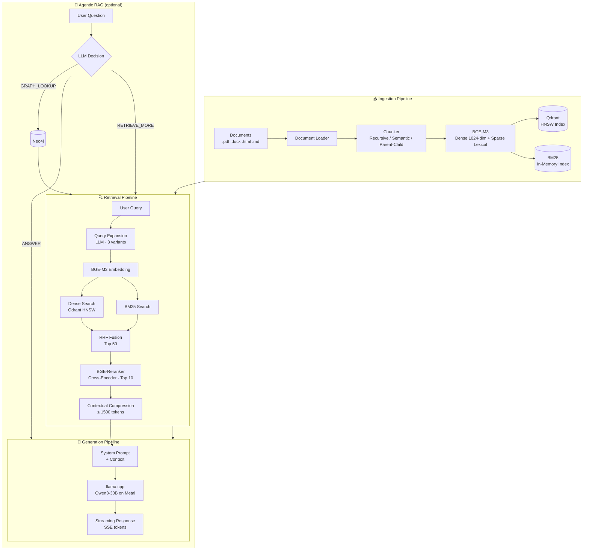
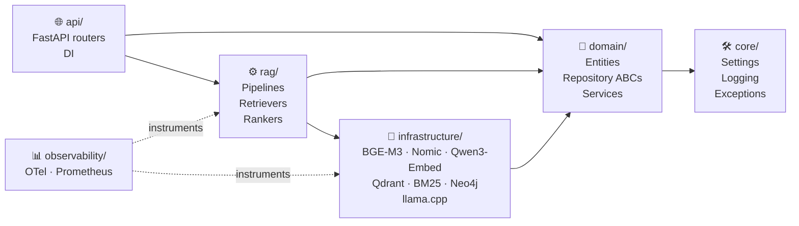
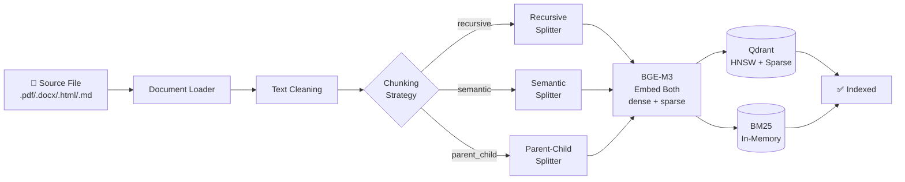
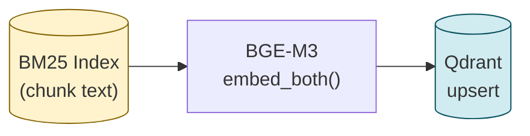
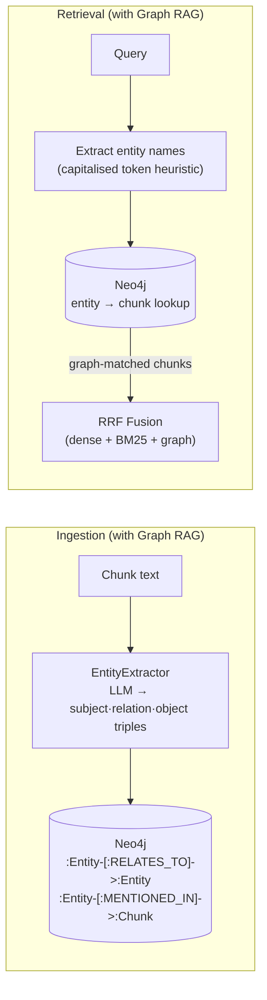
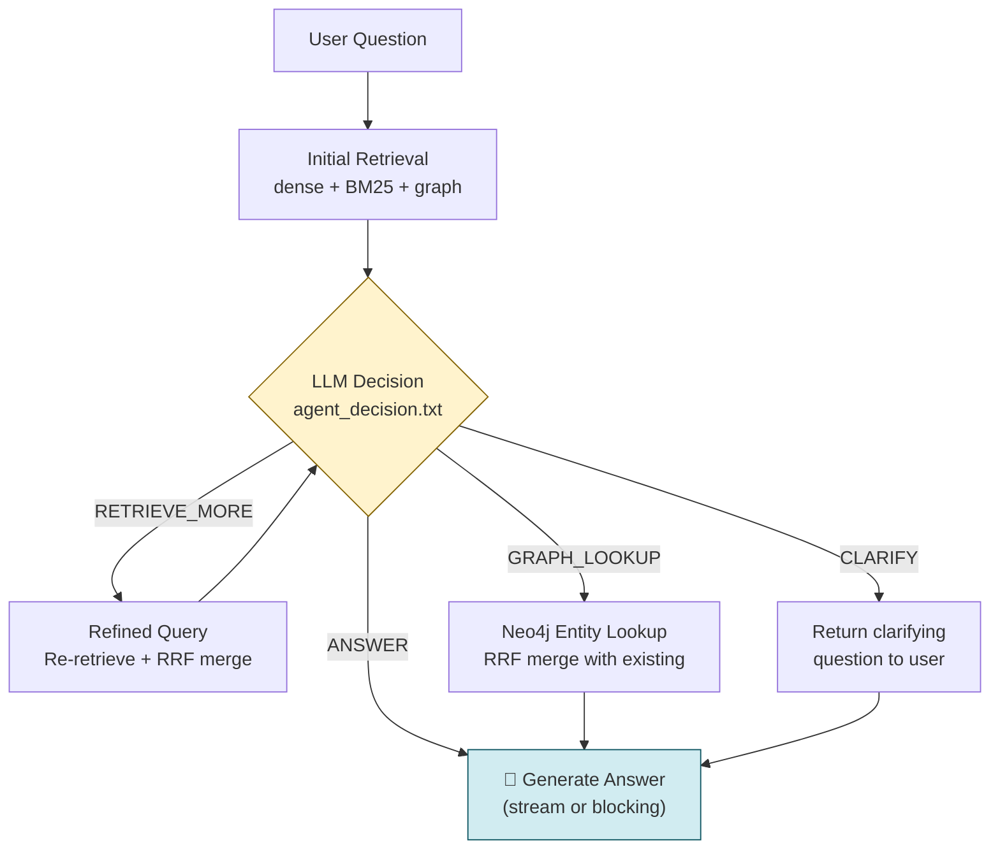
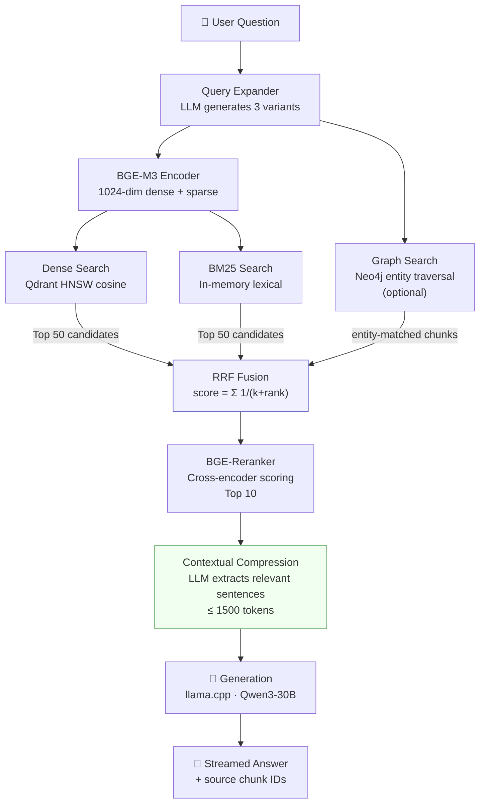

# RAG Platform

A production-grade, **local** Retrieval-Augmented Generation platform built with Clean Architecture and Domain-Driven Design. Runs entirely on Apple Silicon (M-series) with no external API keys required.

---

## Table of Contents

- [Architecture Overview](#architecture-overview)
- [Tech Stack](#tech-stack)
- [Prerequisites](#prerequisites)
- [Installation](#installation)
- [Model Setup](#model-setup)
- [Configuration](#configuration)
- [Usage](#usage)
  - [Ingest Documents](#ingest-documents)
  - [Start the API Server](#start-the-api-server)
  - [Chat](#chat)
  - [Run Evaluations](#run-evaluations)
  - [Benchmark](#benchmark)
- [Knowledge Graph (Graph RAG)](#knowledge-graph-graph-rag)
- [Agentic RAG](#agentic-rag)
- [Embedding Providers](#embedding-providers)
- [API Reference](#api-reference)
- [Project Structure](#project-structure)
- [Development](#development)
- [Testing](#testing)
- [Observability](#observability)
- [CI/CD](#cicd)

---

## Architecture Overview



### Layer Separation (Clean Architecture)



> **Rule:** arrows point inward — `domain/` never imports from `infrastructure/` or `rag/`.

---

## Tech Stack

| Component | Technology |
|---|---|
| LLM (inference) | [llama.cpp](https://github.com/ggerganov/llama.cpp) via `llama-cpp-python` |
| Default model | Qwen3-30B (GGUF) |
| Embeddings | [BGE-M3](https://huggingface.co/BAAI/bge-m3) · [Nomic-Embed-Text v1.5](https://huggingface.co/nomic-ai/nomic-embed-text-v1.5) · [Qwen3-Embedding](https://huggingface.co/Qwen/Qwen3-Embedding-0.6B) |
| Reranker | [BGE-Reranker-v2-M3](https://huggingface.co/BAAI/bge-reranker-v2-m3) |
| Vector DB | [Qdrant](https://qdrant.tech) (self-hosted) |
| Sparse search | BM25 via `rank-bm25` |
| Knowledge graph | [Neo4j](https://neo4j.com) (optional, `uv sync --extra graph`) |
| API framework | [FastAPI](https://fastapi.tiangolo.com) |
| Package manager | [uv](https://docs.astral.sh/uv/) |
| Linting | [Ruff](https://docs.astral.sh/ruff/) + [mypy](https://mypy-lang.org/) |
| Tracing | [OpenTelemetry](https://opentelemetry.io/) |
| Metrics | [Prometheus](https://prometheus.io/) |
| Evaluation | [Ragas](https://docs.ragas.io/) + [DeepEval](https://docs.confident-ai.com/) |

---

## Prerequisites

- **macOS** with Apple Silicon (M1/M2/M3/M4) — MPS acceleration
- **Python 3.12+** (managed by uv)
- **[uv](https://docs.astral.sh/uv/)** — `brew install uv`
- **[Docker](https://www.docker.com/)** — for Qdrant
- **~64 GB RAM** recommended for Qwen3-30B; smaller models work on less

---

## Installation

```bash
# 1. Clone the repository
git clone <repo-url>
cd rag_implementation

# 2. Install all dependencies (including dev tools)
make install

# 3. Copy and edit the environment file
cp .env.example .env

# 4. Start Qdrant
make qdrant-up
```

---

## Model Setup

Download models into the `models/` directory:

```bash
# BGE-M3 embeddings (~570 MB)
huggingface-cli download BAAI/bge-m3 --local-dir models/embeddings/bge-m3

# BGE-Reranker-v2-M3 (~570 MB)
huggingface-cli download BAAI/bge-reranker-v2-m3 --local-dir models/rerankers/bge-reranker-v2-m3

# Qwen3-30B-Instruct GGUF (~16 GB at Q4_K_M)
# Download from Hugging Face and place in models/llm/
# e.g. qwen3-30b-instruct-q4_k_m.gguf
```

Update `configs/llm.yaml` with your model filename:
```yaml
llm:
  model_path: models/llm/qwen3-30b-instruct-q4_k_m.gguf
```

---

## Configuration

All configuration lives in `configs/*.yaml` with environment variable overrides. Copy `.env.example` to `.env` and adjust:

```bash
# Key settings (use __ as nested delimiter)
LLM__MODEL_PATH=models/llm/your-model.gguf
LLM__N_GPU_LAYERS=-1          # -1 = all layers on Metal
EMBEDDINGS__DEVICE=mps        # mps | cuda | cpu
QDRANT__URL=http://localhost:6333
QDRANT__COLLECTION=rag_documents
```

| File | Purpose |
|---|---|
| `configs/llm.yaml` | LLM provider, model path, context size, temperature |
| `configs/embeddings.yaml` | Embedding model, batch size, vector dimensions |
| `configs/retrieval.yaml` | Chunking, hybrid search alpha, reranker settings |
| `configs/evals.yaml` | Evaluation thresholds and dataset paths |
| `configs/logging.yaml` | Log level, format (json/text), OTel endpoint |

---

## Usage

### Ingest Documents

```bash
# Ingest a single file
make ingest SOURCE=data/raw/manual.pdf

# Ingest a directory
make ingest SOURCE=data/raw/

# Supported formats: .pdf, .docx, .html, .htm, .md, .markdown
```

#### Ingestion Flow



### Start the API Server

```bash
make serve
# Server starts at http://localhost:8000
# Interactive docs: http://localhost:8000/docs
```

### Chat

**Streaming (SSE):**
```bash
curl -X POST http://localhost:8000/chat \
  -H "Content-Type: application/json" \
  -d '{"question": "How do IAM roles work in EKS?"}' \
  --no-buffer
```

**Non-streaming:**
```bash
curl -X POST http://localhost:8000/chat/full \
  -H "Content-Type: application/json" \
  -d '{"question": "How do IAM roles work in EKS?"}'
```

**Python client:**
```python
import httpx, json

with httpx.Client() as client:
    with client.stream("POST", "http://localhost:8000/chat",
                       json={"question": "What is EKS?"}) as r:
        for line in r.iter_lines():
            if line.startswith("data: ") and line != "data: [DONE]":
                token = json.loads(line[6:])["token"]
                print(token, end="", flush=True)
```

### Run Evaluations

```bash
# Generate synthetic QA pairs from ingested documents
make evals

# With options
uv run python scripts/run_evals.py \
  --n-pairs 5 \
  --max-chunks 100 \
  --output datasets/synthetic/my_dataset.json
```

### Rebuild Embeddings

Use this when you switch to a different embedding model or need to recover a corrupted Qdrant collection. The BM25 index (which persists chunk text) is used as the source of truth.

```bash
# Preview: count chunks without writing anything
uv run python scripts/rebuild_embeddings.py --dry-run

# Full rebuild using current embedding model from configs/embeddings.yaml
uv run python scripts/rebuild_embeddings.py

# Start fresh: drop Qdrant collection, re-embed everything
uv run python scripts/rebuild_embeddings.py --recreate-collection

# Custom batch size (default: 32)
uv run python scripts/rebuild_embeddings.py --batch-size 16
```



### Run Evaluations via API

Once documents are ingested and `make evals` has generated the golden QA dataset, the live endpoint runs the full benchmark:

```bash
curl -X POST http://localhost:8000/evals/run
```

**Response when QA dataset is empty** (`204 No Content`):
```
QA dataset is empty — generate samples with `make evals` first.
```

**Response when QA pairs are present** (`200 OK`):
```json
{
  "status": "passed",
  "timestamp": "20250623T143012",
  "total_samples": 42,
  "mean_recall_at_5": 0.81,
  "mean_faithfulness": 0.88,
  "mean_relevance": 0.84,
  "passed": true,
  "report_path": "data/exports/benchmark_20250623T143012.json",
  "message": "All metrics above threshold ✓"
}
```

The report is also saved to `data/exports/` for offline analysis.

### Benchmark

```bash
# End-to-end RAG benchmark (exits 0 if all metrics above threshold)
make benchmark

# With custom thresholds
uv run python scripts/benchmark.py \
  --recall-threshold 0.5 \
  --faith-threshold 0.8 \
  --relev-threshold 0.75
```

---

## Knowledge Graph (Graph RAG)

Graph RAG augments the retrieval pipeline with a Neo4j knowledge graph that stores entity relationships extracted from ingested documents. Chunks that mention query-relevant entities are surfaced alongside dense and BM25 results.

### How it works



### Setup

```bash
# 1. Install optional Neo4j driver
uv sync --extra graph

# 2. Start Neo4j (Docker)
docker run -d --name neo4j \
  -p 7474:7474 -p 7687:7687 \
  -e NEO4J_AUTH=neo4j/yourpassword \
  neo4j:5

# 3. Configure (in .env)
# No dedicated Neo4j settings yet — defaults: bolt://localhost:7687 / neo4j / neo4j
```

### Enabling Graph RAG in the pipeline

```python
from src.rag.retrieval.graph_retriever import EntityExtractor, GraphRetriever
from src.infrastructure.vectordb.neo4j_graph import Neo4jGraphRepository
from src.rag.retrieval.bm25_retriever import BM25Retriever
from src.infrastructure.llm.llama_cpp_provider import LlamaCppProvider

llm = LlamaCppProvider.from_settings()
bm25 = BM25Retriever.from_disk()

graph_retriever = GraphRetriever.from_settings(llm=llm, bm25=bm25)

# Inject into HybridRetriever
from src.rag.retrieval.hybrid_retriever import HybridRetriever
hybrid = HybridRetriever(dense=dense, bm25=bm25, graph_retriever=graph_retriever)
```

> **Note:** `HybridRetriever` defaults to `graph_retriever=None` — the pipeline degrades gracefully to dense + BM25 when Neo4j is absent.

---

## Agentic RAG

`AgentPipeline` adds an iterative reasoning loop on top of the existing retrieval + generation stack. After each retrieval, the LLM decides whether the context is sufficient or whether to take a follow-up action before answering.

### Agent loop



> The loop is capped at `max_iterations` (default: 3) to prevent runaway LLM calls. Any decision parsing failure falls back to `ANSWER` immediately.

### Usage

```python
from src.rag.pipelines.agent_pipeline import AgentPipeline

# Build from settings (creates ChatPipeline internally)
agent = AgentPipeline.from_settings(max_iterations=3)

# Streaming
async for token in await agent.chat("How do IAM roles work in EKS?"):
    print(token, end="", flush=True)

# Blocking
answer = await agent.chat_full("How do IAM roles work in EKS?")
print(answer.text)
print("Sources:", answer.sources)
```

### Agent actions

| Action | When triggered | What happens |
|---|---|---|
| `ANSWER` | Context is sufficient | Proceeds to LLM generation |
| `RETRIEVE_MORE` | Context is incomplete | Re-retrieves with `refined_query`, merges via RRF |
| `GRAPH_LOOKUP` | Entity relationships needed | Queries Neo4j, merges entity-linked chunks |
| `CLARIFY` | Question is ambiguous | Returns clarifying question; falls back to no-info reply |

### Relationship to Graph RAG

`GRAPH_LOOKUP` is only active when a `GraphRetriever` (T-070) is wired into `HybridRetriever`. Without Neo4j, the agent still works — it simply skips graph lookups and relies on dense + BM25.

---

## Embedding Providers

Three providers are available. Switch via `EMBEDDINGS__PROVIDER` env var (or `configs/embeddings.yaml`). After switching, update `EMBEDDINGS__DENSE_DIM` and run `python scripts/rebuild_embeddings.py --recreate-collection`.

| Provider | `EMBEDDINGS__PROVIDER` | Dim | Sparse | Model path |
|---|---|---|---|---|
| BGE-M3 (default) | `bge_m3` | 1024 | ✓ native | `models/embeddings/bge-m3` |
| Nomic-Embed-Text v1.5 | `nomic` | 768 | ✗ (BM25 only) | `nomic-ai/nomic-embed-text-v1.5` |
| Qwen3-Embedding-0.6B | `qwen_embedding` | 1024 | ✗ (BM25 only) | `Qwen/Qwen3-Embedding-0.6B` |

```bash
# Example: switch to Nomic
EMBEDDINGS__PROVIDER=nomic
EMBEDDINGS__MODEL_PATH=nomic-ai/nomic-embed-text-v1.5
EMBEDDINGS__DENSE_DIM=768

uv run python scripts/rebuild_embeddings.py --recreate-collection
```

> **Sparse vectors:** BGE-M3 produces both dense and sparse vectors in a single pass, enabling Qdrant native sparse search. Nomic and Qwen3-Embedding are dense-only — BM25 (independent of the embedding model) continues to provide sparse retrieval.

---

## API Reference

| Method | Endpoint | Description |
|---|---|---|
| `GET` | `/health` | Server status and model load state |
| `POST` | `/chat` | Stream answer as Server-Sent Events |
| `POST` | `/chat/full` | Non-streaming chat, returns complete answer |
| `POST` | `/ingest/path` | Ingest a local file or directory |
| `POST` | `/ingest/upload` | Ingest an uploaded file (multipart) |
| `POST` | `/evals/run` | Run E2E benchmark — returns `204` until QA dataset is populated, `200` with full metric report when ready |
| `GET` | `/metrics` | Prometheus metrics (text format) |
| `GET` | `/docs` | Interactive OpenAPI documentation |

---

## Project Structure

```
rag_implementation/
├── configs/                    # YAML configuration
├── data/                       # Runtime data (gitignored)
│   ├── raw/                    # Source documents to ingest
│   ├── processed/              # BM25 index (.pkl)
│   └── exports/                # Benchmark results (.json)
├── datasets/
│   ├── goldens/                # Golden QA + retrieval datasets
│   └── synthetic/              # LLM-generated QA pairs
├── models/                     # Downloaded model files (gitignored)
│   ├── embeddings/bge-m3/
│   ├── rerankers/bge-reranker-v2-m3/
│   └── llm/                    # GGUF models
├── scripts/
│   ├── ingest.py               # Document ingestion CLI
│   ├── rebuild_embeddings.py   # Re-embed all chunks → Qdrant (model migration)
│   ├── run_evals.py            # QA dataset generation CLI
│   └── benchmark.py            # E2E benchmark CLI
├── src/
│   ├── api/                    # FastAPI routers + DI
│   ├── core/                   # Settings, logging, exceptions
│   ├── domain/                 # Entities, repository ABCs, services
│   ├── evals/                  # Retrieval/generation metrics, benchmarks
│   ├── infrastructure/         # BGE-M3, Qdrant, BM25, llama.cpp
│   ├── observability/          # OTel tracing, Prometheus metrics
│   ├── prompts/                # Prompt templates (string.Template)
│   ├── rag/                    # Chunkers, retrievers, pipelines
│   └── main.py                 # FastAPI app factory
├── tests/
│   ├── benchmarks/             # Benchmark tests (skip without data)
│   ├── integration/            # Integration tests (skip without models)
│   └── unit/                   # 568+ unit tests (zero external deps)
├── .env.example
├── .github/workflows/ci.yml
├── .pre-commit-config.yaml
├── Makefile
└── pyproject.toml
```

---

## Development

```bash
# Install dev dependencies
uv sync --group dev

# Lint (ruff check + mypy)
make lint

# Auto-format
make format

# Install pre-commit hooks (requires git repo)
pre-commit install
```

**Environment variables** use `__` as the nested delimiter:
```bash
LLM__TEMPERATURE=0.0
RETRIEVAL__HYBRID_ALPHA=0.5
EMBEDDINGS__DEVICE=cpu
```

---

## Testing

```bash
# Unit tests (fast, no external services needed)
make test-unit

# All tests including integration
make test

# Benchmark suite
uv run pytest tests/benchmarks/ -v -s
```

**Test coverage:** 97 source files · 39 test files · 568+ unit tests.

Integration tests auto-skip when models / Qdrant are absent.

---

## Retrieval Pipeline Details



**Why Hybrid Search?** BM25 finds exact keyword matches (error codes, proper nouns) that dense embeddings miss. RRF fusion consistently outperforms either method alone.

---

## Evaluation Framework

```mermaid
flowchart LR
    subgraph GEN["🏭 Dataset Generation (T-040)"]
        IC[Ingested Chunks] --> LLM2[LLM\nGenerates N Q&A pairs]
        LLM2 --> DED[Cosine Dedup\nthreshold 0.95]
        DED --> QA[("datasets/synthetic\ngenerated_qa.json")]
    end

    subgraph RET["📏 Retrieval Evals (T-041)"]
        QA2[("datasets/goldens\nretrieval_dataset.json")] --> R1["Recall@K"]
        QA2 --> R2["Precision@K"]
        QA2 --> R3["NDCG@K"]
        R1 & R2 & R3 --> RT[Summary Table]
    end

    subgraph GEN2["🧪 Generation Evals (T-042)"]
        QA3[("QA Dataset")] --> F["Faithfulness\nRagas"]
        QA3 --> RV["Relevance\nRagas"]
        QA3 --> H["Hallucination\nDeepEval"]
        F & RV & H --> GR[Pass / Fail\nper threshold]
    end

    subgraph E2E["🏁 E2E Benchmark (T-043 / T-044)"]
        QA4[("QA Dataset")] --> PIPE[Full RAG Pipeline\nRetrieval + Generation]
        PIPE --> MET[Recall@5\nFaithfulness\nRelevance]
        MET --> RPT[("data/exports\nbenchmark_{ts}.json")]
        RPT --> EXIT{All ≥ threshold?}
        EXIT -->|yes| PASS[exit 0 ✅\nPOST /evals/run → 200]
        EXIT -->|no| FAIL[exit 1 ❌\nPOST /evals/run → 200 failed]
    end

    GEN --> RET
    GEN --> GEN2
    GEN --> E2E
```

---

## Observability

### OTel Span Hierarchy

```mermaid
gantt
    title Request Trace (example · 2.3 s total)
    dateFormat  x
    axisFormat  %L ms

    section retrieval
    retrieval.expansion    :0, 180
    retrieval.embedding    :180, 380
    retrieval.hybrid       :380, 780
    retrieval.reranking    :780, 1080
    retrieval.compression  :1080, 1280

    section generation
    generation.llm         :1280, 2300
```



Configure the collector endpoint:
```bash
LOGGING__OTEL_ENDPOINT=http://localhost:4317
```

### Prometheus Metrics

| Metric | Type | Labels |
|---|---|---|
| `rag_request_latency_seconds` | Histogram | `stage` |
| `rag_requests_total` | Counter | `status` |
| `rag_retrieval_chunk_count` | Histogram | — |
| `rag_llm_tokens_total` | Counter | — |

**Grafana scrape config:**
```yaml
scrape_configs:
  - job_name: rag-platform
    static_configs:
      - targets: ['localhost:8000']
    metrics_path: /metrics
```

---

## CI/CD


---

## License

MIT
